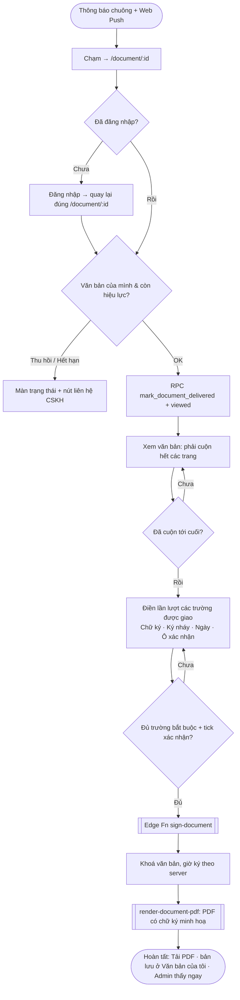
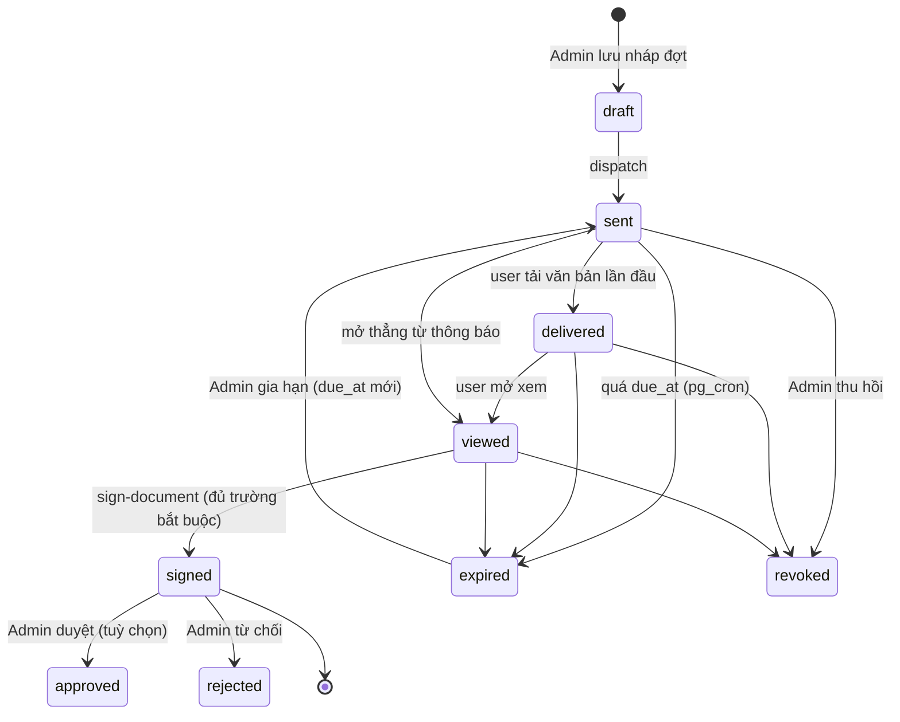
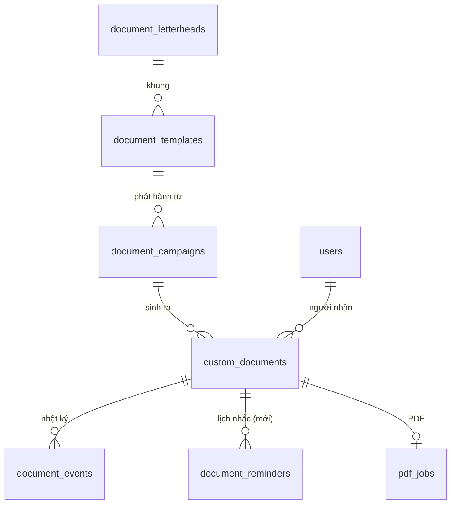
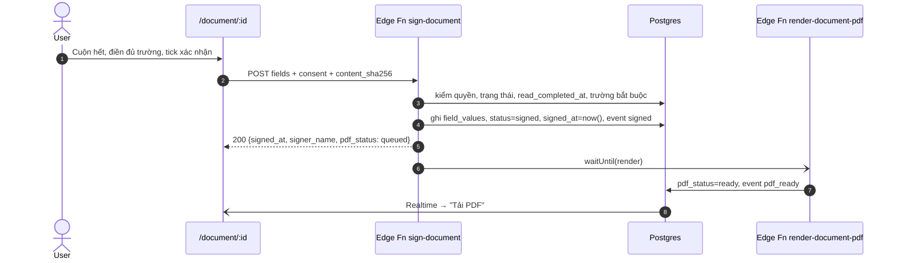

# Thiết kế: Module Quản lý Hợp đồng điện tử (tab "Văn bản" — luồng Admin & User)

> Trạng thái: **v3.1 — đã chốt: không dùng OTP; chữ ký chỉ mang tính minh hoạ**
> Phạm vi: mở rộng tab **Văn bản** đã có (Giai đoạn 2, xem `docs/design/e-sign-letterhead-spec.md`) thành module hợp đồng đầy đủ: trường ký kéo-thả, nhắc hạn, bảng trạng thái chi tiết, PDF bản ký.
> Stack giữ nguyên: Vite + React host tĩnh trên GitHub Pages; backend 100% Supabase (Postgres + RLS + Realtime + Storage + Edge Functions + pg_cron/pg_net).

---

## 0. Bối cảnh

### 0.1 Đã có (không làm lại)

| Thành phần | Vị trí | Dùng lại thế nào |
|---|---|---|
| 5 sub-tab Văn bản: Khung văn bản · Mẫu · Nhóm · Phát hành · Theo dõi | `src/components/admin/ESignTab.jsx`, `esign/*` | Giữ khung; nâng cấp Mẫu (trường kéo-thả), Phát hành (cài đặt gửi), Theo dõi (bảng trạng thái) |
| Soạn thân văn bản Quill + biến `{{…}}` dạng embed | `esign/QuillBodyEditor.jsx`, `shared/docLayout/resolve.ts` | Thêm embed **neo trường** (`field_anchor`) bên cạnh `VariableEmbed` |
| Layout engine dùng chung trình duyệt ↔ Edge Function | `src/shared/docLayout/*` → `supabase/functions/_shared/docLayout` | Tính toạ độ trường theo từng người nhận (mục 4.4) |
| Khung ký người nhận / bên phát hành | `layout.slots[]`, `custom_documents.slot_boxes` | Trở thành 2 trường đặc biệt trong mô hình trường mới (tương thích ngược) |
| Phát hành theo lô, nhóm tĩnh/động | Edge Function `dispatch-campaign`, `user_groups` | Thêm `delivery_settings` |
| Ký qua server, PDF, `/verify` | `sign-document`, `render-document-pdf`, `get-document-pdf`, `pages/Verify.jsx` | Mở rộng payload ký (nhiều trường), thêm nhãn "chữ ký minh hoạ" |
| Nhật ký `document_events` chỉ ghi thêm | migration `esign_phase2_schema` | Thêm thông tin thiết bị |

Dữ liệu thật hiện tại (01/10/2026): 0 mẫu, 0 đợt, 0 văn bản → **đổi schema không cần chuyển dữ liệu**.

### 0.2 Quyết định đã chốt

| # | Chủ đề | Quyết định | Ảnh hưởng |
|---|---|---|---|
| Q1 | OTP trước khi ký | **Không dùng OTP** (giữ như D2 của spec v2) | Người ký = tài khoản đang đăng nhập (JWT). Không cần nhà cung cấp SMS/Email, không có bảng OTP |
| Q2 | Kênh thông báo | **In-App + Web Push** (10/10 tài khoản dùng email ảo `…@vinclub.com` nên không gửi Email) | Kênh Email để sẵn trong schema, mặc định tắt |
| Q3 | Vị trí trường ký | **Kéo-thả, neo theo nội dung** (mục 2.3) | Toạ độ X/Y/trang thật tính riêng cho từng người nhận lúc gửi |
| Q4 | Giá trị chữ ký | **Chữ ký chỉ mang tính minh hoạ**, không phải chữ ký số / chữ ký điện tử có giá trị chứng cứ | Không chứng thư số, không PAdES, không chuỗi hash pháp lý, không trang "chứng nhận ký". Văn bản và PDF hiển thị nhãn "Chữ ký minh hoạ" (bật/tắt theo mẫu, mục 2.6) |
| Q5 | Trạng thái "Delivered" | = người nhận đã tải văn bản về thiết bị lần đầu; "Viewed" = mở xem văn bản | RPC riêng cho từng mốc |

Hệ quả của Q4: hệ thống vẫn **khoá nội dung sau khi ký** và lưu nhật ký ai/khi nào để vận hành (tránh tranh cãi nội bộ, hiển thị đúng trạng thái), nhưng **không** thiết kế hay quảng bá như bằng chứng pháp lý.

---

## 1. Information Architecture & User Flow

### 1.1 Cấu trúc tab "Văn bản" (Admin)

```
Admin ▸ Văn bản
├── Tổng quan              (MỚI — Contract Status Dashboard, mặc định khi mở tab)
├── Hợp đồng & Văn bản     (MỚI — bảng toàn bộ văn bản đã gửi, lọc/hành động hàng loạt)
├── Soạn mẫu               (nâng cấp "Mẫu": canvas + trường kéo-thả + preview)
├── Gửi                    (nâng cấp "Phát hành": người nhận + cài đặt gửi)
├── Theo dõi đợt           (giữ "Theo dõi" — góc nhìn theo đợt gửi)
├── Khung văn bản          (giữ)
└── Nhóm người dùng        (giữ)
```

### 1.2 Luồng Admin: Tạo → Nháp → Đặt trường → Gửi → Theo dõi

```mermaid
flowchart TD
  A([Admin mở Văn bản ▸ Soạn mẫu]) --> B{Mẫu có sẵn?}
  B -- Có --> B1[Nhân bản / sửa mẫu → bản nháp vN+1]
  B -- Không --> B2[Tạo mẫu mới: chọn Khung văn bản]
  B1 & B2 --> C[Soạn thân văn bản Quill<br/>chèn biến {{user_name}}, {{tax_code}}…]
  C --> D[Kéo-thả trường: Chữ ký · Ký nháy · Ngày · Ô xác nhận · Ô nhập]
  D --> E[Preview với dữ liệu mẫu / người thật]
  E --> F{Kiểm tra trước xuất bản}
  F -- Lỗi --> C
  F -- Đạt --> G[Xuất bản mẫu vN]
  G --> H[Gửi: chọn mẫu đã xuất bản]
  H --> I[Điền biến cấp đợt]
  I --> J[Chọn người nhận: 1 người · Lọc · Nhóm · Tất cả]
  J --> K[Cài đặt gửi: hạn ký, nhắc tự động, quyền tải PDF, kênh báo]
  K --> L[Xem lại: preview 3 người ngẫu nhiên + số người N]
  L --> M{Gửi ngay / Hẹn giờ / Lưu nháp đợt}
  M -- Lưu nháp --> M1[(campaign: draft)]
  M -- Hẹn giờ --> M2[(campaign: scheduled)] --> N
  M -- Gửi ngay --> N[[Edge Fn dispatch-campaign<br/>tính toạ độ trường từng người, chụp nội dung]]
  N --> O[Theo dõi: Tổng quan / Bảng văn bản / Theo dõi đợt]
  O --> P{Hành động}
  P --> P1[Nhắc lại] & P2[Thu hồi] & P3[Gia hạn ký] & P4[Duyệt / Từ chối] & P5[Xem nhật ký + tải PDF]
```

### 1.3 Luồng User: Nhận → Mở → Xem → Ký → Hoàn tất



Xác thực người ký = phiên đăng nhập hiện tại (JWT). Không có bước OTP hay nhập lại mật khẩu.

### 1.4 Máy trạng thái văn bản



- `draft` thuộc về **đợt** (`document_campaigns.status`), các trạng thái còn lại thuộc về **từng văn bản** (`custom_documents.status`).
- `delivered`/`viewed` không bao giờ lùi trạng thái (chỉ set nếu đang ở trạng thái "thấp hơn").
- `signed`, `approved`, `rejected`, `revoked` là trạng thái cuối với nội dung — trigger khoá áp dụng cả admin.

---

## 2. UI/UX — Admin

Thiết kế theo token đã có: màu chính `#948154`, chữ 11–14px, bo `rounded-xl/2xl`, card trắng viền `gray-200`. Desktop ưu tiên (Admin dùng máy tính), vẫn dùng được trên tablet ≥ 768px.

### 2.1 Trình soạn hợp đồng (Soạn mẫu) — 4 vùng

```
┌──────────────────────────────────────────────────────────────────────────────────────────┐
│ ← Mẫu  "Hợp đồng đầu tư Vinhomes" v3 (Nháp) · Đã lưu 14:02     [Preview ▸] [Lưu] [Xuất bản]│ ← thanh lệnh
├────────────────┬───────────────────────────────────────────────┬──────────────────────────┤
│ SIDEBAR TRÁI   │               DOCUMENT CANVAS (A4)            │ INSPECTOR                │
│ [Biến|Trường|  │  zoom 50–200% · trang 1/3 · lưới 1mm (Alt)    │ (theo vật đang chọn)     │
│  Khối]         │  ┌─────────────────────────────────────────┐  │                          │
│                │  │ HEADER khung văn bản 🔒                  │  │ ▸ Trường: Chữ ký #1      │
│ ▾ Biến         │  ├─────────────────────────────────────────┤  │   Loại   [Chữ ký ▼]      │
│  Hệ thống      │  │ HỢP ĐỒNG ĐẦU TƯ SỐ {{doc_no}}            │  │   Người ký [Người nhận ▼]│
│  • user_name   │  │ Bên B: [user_name] MST: [tax_code]       │  │   Bắt buộc  ☑            │
│  • tax_code    │  │ Hiệu lực từ [effective_date]             │  │   Rộng × Cao  60 × 25 mm │
│  • effective_… │  │ ...                                     │  │   Neo: sau đoạn "Điều 5" │
│  Tuỳ chỉnh     │  │ Điều 5. ... ☐[Ô xác nhận: Đã đọc điều 5] │  │   Lệch X/Y  +0 / +4 mm   │
│  • custom_…    │  │                                         │  │   Nhãn  "Bên B ký"       │
│  + Thêm biến   │  │ ┌ ✍ Chữ ký #1 ┐      ┌ 🔒 Bên phát hành ┐│  │   ☑ Hiện tên  ☑ Hiện giờ │
│                │  │ │ Người nhận  │      │ con dấu + chữ ký  ││  │   [Nhân bản] [Xoá]       │
│ ▾ Trường       │  │ └─────────────┘      └──────────────────┘│  │                          │
│  ✍ Chữ ký      │  │  📅 [Ngày ký]        (ký nháy mỗi trang ↓)│  │ ▸ Mẫu                    │
│  ✎ Ký nháy     │  ├─────────────────────────────────────────┤  │   Danh mục, Khung VB     │
│  📅 Ngày ký    │  │ FOOTER 🔒 · Trang 1/3 · [Ký nháy ▢]      │  │   ☑ Nhãn "Chữ ký minh hoạ"│
│  ☐ Ô xác nhận  │  └─────────────────────────────────────────┘  │   Lưu trữ PDF [1 năm ▼]  │
│  ▭ Ô nhập chữ  │                                               │                          │
│ ▾ Khối nhanh   │  ⚠ 1 biến chưa khai báo: {{tax_code}}         │ ▸ Kiểm tra (2 lỗi)       │
└────────────────┴───────────────────────────────────────────────┴──────────────────────────┘
```

**Sidebar trái (260px, 3 tab)**
- **Biến**: biến hệ thống (`user_name`, `phone`, `id_card_number`, `doc_no`, `date`, `due_date`…) + biến tuỳ chỉnh của mẫu (`tax_code`, `effective_date`, `custom_field`…). "+ Thêm biến" mở form: key (snake_case), nhãn, kiểu `text|richtext|date|money|number`, phạm vi `campaign|recipient`, bắt buộc. Chèn bằng kéo chip vào canvas hoặc gõ `{{` → autocomplete.
- **Trường**: 5 loại có thể kéo-thả (mục 2.2).
- **Khối nhanh**: đoạn mẫu "Căn cứ", "Điều khoản thanh toán", "Nơi nhận"… chèn Delta có sẵn.

**Document canvas (giữa)**
- 2 chế độ như v2: **Soạn** (Quill, chữ chảy tự do) và **Bản in** (layout engine, đúng từng trang như PDF). Trường hiển thị ở cả 2 chế độ.
- Header/footer khung văn bản khoá (🔒). Trường bị khoá hiển thị viền xám nét liền; trường thường viền nét đứt màu theo người ký.
- Phím tắt: `Del` xoá trường, `Ctrl+D` nhân bản, mũi tên dịch 1mm (`Shift` = 5mm), `Ctrl+Z/Y`.

**Field mapping overlay**
- Lớp `position:absolute` phủ đúng canvas (đơn vị mm × scale như `LetterheadRenderer`). Mỗi trường là 1 box có 8 tay nắm co giãn (snap 1mm), kéo thân để di chuyển.
- Khi kéo, đường gióng hiện ra khi thẳng hàng với lề/trường khác; điểm neo hiện dạng ⚓ nối nét đứt tới vị trí văn bản được neo (mục 2.3).
- Không cho thả đè header/footer; thả đè lên chữ → cảnh báo vàng "Trường che nội dung" (vẫn cho lưu).
- Màu theo **người ký**: Người nhận = `#948154`, Bên phát hành = xám đậm (khoá). Schema chừa nhiều người ký (mục 4.3) nhưng UI v1 chỉ có 2 vai trò này.

**Inspector (300px)**: thuộc tính vật đang chọn (trường / mẫu); tab **Kiểm tra** liệt kê lỗi chặn xuất bản: biến chưa khai báo; `requires_signature` nhưng không có trường Chữ ký người nhận; 2 trường trùng `id`; trường ngoài vùng in; khung văn bản thiếu con dấu/chữ ký đại diện; preview vượt 10 trang.

**Preview panel** (`Preview ▸`): drawer phải 50% màn hình, chọn "Dữ liệu mẫu" hoặc 1 người thật (tìm kiếm) → render bản in kèm vị trí trường đã tính cho người đó; nút "Xem như người nhận" mở đúng giao diện ký phía user (chế độ chỉ xem).

### 2.2 Các loại trường

| Loại | Icon | Người điền | Kích thước mặc định | Giá trị lưu | Vẽ vào PDF |
|---|---|---|---|---|---|
| `signature` Chữ ký | ✍ | Người nhận / Bên phát hành (tự động) | 60 × 25 mm | PNG (Storage private) | Ảnh chữ ký contain trong box + tên + giờ ký |
| `initials` Ký nháy | ✎ | Người nhận | 20 × 12 mm | PNG; tuỳ chọn **lặp mỗi trang** (neo footer) | Ảnh ở mọi trang chỉ định |
| `date` Ngày | 📅 | Tự động lúc ký (server) | 35 × 7 mm | ISO timestamp | Chuỗi "dd/MM/yyyy" GMT+7 |
| `checkbox` Ô xác nhận | ☐ | Người nhận | 5 × 5 mm + nhãn | boolean | ☑/☐ + nhãn |
| `text` Ô nhập | ▭ | Người nhận | 60 × 7 mm | string ≤ 200 ký tự, regex tuỳ chọn | Chữ 11pt |

Mỗi trường có: `required`, `label`, `hint`; `checkbox` thêm `must_be_checked` (ví dụ "Tôi đã đọc Điều 5" bắt buộc tick).

### 2.3 Neo trường theo nội dung (thay toạ độ tuyệt đối)

Vấn đề: cùng một mẫu, `{{custom_field}}` dài 1 dòng với người A và 2 trang với người B → toạ độ cố định sẽ đè chữ hoặc rơi sai trang.

Cách làm:
1. Khi Admin thả trường, hệ thống tìm **vị trí văn bản gần nhất phía trên điểm thả** (ký tự cuối của dòng đó) và chèn một embed vô hình `{ insert: { field_anchor: "fld_sig_1" } }` vào Delta tại đó.
2. Lưu `offset_x_mm` (so với lề trái vùng thân) và `offset_y_mm` (so với đáy dòng chứa neo).
3. Lúc phát hành, `layoutDocument()` biết dòng chứa neo nằm ở trang nào, y bao nhiêu **với dữ liệu của từng người** → tính box tuyệt đối `{page, x_mm, y_mm, w_mm, h_mm}` → lưu vào `custom_documents.field_boxes`.
4. Nếu box tràn khỏi đáy trang → đẩy cả box sang đầu trang sau (keep-together).
5. 3 kiểu neo:
   - `flow` (mặc định): neo theo đoạn văn như trên.
   - `signature_zone`: nằm trong vùng ký sau thân văn bản (chính là 2 slot của v2 — tương thích ngược).
   - `every_page_footer`: lặp ở footer mỗi trang (dùng cho ký nháy).

Kết quả: Admin vẫn **kéo-thả trực quan** như trình soạn PDF, còn toạ độ X/Y/trang cuối cùng luôn đúng với nội dung thực của từng người nhận.

### 2.4 Gửi (Recipient Assignment + Delivery Settings)

Wizard 4 bước (nâng cấp `DispatchWizard.jsx`):

```
① Mẫu ──── ② Nội dung ──── ③ Người nhận ──── ④ Cài đặt & Gửi
```

**③ Người nhận** — Segmented: `Một người | Lọc hàng loạt | Nhóm | Tất cả`
- *Một người*: tìm theo tên / SĐT / identifier; hiển thị luôn biến `scope=recipient` để nhập.
- *Lọc hàng loạt*: bộ lọc hạng thẻ, VIP, ngày tham gia, **tổng đã nạp ≥ X**, đang có đầu tư dự án Y, bỏ tài khoản khoá → "Khớp N người" + 20 dòng xem trước. Có thể **lưu thành nhóm động**.
- *Nhóm*: multi-select nhóm tĩnh/động + "Thêm người lẻ" + "Loại trừ".
- *Tất cả*: cảnh báo cam, gõ lại số N để xác nhận khi N > 50.
- Import CSV biến cấp người nhận (`user_id|phone|identifier, tax_code, effective_date…`) → bảng khớp/không khớp trước khi tiếp tục.
- Thanh dưới luôn hiện **"Sẽ gửi tới N người"**.

**④ Cài đặt gửi**

| Nhóm | Thiết lập | Mặc định |
|---|---|---|
| Hạn | Hạn ký (ngày/giờ), hết hạn tự chuyển `expired` | +7 ngày |
| Nhắc tự động | Lịch nhắc: `[3 ngày trước hạn, 1 ngày trước hạn, ngày hết hạn 09:00]`; tối đa 3 lần; dừng khi đã ký | Bật |
| Quyền | Người nhận được tải PDF đã ký · Cho xem lại sau khi hết hạn · Ẩn văn bản khi thu hồi | Bật · Bật · Bật |
| Kênh báo | In-App (luôn bật) · Web Push · Email (mờ — chưa khả dụng, Q2) | In-App + Push |
| Sự kiện báo Admin | Khi có người ký · Khi đợt hoàn tất 100% · Khi PDF lỗi | Bật cả 3 |
| Lưu trữ | Thời gian lưu PDF (theo cài đặt chung / ghi đè) | Theo mẫu |
| Thời điểm | Gửi ngay / Hẹn giờ | Gửi ngay |

### 2.5 Contract Status Dashboard

**Tổng quan** (sub-tab mặc định):

```
┌──────────┬───────────┬───────────┬──────────┬──────────┬──────────┬──────────┐
│ Nháp  3  │ Đã gửi 120│ Đã nhận 98│ Đã xem 76│ Đã ký 61 │ Hết hạn 4│ Thu hồi 2│   ← thẻ KPI (bấm = lọc bảng)
└──────────┴───────────┴───────────┴──────────┴──────────┴──────────┴──────────┘
 Phễu 30 ngày: Gửi ▇▇▇▇▇▇▇▇▇ → Xem ▇▇▇▇▇▇ → Ký ▇▇▇▇▇   ·  Thời gian ký trung vị: 1,8 ngày
 ⚠ Sắp hết hạn ký (48h): 9   ⚠ PDF lỗi: 1   ⚠ Sắp hết hạn lưu trữ (7 ngày): 0
 Hoạt động gần đây (realtime): 14:32 Nguyễn A đã ký HĐ-2026-00123 · iPhone Safari …
```

**Bảng Hợp đồng & Văn bản**

```
[🔍 Tìm mã VB / người nhận / SĐT]  [Trạng thái ▼] [Mẫu ▼] [Đợt ▼] [Ngày gửi ▭–▭] [Hạn ký ▼] [Người tạo ▼]  [Xuất CSV]
┌─┬──────────────┬───────────────┬────────────┬──────────────┬────────────┬──────────┬───────────┬───┐
│☐│ Mã VB        │ Người nhận     │ Mẫu / Đợt  │ Trạng thái    │ Gửi lúc     │ Hạn ký    │ Hoạt động │ ⋮ │
├─┼──────────────┼───────────────┼────────────┼──────────────┼────────────┼──────────┼───────────┼───┤
│☐│ HĐ-2026-0123 │ Nguyễn Văn A  │ HĐ đầu tư  │ 🟢 Đã ký      │ 28/09 09:00│ 05/10    │ Ký 14:32  │ ⋮ │
│☐│ HĐ-2026-0124 │ Trần Thị B    │ HĐ đầu tư  │ 🔵 Đã xem     │ 28/09 09:00│ ⚠ 02/10  │ Xem 3 lần │ ⋮ │
└─┴──────────────┴───────────────┴────────────┴──────────────┴────────────┴──────────┴───────────┴───┘
 Đã chọn 12:  [Nhắc lại] [Gia hạn…] [Thu hồi…] [Duyệt] [Tải ZIP PDF]                    ‹ 1 2 3 › 50/trang
```

Badge trạng thái (chữ + icon, không dựa riêng vào màu):

| Trạng thái | Nhãn | Màu nền / chữ | Icon |
|---|---|---|---|
| draft | Nháp | `gray-100` / `gray-600` | ✎ |
| sent | Đã gửi | `sky-50` / `sky-700` | ➤ |
| delivered | Đã nhận | `indigo-50` / `indigo-700` | ⇣ |
| viewed | Đã xem | `blue-50` / `blue-700` | 👁 |
| signed | Đã ký | `emerald-50` / `emerald-700` | ✔ |
| approved | Đã duyệt | `emerald-600` / trắng | ✔✔ |
| rejected | Từ chối | `rose-50` / `rose-700` | ✕ |
| expired | Hết hạn | `amber-50` / `amber-800` | ⏱ |
| revoked | Thu hồi | `gray-200` / `gray-700` gạch ngang | ⊘ |

Menu `⋮` theo trạng thái:

| Hành động | sent/delivered/viewed | signed | expired | revoked |
|---|---|---|---|---|
| Xem văn bản / Xem nhật ký | ✔ | ✔ | ✔ | ✔ |
| Nhắc lại ngay | ✔ | | | |
| Gia hạn ký | ✔ | | ✔ | |
| Thu hồi (bắt buộc lý do) | ✔ | | ✔ | |
| Tải PDF đã ký / Tạo lại PDF | | ✔ | | |
| Duyệt / Từ chối | | ✔ | | |
| Gia hạn lưu trữ | | ✔ | | |
| Gửi lại bản mới (nhân bản sang đợt mới) | ✔ | ✔ | ✔ | ✔ |

**Drawer chi tiết văn bản** (bấm vào dòng): trái = preview bản in (đã ký thì là PDF), phải = **dòng thời gian hoạt động**:

```
● 28/09 09:00:02  Đã gửi          bởi admin@… · đợt "HĐ đầu tư T9"
● 28/09 09:00:05  Đã nhận         Android 14 · Chrome 128
● 28/09 20:14:40  Đã xem (1/3)    cuộn hết 3/3 trang lúc 20:16:02
● 29/09 14:32:05  Đã ký           Vẽ tay · 4 trường · iPhone 15 · Safari 18 · IP 14.x.x.x
● 29/09 14:32:09  PDF sẵn sàng
                                                     [Xuất nhật ký CSV] [Tải PDF]
```

Realtime: bảng subscribe `custom_documents` + `document_events` (filter theo trang hiện tại) — đổi trạng thái không cần tải lại.

### 2.6 Nhãn "Chữ ký minh hoạ" (Q4)

- Tuỳ chọn theo mẫu `illustrative_label` (mặc định **bật**), có thể ghi đè theo đợt.
- Khi bật:
  - Dưới mỗi trường chữ ký/ký nháy trên màn hình và PDF in dòng 6pt xám: *"Chữ ký minh hoạ"*.
  - Footer PDF thêm: *"Văn bản ký trên VinClub — chữ ký mang tính minh hoạ."*
  - Câu xác nhận trước khi ký (mục 3.4) dùng lời *"Tôi đã đọc và đồng ý với nội dung văn bản"*, không dùng các từ "ràng buộc pháp lý", "chữ ký số".
- Khi tắt: không in nhãn; hệ thống vẫn không đưa ra bất kỳ khẳng định pháp lý nào.

---

## 3. UI/UX — User (mobile-first)

### 3.1 Nhận & truy cập
- Thông báo chuông (`notifications` per-user, `type='document'`) + Web Push → deep link `/document/:id`. Không dùng link công khai có token: **luôn yêu cầu đăng nhập** (văn bản gắn với tài khoản), sau đăng nhập quay lại đúng trang.
- Hồ sơ ▸ **Văn bản của tôi**: tab `Cần ký (badge) · Đã ký · Tất cả`; mỗi thẻ có hạn ký đếm ngược.

### 3.2 Xem & yêu cầu cuộn hết

```
┌─────────────────────────────┐
│ ←  Hợp đồng đầu tư   1/3  ⋮ │  ← chỉ số trang hiện tại
├─────────────────────────────┤
│ 🟠 Cần ký trước 05/10 · còn 3 ngày │
├─────────────────────────────┤
│  Trang A4 (layout engine),  │
│  pinch-zoom, double-tap      │
│  [☐ Đã đọc Điều 5] ← trường  │
│  [✍ Chạm để ký] ← trường     │
├─────────────────────────────┤
│ ▓▓▓▓▓▓░░░░ Đã đọc 2/3 trang  │  ← thanh tiến độ đọc
│ [ Tiếp tục đọc ↓ ]           │  ← CTA đổi thành "Ký (0/4 trường)" khi đọc xong
└─────────────────────────────┘
```

- **Cổng cuộn**: `IntersectionObserver` gắn sentinel cuối mỗi trang; trường chỉ bấm được khi trang chứa nó đã hiện ≥ 60%; CTA ký chỉ bật khi sentinel trang cuối đã hiện. Ghi event `read_completed` `{pages_seen, duration_ms}`.
- Nút **"Trường tiếp theo"** cuộn tới trường bắt buộc chưa điền kế tiếp.

### 3.3 Ký (bottom sheet `vaul`)

Với trường `signature`/`initials`, sheet có 4 tab (đã có Vẽ/Gõ/Đã lưu, thêm **Tải ảnh**):
- **Vẽ**: Pointer Events, nét Bézier, độ dày theo vận tốc, hoàn tác, 3 màu mực, toàn màn hình ngang.
- **Gõ**: tên điền sẵn, 4 font chữ ký hỗ trợ tiếng Việt, cỡ chữ, nghiêng → render PNG.
- **Tải ảnh**: JPG/PNG/HEIC ≤ 5MB → crop theo tỉ lệ box → xoá nền (ngưỡng chỉnh được) → PNG ≤ 1200×400.
- **Đã lưu**: chữ ký trong bảng `signatures`.
- "Dùng chữ ký này cho các trường ký nháy còn lại" (1 chạm điền hết).

Trường `date` tự điền khi ký (hiển thị "Sẽ ghi ngày ký"). `checkbox` chạm để tick. `text` mở bàn phím.

### 3.4 Xác nhận cuối (không OTP)

```
┌─────────────────────────────────────┐
│  Xác nhận ký                         │
│  ✔ 4/4 trường đã điền                │
│  ☐ Tôi đã đọc và đồng ý với nội dung │
│    văn bản trên.                      │
│  ⓘ Chữ ký mang tính minh hoạ         │  ← chỉ hiện khi illustrative_label bật
│  [        Ký và hoàn tất        ]    │
└─────────────────────────────────────┘
```

Bấm "Ký và hoàn tất" gửi thẳng `sign-document`; không có bước OTP hay nhập lại mật khẩu.

### 3.5 Hoàn tất
1. Optimistic: các trường hiện giá trị + "Đang lưu…".
2. Server trả `signed_at`, `signer_name` → overlay **"ĐÃ KÝ"**, CTA thành **Tải PDF** (khoá tới khi `pdf_status=ready`, Realtime).
3. Thông báo chuông "Đã lưu bản hợp đồng đã ký" + bản PDF ở Văn bản của tôi; Admin nhận thông báo theo cài đặt 2.4.

---

## 4. Data Structure & Variable Schema

### 4.1 Sơ đồ quan hệ



### 4.2 Biến (Variable Schema)

```json
{
  "variables": [
    { "key": "user_name",      "label": "Họ tên",          "type": "text",     "scope": "system" },
    { "key": "tax_code",       "label": "Mã số thuế",       "type": "text",     "scope": "recipient", "required": true,
      "validation": { "pattern": "^[0-9]{10}([0-9]{3})?$", "message": "MST 10 hoặc 13 số" } },
    { "key": "effective_date", "label": "Ngày hiệu lực",    "type": "date",     "scope": "campaign",  "required": true },
    { "key": "custom_field",   "label": "Điều khoản riêng", "type": "richtext", "scope": "recipient" }
  ]
}
```

- `scope`: `system` (tự sinh: `user_name`, `phone`, `id_card_number` che bớt, `doc_no`, `date`, `due_date`, `signed_at`), `campaign` (nhập 1 lần cho đợt), `recipient` (từng người — nhập tay hoặc CSV).
- Thứ tự ưu tiên khi trùng key: `system < campaign < recipient` (giữ như `resolve.ts`).
- Giá trị đã thay được **chụp cứng** vào `rendered_model`; `recipient_vars` lưu riêng để tra cứu.

### 4.3 Định nghĩa trường trong mẫu (`document_templates.layout.fields[]`)

```json
{
  "page": { "size": "A4", "orientation": "portrait" },
  "illustrative_label": true,
  "signers": [
    { "role": "recipient", "label": "Bên B (Khách hàng)", "order": 1 },
    { "role": "issuer",    "label": "Bên A (VinClub)",    "order": 0, "fill": "auto_on_dispatch" }
  ],
  "fields": [
    {
      "id": "fld_sig_b",
      "type": "signature",
      "signer_role": "recipient",
      "required": true,
      "label": "Bên B ký, ghi rõ họ tên",
      "size_mm": { "w": 60, "h": 25 },
      "anchor": { "kind": "signature_zone", "column": "left" },
      "offset_mm": { "x": 0, "y": 0 },
      "options": { "show_name": true, "show_signed_at": true }
    },
    {
      "id": "fld_ok_dieu5",
      "type": "checkbox",
      "signer_role": "recipient",
      "required": true,
      "label": "Tôi đã đọc và đồng ý Điều 5",
      "size_mm": { "w": 5, "h": 5 },
      "anchor": { "kind": "flow", "anchor_id": "fld_ok_dieu5" },
      "offset_mm": { "x": 0, "y": 2 },
      "options": { "must_be_checked": true }
    },
    {
      "id": "fld_initials",
      "type": "initials",
      "signer_role": "recipient",
      "required": true,
      "size_mm": { "w": 20, "h": 12 },
      "anchor": { "kind": "every_page_footer", "align": "right", "pages": "all_but_last" }
    },
    {
      "id": "fld_date",
      "type": "date",
      "signer_role": "recipient",
      "size_mm": { "w": 35, "h": 7 },
      "anchor": { "kind": "signature_zone", "column": "left", "below_field": "fld_sig_b" },
      "options": { "format": "dd/MM/yyyy", "auto": "signed_at" }
    }
  ]
}
```

- Embed neo trong Delta: `{ "insert": { "field_anchor": "fld_ok_dieu5" } }` — không hiện chữ, layout engine ghi lại vị trí.
- **Tương thích ngược**: `layout.slots[]` cũ được chuyển tự động thành `fields[]` loại `signature` với `anchor.kind = signature_zone` (hàm `normalizeLayout()`).

### 4.4 Toạ độ trường đã tính cho từng người (`custom_documents.field_boxes`)

Đơn vị mm, gốc góc trên-trái trang (như v2 mục 3.3); Edge Function đổi sang point/gốc dưới-trái của pdf-lib bằng `mmToPdf()`.

```json
{
  "fld_sig_b":    [{ "page": 3, "x_mm": 22.0,  "y_mm": 201.4, "w_mm": 60, "h_mm": 25 }],
  "fld_ok_dieu5": [{ "page": 2, "x_mm": 20.0,  "y_mm": 148.7, "w_mm": 5,  "h_mm": 5  }],
  "fld_initials": [{ "page": 1, "x_mm": 170.0, "y_mm": 274.0, "w_mm": 20, "h_mm": 12 },
                   { "page": 2, "x_mm": 170.0, "y_mm": 274.0, "w_mm": 20, "h_mm": 12 }],
  "fld_date":     [{ "page": 3, "x_mm": 34.5,  "y_mm": 229.4, "w_mm": 35, "h_mm": 7 }]
}
```

Mảng vì một trường có thể xuất hiện nhiều lần (ký nháy mỗi trang). `slot_boxes` cũ giữ lại (alias của các trường signature) để code hiện tại không vỡ trong lúc chuyển đổi.

### 4.5 Metadata văn bản (`custom_documents` — cột mới)

| Cột | Kiểu | Ghi chú |
|---|---|---|
| `status` | text | thêm `delivered`, `viewed` vào enum hiện có (`pending` hiển thị "Đã gửi"; giữ giá trị `pending` trong DB để tương thích) |
| `delivered_at` | timestamptz | đã có cột, nay có RPC ghi |
| `read_completed_at` | timestamptz | cuộn hết văn bản |
| `fields_snapshot` | jsonb | `layout.fields` tại thời điểm gửi |
| `field_boxes` | jsonb | mục 4.4 |
| `recipient_vars` | jsonb | giá trị biến cấp người nhận đã dùng |
| `delivery_settings` | jsonb | chụp từ đợt (mục 4.7) |
| `illustrative_label` | boolean | chụp từ mẫu/đợt |
| `revoked_reason`, `revoked_by` | text | |
| `reminder_count`, `last_reminded_at` | int, timestamptz | |

Các cột đã có (`content_sha256`, `pdf_sha256`, `signed_ip`, `signed_user_agent`, `consent_text`…) giữ nguyên để kiểm tra "văn bản không bị sửa sau khi gửi" ở mức vận hành, không mang ý nghĩa pháp lý.

### 4.6 Lưu giá trị trường & lịch nhắc

**Đã triển khai (đợt 1):** giá trị trường lưu thẳng trong `custom_documents.field_values` (jsonb, 1 giá trị / trường — ký nháy lặp nhiều trang dùng chung 1 ảnh), ghi nguyên tử cùng chữ ký bởi `esign_record_signature(..., p_field_values)`; vị trí trường không lưu riêng vì bộ dàn trang tính lại xác định từ `layout_snapshot`.

```json
{
  "ok_dieu5": { "type": "checkbox", "value_bool": true },
  "ma_so_thue": { "type": "text", "value_text": "0101234567" },
  "ky_nhay": { "type": "initials", "method": "draw", "asset_path": "<uid>/<doc>.field-ky_nhay.png", "image_data_url": "data:image/png;base64,…" },
  "ngay_ky": { "type": "date", "value_text": "01/10/2026" }
}
```

Lịch nhắc (đợt sau):

```sql
create table public.document_reminders (
  id            bigint generated always as identity primary key,
  document_id   text not null references public.custom_documents(id) on delete cascade,
  run_at        timestamptz not null,
  status        text not null default 'scheduled' check (status in ('scheduled','sent','skipped','cancelled')),
  channel       text[] not null default '{in_app,push}',
  sent_at       timestamptz
);
create index on public.document_reminders (status, run_at);
```

RLS: `document_reminders` không có policy cho `authenticated` (chỉ Edge Function/service role).

### 4.7 Cài đặt gửi (`document_campaigns.delivery_settings`)

```json
{
  "due_at": "2026-10-05T16:59:59Z",
  "auto_expire": true,
  "reminders": { "enabled": true, "offsets_hours": [-72, -24, 0], "at_local_time": "09:00", "max": 3 },
  "permissions": { "recipient_can_download_pdf": true, "visible_after_expiry": true, "hide_on_revoke": true },
  "channels": { "in_app": true, "push": true, "email": false },
  "admin_alerts": { "on_signed": true, "on_campaign_complete": true, "on_pdf_failed": true },
  "illustrative_label": true,
  "retention_days": 365
}
```

### 4.8 Nhật ký hoạt động (`document_events`)

Thêm cột `device jsonb`. Không có chuỗi hash (Q4).

```json
{
  "id": 1842,
  "document_id": "doc_01J9Z…",
  "event": "signed",
  "actor_id": "f5ee2984-…",
  "ip": "14.191.x.x",
  "user_agent": "Mozilla/5.0 (iPhone; CPU iPhone OS 18_0 …) Safari/604.1",
  "device": { "os": "iOS 18.0", "browser": "Safari 18", "type": "mobile", "screen": "1179x2556", "tz": "Asia/Ho_Chi_Minh", "lang": "vi-VN" },
  "data": { "fields": ["fld_sig_b", "fld_ok_dieu5", "fld_initials", "fld_date"], "method": "draw" },
  "created_at": "2026-09-29T07:32:05.114Z"
}
```

- Chỉ ghi thêm qua RPC/Edge Function; không có policy UPDATE/DELETE cho `authenticated`.
- Danh sách `event`: `dispatched, delivered, viewed, read_completed, signed, pdf_ready, pdf_failed, downloaded, reminded, extended, revoked, expired, approved, rejected, pdf_purged`.

---

## 5. API & luồng server

### 5.1 Endpoint mới / thay đổi

| # | Tên | Loại | Ai gọi | Mô tả |
|---|---|---|---|---|
| N1 | `mark_document_delivered(p_document_id, p_device jsonb)` | RPC | User | Lần đầu tải → `delivered` |
| N2 | `mark_document_viewed(...)` (mở rộng nhận `device`) | RPC | User | |
| N3 | `mark_document_read(p_document_id, p_pages_seen int, p_duration_ms int)` | RPC | User | `read_completed_at` |
| N4 | `POST /functions/v1/sign-document` (v2) | Edge Fn | User | Nhận tất cả trường |
| N5 | `POST /functions/v1/send-document-reminders` | Edge Fn nội bộ | pg_cron mỗi 15 phút | Gửi nhắc đến hạn |
| N6 | `extend_document_due(p_ids text[], p_due_at)` | RPC admin | Admin | `expired → sent`, lên lại lịch nhắc |
| N7 | `revoke_documents(p_ids text[], p_reason)` | RPC admin | Admin | Thu hồi hàng loạt |
| N8 | `export_document_events(p_document_id)` | RPC admin | Admin | Xuất nhật ký CSV/JSON |
| — | pg_cron `esign-expire-documents` (mỗi 15 phút) | SQL | hệ thống | `due_at < now()` & chưa ký → `expired` + event |

### 5.2 `sign-document` v2

```http
POST /functions/v1/sign-document
Authorization: Bearer <user JWT>

{
  "document_id": "doc_01J9Z…",
  "idempotency_key": "b2f1c9e4-…",
  "content_sha256": "9f2c…e1",
  "consent": true,
  "fields": [
    { "field_id": "fld_sig_b",    "occurrence": 0, "method": "draw", "image_png_base64": "iVBORw0…" },
    { "field_id": "fld_initials", "occurrence": 0, "method": "draw", "image_png_base64": "iVBORw0…" },
    { "field_id": "fld_initials", "occurrence": 1, "method": "reuse", "from": { "field_id": "fld_initials", "occurrence": 0 } },
    { "field_id": "fld_ok_dieu5", "occurrence": 0, "value_bool": true }
  ],
  "device": { "screen": "1179x2556", "tz": "Asia/Ho_Chi_Minh", "lang": "vi-VN" }
}
```

Thứ tự kiểm tra (fail sớm, trả mã lỗi cụ thể):
1. JWT → `user_id`; văn bản thuộc user, `FOR UPDATE`.
2. Idempotency → trả kết quả cũ nếu trùng key.
3. Trạng thái ∈ {sent, delivered, viewed}; chưa quá `due_at`; `content_sha256` khớp (văn bản không đổi từ lúc user mở).
4. `read_completed_at` không null → nếu null: `409 READ_REQUIRED`.
5. Đủ trường `required`; `checkbox.must_be_checked`; PNG hợp lệ (magic bytes, ≤ 500KB, không rỗng); không nhận trường của vai trò khác.
6. Ghi `custom_documents.field_values`, ảnh vào `signed-documents/{uid}/{doc}.field-{id}.png`; `status=signed`, `signed_at=now()`, `locked_at`; event `signed`; `pdf_jobs` → nền `render-document-pdf`.

Mã lỗi thêm so với v1: `409 READ_REQUIRED`, `422 FIELD_REQUIRED {field_id}`, `422 INVALID_FIELD_VALUE {field_id}`.

### 5.3 Trình tự ký



### 5.4 PDF bản ký (`render-document-pdf` mở rộng)

- Vẽ mọi trường theo `field_boxes` (ảnh chữ ký contain + tên + giờ, ☑, ngày, chữ nhập) bằng hàm dùng chung với FE.
- Nếu `illustrative_label = true`: dòng "Chữ ký minh hoạ" dưới mỗi chữ ký/ký nháy + câu footer ở mục 2.6.
- **Không** có trang chứng nhận ký, không ký số, không dấu thời gian bên thứ ba.
- Metadata PDF: Title, Author=VinClub, Subject=doc_no, CreationDate = `signed_at`.
- Lưu `signed-documents/{uid}/{doc}.pdf` (bucket private); Admin và User tải qua signed URL 5 phút (`get-document-pdf`, có kiểm `permissions.recipient_can_download_pdf`).
- Trang `/verify` giữ chức năng tra cứu mã văn bản (có tồn tại, đã ký ngày nào); đổi nhãn kết quả thành "Văn bản có trên hệ thống VinClub", không dùng từ "hợp lệ pháp lý".

### 5.5 Nhắc & hết hạn
- Lúc dispatch: sinh dòng `document_reminders` theo `offsets_hours` (bỏ mốc đã qua).
- pg_cron 15 phút gọi `send-document-reminders`: chọn `scheduled` có `run_at <= now()` của văn bản chưa ký → tạo thông báo chuông + push "Còn 1 ngày để ký HĐ-…" → `sent`; văn bản đã ký/thu hồi → `cancelled`.
- `esign-expire-documents` chuyển `expired`, huỷ nhắc còn lại, báo user + Admin.

---

## 6. Bảo mật — Checklist

Chữ ký chỉ minh hoạ (Q4) nên phần này nhằm **bảo vệ dữ liệu và tính đúng của hệ thống**, không nhằm tạo bằng chứng pháp lý.

### 6.1 Truy cập & dữ liệu
- [ ] RLS mọi bảng mới; user chỉ thấy văn bản của mình; `document_reminders` không có policy cho `authenticated`.
- [ ] Mọi thao tác thay đổi trạng thái chạy qua Edge Function/RPC SECURITY DEFINER (`SET search_path = public`, `REVOKE EXECUTE … FROM anon`).
- [ ] `user_id` lấy từ JWT, `signer_name` lấy từ `users`, thời gian từ `now()` Postgres — không tin client.
- [ ] Bucket `signed-documents` private, signed URL 5 phút; không bao giờ public.
- [ ] Ảnh chữ ký: kiểm magic bytes + giải mã thử; không nhận SVG; giới hạn kích thước.
- [ ] Che dữ liệu nhạy cảm khi hiển thị: SĐT `••••3475`, CCCD `0791••••••23`.
- [ ] Thu hồi/gia hạn/duyệt đều ghi event kèm admin thực hiện; không xoá cứng văn bản đã gửi.
- [ ] Secret nội bộ (`esign_internal_secret`) chỉ ở Vault/Edge Function secrets.

### 6.2 Tính đúng của nội dung
- [ ] Nội dung chụp cứng lúc gửi; trigger khoá nội dung khi `locked_at` không null (áp dụng cả admin), mở rộng sang `field_values`.
- [ ] `content_sha256` so khớp lúc ký để chặn ký trên bản đã bị đổi.
- [ ] Rate limit ký 5 lần/phút/user; idempotency key.

### 6.3 Lưu trữ & quyền riêng tư
- [ ] Thời gian lưu PDF theo cài đặt (mặc định 365 ngày); nhật ký + metadata giữ lại khi PDF hết hạn.
- [ ] Câu thông báo xử lý dữ liệu (IP, thiết bị, ảnh chữ ký) hiển thị trong màn ký, phù hợp quy định bảo vệ dữ liệu cá nhân của Việt Nam.
- [ ] Không đưa vào giao diện, PDF hay thông báo bất kỳ cụm từ khẳng định giá trị pháp lý ("chữ ký số", "ràng buộc pháp lý", "có giá trị như bản giấy").

---

## 7. Kế hoạch triển khai

| Ticket | Nội dung | Phụ thuộc |
|---|---|---|
| C1 | Migration: `field_values`, `read_completed_at`, RPC `mark_document_read`, `esign_record_signature` có trường (**xong — đợt 1**); `document_reminders`, cột `device`, RPC N1, N6–N8, cron hết hạn (đợt sau) | — |
| C2 | `shared/docLayout`: kiểu `FieldConfig`, embed `field_anchor`, tính vị trí trường (flow / every_page_footer), nhãn minh hoạ; test Vitest + Deno (**xong — đợt 1**; khung ký người nhận giữ dạng `slots`) | — |
| C3 | Soạn mẫu: palette trường, điểm neo trong Quill, overlay kéo-thả/co giãn, Inspector trường, kiểm tra trước xuất bản (**xong — đợt 1**); đường gióng/snap nâng cao (đợt sau) | C2 |
| C4 | Gửi: bước Lọc hàng loạt, CSV biến, bước Cài đặt gửi (`delivery_settings`) | C1 |
| C5 | `dispatch-campaign`: tính `field_boxes` từng người, lịch nhắc | C1, C2 |
| C6 | Dashboard: Tổng quan KPI + bảng Hợp đồng & Văn bản + drawer nhật ký + hành động hàng loạt + realtime | C1 |
| C7 | User: cổng cuộn, điều hướng "mục tiếp theo", sheet ký 4 tab, checkbox/text/date, màn xác nhận (**xong — đợt 1**) | C2 |
| C8 | `sign-document` v2 + `render-document-pdf` (vẽ trường, nhãn minh hoạ, bỏ trang chứng nhận) (**xong — đợt 1**); chỉnh nhãn `/verify` (đợt sau) | C1, C2 |
| C9 | `send-document-reminders` + cron | C1 |

## 8. Tiêu chí nghiệm thu chính

- Thả 1 trường Chữ ký sau "Điều 5"; gửi cho 2 người có `custom_field` dài 1 dòng và 2 trang → trường của mỗi người nằm ngay sau Điều 5, không đè chữ, PDF trùng vị trí màn hình (sai số ≤ 0,5 mm).
- Ký nháy `every_page_footer` xuất hiện đúng ở mọi trang trừ trang cuối; ký 1 lần điền hết.
- Chưa cuộn hết → không bấm được Ký; server trả `READ_REQUIRED` nếu gọi thẳng API.
- Ký không cần OTP hay mật khẩu; người khác (JWT khác) gọi API ký văn bản không phải của mình → 403.
- Sửa nội dung văn bản đã ký (kể cả admin) → bị trigger từ chối.
- Hết `due_at` → trạng thái Hết hạn, nhắc còn lại bị huỷ, Admin gia hạn → quay về Đã gửi và có lịch nhắc mới.
- Bảng Admin cập nhật realtime khi user xem/ký; lọc theo trạng thái, mẫu, đợt, khoảng ngày; xuất CSV đúng dữ liệu lọc.
- `illustrative_label` bật → nhãn "Chữ ký minh hoạ" có trên màn hình ký, màn đã ký và PDF; tắt → không có. Không nơi nào xuất hiện cụm từ khẳng định giá trị pháp lý.
