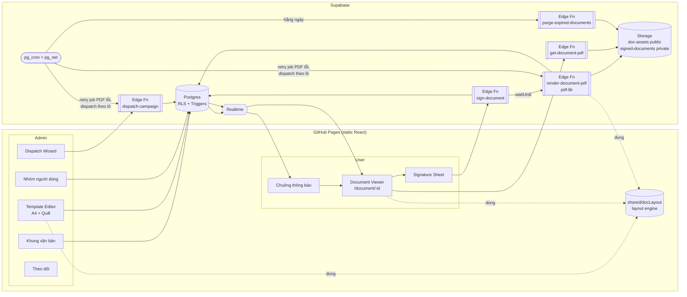
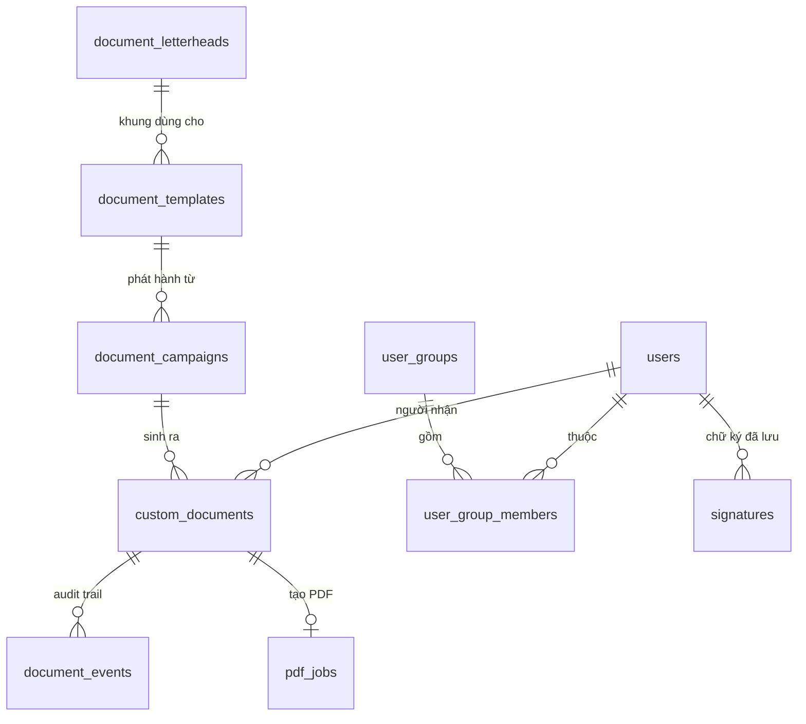
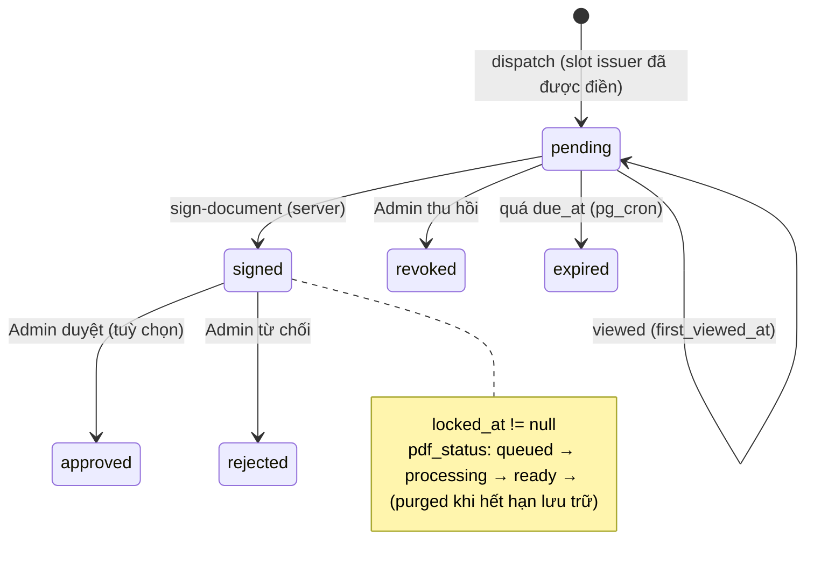

# Thiết kế Chi tiết: "Quản lý & Ký văn bản điện tử" trên Mẫu khung văn bản chuẩn (Generic Letterhead)

> Trạng thái: **v2 — đã chốt quyết định sản phẩm (xem 0.1)** · Phạm vi: Giai đoạn 2 của "E-Contract & Document e-Signing"
> Stack: Vite + React (JS) host tĩnh trên **GitHub Pages**; backend **100% Supabase** (Postgres + RLS + Realtime + Storage + Edge Functions + pg_cron/pg_net). **Không có server Node riêng, không dùng Render.**

---

## 0. Bối cảnh

### 0.1 Quyết định đã chốt (v2)

| # | Câu hỏi | Quyết định | Ảnh hưởng tới thiết kế |
|---|---|---|---|
| D1 | Chữ ký bên phát hành | **Chèn tự động lúc phát hành** (con dấu + chữ ký đại diện lấy từ Khung văn bản) | Slot `issuer` luôn `fill = auto_on_dispatch`; bỏ chế độ "Admin ký sau". Luồng duyệt `approved/rejected` hiện có vẫn giữ nhưng **không** gắn với chữ ký bên phát hành |
| D2 | OTP xác nhận trước khi ký | **Không dùng** | Bằng chứng người ký = phiên đăng nhập (JWT) + câu đồng ý + IP/thiết bị + audit trail + hash (mục 8.5) |
| D3 | Thời gian lưu trữ PDF | **Tuỳ chỉnh** | Mặc định cấu hình trong Cài đặt, ghi đè theo Mẫu và theo Đợt phát hành; có "Vĩnh viễn" và "Giữ pháp lý" (mục 4.10) |
| D4 | Nhóm user lưu sẵn | **Có, ngay bản đầu** | Thêm `user_groups` + `user_group_members`, nhóm tĩnh và nhóm động (mục 4.8, 6.5) |
| D5 | Hạ tầng tạo PDF | **Không dùng Render** (app chỉ có GitHub Pages + Supabase) | PDF tạo trong **Supabase Edge Function** bằng `pdf-lib`, dùng **layout engine dùng chung** giữa trình duyệt và server để đảm bảo WYSIWYG (mục 3.4, 8.4) |
| D6 | Thời gian lưu trữ mặc định ban đầu | **1 năm (365 ngày)** | Giá trị khởi tạo của `document_settings.config.default_retention_days`; Admin đổi được trong Cài đặt |
| D7 | Gói Supabase | **Pro** | Chốt ngân sách Edge Function và Storage theo gói Pro (mục 8.6) |

### 0.2 Cái gì ĐÃ CÓ, cái gì CÒN THIẾU

Spec này **mở rộng**, không thay thế, những thứ đã có trong repo:

| Thành phần hiện có | Vị trí | Đang làm gì | Sẽ thay đổi thế nào |
|---|---|---|---|
| Bảng `document_templates` | `supabase/migrations/20260928163353_document_templates.sql` | Mẫu dạng plain-text + placeholder `{{BIEN}}` | Thêm `letterhead_id`, `body_delta` (Quill Delta), `layout`, `retention_days` |
| Bảng `custom_documents` | `supabase/migrations/20260928131024_custom_documents.sql` | 1 văn bản gửi 1 user; `pending → signed → approved/rejected` | Thêm snapshot đã render, hash, PDF, audit, hạn lưu trữ, liên kết đợt phát hành |
| Trigger `protect_custom_document_fields` | cùng file | User được tự ghi 3 cột chữ ký khi `pending` | **Siết lại**: user KHÔNG ghi trực tiếp nữa, chỉ ký qua Edge Function |
| `TemplateManager.jsx` | `src/components/admin/` | CRUD mẫu (textarea + danh sách biến) | Thay textarea bằng A4 Canvas editor (Quill) + Inspector khung ký |
| `DocumentsTab.jsx` | `src/components/admin/` | Gửi 1 văn bản cho **1 user** | Thay bằng Dispatch Wizard: 1 user / nhóm / tất cả |
| `CustomDocumentView.jsx` | `src/components/documents/` | Render Quốc hiệu + nội dung + 2 cột ký (hard-code) | Thay bằng `LetterheadRenderer` vẽ từ kết quả của layout engine |
| `SignaturePicker.jsx` / `SignaturePad.jsx` | `src/components/signature/` | Tab Vẽ / Gõ tên / Đã lưu | Thêm tab **Tải ảnh**, chọn font, xuất PNG chuẩn hoá |
| `pages/Document.jsx` (`/document/:id`) | `src/pages/` | User xem + ký | Chuyển sang luồng chạm-vào-khung-ký + gọi Edge Function |
| `react-quill` | `package.json` | Đã có sẵn | Editor phần thân; lưu **Delta JSON** thay vì HTML |
| `jspdf`, `html2canvas` | `package.json` | Đã có sẵn | **Không** dùng cho bản PDF lưu trữ (xem 8.4) |
| Deploy | `.github/workflows/deploy.yml` | GitHub Pages, không có server | Mọi logic server nằm trong `supabase/functions/*` (thư mục này chưa có trong repo — sẽ tạo mới) |

**Khoảng trống cần lấp:** (1) chưa có khái niệm *Letterhead* tách khỏi nội dung; (2) chưa cấu hình được vị trí khung ký; (3) chưa gửi hàng loạt / theo nhóm; (4) chưa có upload ảnh chữ ký; (5) chưa có PDF lưu trữ, hash, timestamp phía server; (6) chữ ký hiện do client tự ghi vào DB → không đủ tin cậy làm bằng chứng.

---

## 1. Mục tiêu & Ngoài phạm vi

### Mục tiêu
1. Admin soạn văn bản trên **khung chuẩn cố định** (Header thương hiệu + Quốc hiệu + Footer), chỉ tự do ở vùng thân.
2. Hỗ trợ **biến động** `{{user_name}}`, `{{date}}`, `{{notice_content}}`… được điền tự động theo từng người nhận.
3. Cấu hình **2 khung ký**: Người nhận (dưới-trái) và Bên phát hành (dưới-phải, **tự động chèn khi phát hành**).
4. Phát hành tới **1 user / nhóm user lưu sẵn / tất cả**.
5. User ký bằng **Vẽ tay / Tải ảnh / Tạo từ nét chữ**; hệ thống tự điền tên, chèn đúng bounding box.
6. Sau ký: **khoá read-only**, **timestamp phía server**, **xuất PDF** lưu Supabase Storage kèm **SHA-256** và **trang nhật ký ký**; tự xoá PDF khi hết **thời gian lưu trữ đã cấu hình**.

### Ngoài phạm vi (v1)
- **Chữ ký số** có chứng thư CA / USB token. Theo Luật Giao dịch điện tử 2023, luồng này là *chữ ký điện tử* (không phải *chữ ký số*) — giá trị pháp lý dựa trên việc chứng minh danh tính người ký + tính toàn vẹn dữ liệu.
- **OTP** trước khi ký (D2).
- Nhiều người ký tuần tự — schema đã chừa chỗ (`layout.slots[]`) nhưng v1 chỉ có 1 người ký phía user.
- Định dạng phức tạp trong thân văn bản: bảng, ảnh chèn giữa nội dung, nhiều cột (xem 3.4 — giới hạn có chủ đích để PDF khớp màn hình).

---

## 2. Kiến trúc tổng quan



**Nguyên tắc thiết kế cốt lõi**

1. **Snapshot tại thời điểm phát hành.** Nội dung đã thay biến được lưu cứng vào `custom_documents.rendered_model` + `content_sha256`. Sửa mẫu sau đó KHÔNG ảnh hưởng văn bản đã phát hành.
2. **Server là nguồn sự thật cho mọi thứ mang giá trị bằng chứng**: thời điểm ký (`now()` của Postgres), tên người ký (bảng `users`), nội dung PDF (dựng từ snapshot trong DB, không nhận nội dung từ client), hash.
3. **Một layout engine duy nhất** (`src/shared/docLayout/`, TypeScript thuần, không phụ thuộc DOM) tính vị trí từng dòng, từng khung ký theo mm. Trình duyệt dùng nó để vẽ preview; Edge Function dùng **cùng file** để vẽ PDF → xuống dòng, ngắt trang, vị trí chữ ký trùng khớp.
4. **Không cần server riêng**: mọi xử lý nền chạy bằng Edge Function + `EdgeRuntime.waitUntil` + pg_cron/pg_net.
5. **Tái sử dụng tối đa** code/bảng đã có; thay đổi schema tương thích ngược với dữ liệu Giai đoạn 1.

---

## 3. Mô hình bố cục văn bản

### 3.1 Cấu trúc trang A4

```
┌──────────────────────── A4 · 210 × 297 mm · lề 20/15/20/25 ────────────────────────┐
│ [LOGO]  VINCLUB — tên đơn vị phát hành        │   CỘNG HÒA XÃ HỘI CHỦ NGHĨA VIỆT NAM   │  ← HEADER (letterhead, khoá)
│  Số: {{doc_no}}                               │      Độc lập - Tự do - Hạnh phúc       │
│                                               │  Hà Nội, ngày {{date}}                 │
├───────────────────────────────────────────────────────────────────────────────────────┤
│                         {{title}}  (TIÊU ĐỀ VĂN BẢN)                                 │
│   Kính gửi: {{user_name}}                                                             │  ← BODY (Admin soạn, Quill,
│   ...nội dung... {{notice_content}} ...                                               │     có biến động)
├───────────────────────────────────────────────────────────────────────────────────────┤
│  NGƯỜI NHẬN                               │              ĐẠI DIỆN BÊN PHÁT HÀNH        │  ← SIGNATURE ZONE
│  ┌─────────────────────────┐              │         ┌─────────────────────────┐        │     (luôn nằm ngay sau body,
│  │  [slot: recipient]      │              │         │ [slot: issuer]          │        │      không bị tách trang)
│  │  chạm để ký             │              │         │ con dấu + chữ ký (tự    │        │
│  └─────────────────────────┘              │         │ động lúc phát hành)     │        │
│  {{user_name}}                            │         └─────────────────────────┘        │
│  Ký lúc: {{signed_at}}                    │          {{issuer_name}} · {{issuer_title}}│
├───────────────────────────────────────────────────────────────────────────────────────┤
│ VinClub · Hotline · địa chỉ · Mã VB {{doc_no}} · Trang x/y · SHA-256: {{hash8}}  [QR]  │  ← FOOTER (letterhead, khoá)
└───────────────────────────────────────────────────────────────────────────────────────┘
```

### 3.2 Khung ký "neo theo luồng", không toạ độ tuyệt đối

Độ dài nội dung thay đổi theo từng người (`{{notice_content}}` có thể 2 dòng hoặc 2 trang), nên toạ độ cố định sẽ đè lên chữ. Vì vậy:

- **Signature Zone** luôn đặt **ngay sau body**, không bị tách trang (không đủ chỗ → cả khối sang trang mới).
- **Trong Zone**, mỗi slot cấu hình: cột (`left`/`right`), căn lề, kích thước box (mm), offset tinh chỉnh (mm), nhãn, hiển thị tên/giờ ký.
- Toạ độ thật của từng slot (trang, x, y, w, h theo mm) **do layout engine tính** và lưu vào `custom_documents.slot_boxes` lúc phát hành. FE (chạm để ký) và Edge Function (vẽ chữ ký vào PDF) cùng đọc giá trị này.

### 3.3 Đơn vị & hệ toạ độ

- Đơn vị lưu trữ: **mm** (float), gốc toạ độ **góc trên-trái** của trang. `pdf-lib` dùng point, gốc dưới-trái → chuyển đổi trong một hàm duy nhất `mmToPdf(x, y, pageHeight)` (1 mm = 2.8346 pt).
- Hiển thị trên màn hình: `scale = containerWidthPx / 210`; mọi phần tử `px = mm * scale`.

### 3.4 Layout engine dùng chung (thay cho việc render HTML → PDF)

Không có Chromium trên Supabase Edge Functions, nên không thể "in HTML ra PDF" phía server. Thay vào đó:

```
rendered_model (JSON) ──► layoutDocument(model, fonts) ──► PageLayout[]
                                                             │
                              ┌──────────────────────────────┴───────────────┐
                              ▼                                              ▼
              Trình duyệt: <LetterheadRenderer>                 Edge Function: drawPdf()
              vẽ từng dòng bằng <div> absolute (mm)             vẽ từng dòng bằng pdf-lib
```

- **Vị trí code:** `src/shared/docLayout/*.ts` — TypeScript thuần, không import React/DOM/Deno. Edge Function import bằng đường dẫn tương đối (hoặc copy vào `supabase/functions/_shared/` bằng script `npm run sync:shared` chạy trong CI để tránh lệch phiên bản).
- **Đầu vào** là Quill Delta đã thay biến + letterhead + layout. **Đầu ra** là danh sách trang; mỗi trang gồm các "run" `{ text, x_mm, y_mm, font, size_pt, color, underline }`, ảnh `{ src, x, y, w, h }` và toạ độ slot.
- **Đo chữ không dùng DOM**: dùng bảng độ rộng glyph (advance width) sinh sẵn từ file font bằng script `scripts/build-font-metrics.mjs` (fontkit) → `fontMetrics/<font>.json` (~20 KB mỗi kiểu chữ, đủ bảng chữ tiếng Việt dựng sẵn NFC). Trình duyệt và server dùng **cùng bảng** nên xuống dòng giống hệt nhau. Không dùng kerning ở cả hai phía.
- **Font**: Noto Serif (Regular, Bold, Italic, BoldItalic — license OFL, hỗ trợ tiếng Việt) cho thân văn bản; 4 font chữ ký cho tab "Nét chữ". Web tải bản `.woff2`, Edge Function nhúng bản `.ttf` (đọc từ bucket `doc-assets/fonts/`, cache trong bộ nhớ của instance).
- **Định dạng được hỗ trợ** (toolbar Quill bị giới hạn đúng tập này): đoạn văn, tiêu đề H1–H3, **đậm**, *nghiêng*, gạch chân, căn trái/giữa/phải/đều, danh sách có thứ tự và gạch đầu dòng (1 cấp lồng), thụt lề, xuống dòng, màu chữ trong bảng màu cố định, biến động. **Không hỗ trợ** bảng, ảnh chèn giữa, link, font tuỳ ý — đây là đánh đổi có chủ đích để PDF luôn khớp màn hình.
- **Ngắt trang**: theo dòng; tiêu đề không đứng một mình cuối trang (keep-with-next); Signature Zone không bị tách.
- **Căn đều (justify)**: chia khoảng trắng dư đều cho các dấu cách của dòng, trừ dòng cuối đoạn.

---

## 4. Data Schema

### 4.1 Sơ đồ quan hệ



### 4.2 Bảng mới: `document_letterheads` (Khung văn bản chung)

| Cột | Kiểu | Ghi chú |
|---|---|---|
| `id` | text PK | theo convention hiện tại (id text) |
| `name` | text | "Khung chuẩn VinClub 2026" |
| `is_default` | boolean | đúng 1 dòng `true` (partial unique index) |
| `header` | jsonb | `{ logo_url, org_name, org_sub, show_national_motto: true, doc_no_pattern: "VC/{{yyyy}}/{{seq}}", place: "Hà Nội" }` |
| `footer` | jsonb | `{ lines: ["VinClub · Hotline 1900…"], show_page_number: true, show_hash: true, show_qr: true }` |
| `issuer` | jsonb | `{ name, title, seal_url, signature_url }` — chèn tự động vào slot `issuer` khi phát hành (D1) |
| `theme` | jsonb | `{ primary: "#948154", font_body: "Noto Serif", font_size_pt: 13, line_height: 1.4, margins_mm: {top:20,right:15,bottom:25,left:20} }` |
| `status` | text | `draft \| published \| archived` |
| `version` | int | tăng mỗi lần publish |
| `created_by`, `created_date`, `updated_date` | | |

### 4.3 Mở rộng `document_templates`

| Cột mới | Kiểu | Ghi chú |
|---|---|---|
| `letterhead_id` | text FK | NULL = dùng letterhead mặc định |
| `title_template` | text | ví dụ `"THÔNG BÁO V/v {{notice_subject}}"` |
| `body_delta` | jsonb | **Quill Delta** — nguồn sự thật của phần thân. Cột `body` cũ giữ nguyên cho mẫu Giai đoạn 1 |
| `layout` | jsonb | cấu hình Signature Zone — xem 4.3.1 |
| `requires_signature` | boolean default true | false = chỉ là thông báo, user bấm "Tôi đã đọc" |
| `retention_days` | int null | ghi đè thời gian lưu trữ mặc định (mục 4.10) |

Biến động trong Delta được lưu dạng **embed** (không phải chuỗi `{{...}}` rời) để không bị gõ vỡ:

```json
{ "ops": [
  { "insert": "Kính gửi: " },
  { "insert": { "variable": "user_name" }, "attributes": { "bold": true } },
  { "insert": "\n" },
  { "insert": { "variable": "notice_content" } },
  { "insert": "\n" }
]}
```

`variables` (đã có) giữ định dạng mảng, mở rộng thêm field:

```json
[
  { "key": "notice_content", "label": "Nội dung thông báo", "type": "richtext", "scope": "campaign",  "required": true },
  { "key": "deadline",       "label": "Hạn phản hồi",       "type": "date",     "scope": "campaign",  "required": false },
  { "key": "amount",         "label": "Số tiền",            "type": "money",    "scope": "recipient", "required": false }
]
```

- `scope: "campaign"` → Admin nhập 1 lần cho cả đợt.
- `scope: "recipient"` → giá trị riêng từng người (nhập tay khi gửi 1 người, hoặc import CSV).
- Biến **hệ thống** luôn có sẵn: xem mục 5.

> **Tương thích:** `TemplateManager.jsx` hiện chuẩn hoá key thành CHỮ HOA. Quy ước mới: **so khớp không phân biệt hoa/thường**, key chuẩn là **snake_case chữ thường** (khớp `{{user_name}}`). Mẫu cũ dùng `{{HO_TEN}}` vẫn render đúng.

#### 4.3.1 `document_templates.layout`

```json
{
  "page": { "size": "A4", "orientation": "portrait" },
  "signature_zone": { "placement": "after_body", "keep_together": true, "gap_top_mm": 8, "columns": 2 },
  "slots": [
    {
      "id": "recipient", "role": "recipient", "column": "left", "align": "center",
      "heading": "NGƯỜI NHẬN", "hint": "(Ký, ghi rõ họ tên)",
      "box": { "w_mm": 60, "h_mm": 25, "offset_x_mm": 0, "offset_y_mm": 0 },
      "show_name": true, "show_signed_at": true, "required": true
    },
    {
      "id": "issuer", "role": "issuer", "column": "right", "align": "center",
      "heading": "ĐẠI DIỆN BÊN PHÁT HÀNH", "hint": "(Ký, đóng dấu)",
      "box": { "w_mm": 60, "h_mm": 30, "offset_x_mm": 0, "offset_y_mm": 0 },
      "fill": "auto_on_dispatch", "show_name": true
    }
  ]
}
```

`issuer.fill` chỉ có một giá trị `auto_on_dispatch` trong v1 (D1).

### 4.4 Bảng mới: `document_campaigns` (Đợt phát hành)

| Cột | Kiểu | Ghi chú |
|---|---|---|
| `id` | text PK | |
| `template_id`, `template_version` | text FK, int | chụp version lúc phát hành |
| `title` | text | tiêu đề đã điền biến campaign |
| `campaign_values` | jsonb | giá trị biến `scope=campaign` (richtext lưu dạng Delta) |
| `audience` | jsonb | xem bên dưới |
| `recipient_count` | int | số người nhận thực tế |
| `due_at` | timestamptz null | hạn ký |
| `retention_days` | int null | ghi đè thời gian lưu trữ cho đợt này (mục 4.10) |
| `status` | text | `draft \| scheduled \| dispatching \| sent \| revoked` |
| `dispatch_cursor` | text null | user_id cuối đã xử lý (phát hành theo lô) |
| `scheduled_at` | timestamptz null | phát hành hẹn giờ |
| `created_by`, `created_date`, `dispatched_at` | | |

`audience` — một trong các dạng:

```json
{ "type": "user",   "user_ids": ["u_123"], "per_recipient_values": { "u_123": { "amount": "5.000.000" } } }
{ "type": "users",  "user_ids": ["u_1","u_2"], "per_recipient_values": {} }
{ "type": "groups", "group_ids": ["grp_vip", "grp_hn"], "exclude_user_ids": ["u_9"] }
{ "type": "all",    "exclude_locked": true }
```

Nhóm được **giải quyết tại thời điểm phát hành** (hợp các nhóm, bỏ trùng, trừ `exclude_user_ids`), danh sách người nhận thực tế chính là các dòng `custom_documents` được tạo ra. Thành viên vào nhóm sau đó không nhận văn bản cũ.

### 4.5 Mở rộng `custom_documents`

| Cột mới | Kiểu | Ghi chú |
|---|---|---|
| `campaign_id` | text FK null | NULL với văn bản gửi lẻ kiểu cũ |
| `letterhead_snapshot` | jsonb | header/footer/issuer/theme lúc phát hành |
| `layout_snapshot` | jsonb | `layout` của mẫu |
| `rendered_model` | jsonb | Delta đã thay biến (snapshot bất biến) |
| `slot_boxes` | jsonb | `{ recipient: {page, x_mm, y_mm, w_mm, h_mm}, issuer: {...} }` do layout engine tính |
| `content_sha256` | text | SHA-256 của JSON chuẩn hoá (khoá sắp xếp) gồm `letterhead_snapshot`, `layout_snapshot`, `title`, `rendered_model` |
| `doc_no` | text UNIQUE | sinh theo `doc_no_pattern` |
| `requires_signature` | boolean | |
| `due_at` | timestamptz | |
| `delivered_at`, `first_viewed_at` | timestamptz | |
| `signer_name` | text | lấy từ `users.full_name` lúc ký (server) |
| `signature_method` | text | `draw \| upload \| typed \| saved` |
| `signature_path` | text | PNG chữ ký trong bucket private |
| `signature_meta` | jsonb | `{ typed_text, font, source_signature_id, width, height }` |
| `signed_ip`, `signed_user_agent` | text | |
| `consent_text` | text | câu đồng ý user đã tick (lưu nguyên văn) |
| `locked_at` | timestamptz | = `signed_at`; từ đây nội dung bị khoá |
| `pdf_status` | text | `none \| queued \| processing \| ready \| failed \| purged` |
| `pdf_path`, `pdf_sha256`, `pdf_generated_at` | | |
| `retention_days` | int null | giá trị lưu trữ đã áp dụng (chụp lại lúc phát hành) |
| `pdf_expires_at` | timestamptz null | = `signed_at + retention_days`; NULL = vĩnh viễn |
| `legal_hold` | boolean default false | true = không bao giờ tự xoá dù đã hết hạn |

Máy trạng thái (giữ giá trị `status` cũ, thêm `revoked`/`expired`):



### 4.6 Bảng mới: `document_events` (Audit trail — chỉ ghi thêm)

| Cột | Kiểu |
|---|---|
| `id` | bigint identity PK |
| `document_id` | text FK |
| `event` | text: `dispatched \| delivered \| viewed \| signed \| pdf_ready \| pdf_failed \| downloaded \| revoked \| approved \| rejected \| pdf_purged \| legal_hold_set \| legal_hold_released` |
| `actor_id` | text (user/admin id, `system`) |
| `ip`, `user_agent` | text |
| `data` | jsonb |
| `created_at` | timestamptz default `now()` |

RLS: SELECT own/admin; ghi chỉ qua SECURITY DEFINER function / service role; **không** có policy UPDATE/DELETE. Audit trail **không** bị xoá khi PDF hết hạn lưu trữ.

### 4.7 Bảng mới: `pdf_jobs` (hàng đợi tạo PDF)

`document_id` PK, `status` (`queued|processing|done|failed`), `attempts`, `last_error`, `created_at`, `updated_at`.

- Đường chính: `sign-document` gọi tạo PDF ngay trong nền bằng `EdgeRuntime.waitUntil(...)`.
- Đường dự phòng: pg_cron mỗi 2 phút chọn job `queued`/`failed` (attempts < 5, cập nhật > 2 phút trước) và gọi `render-document-pdf` qua `net.http_post` (pg_net) kèm header bí mật.

### 4.8 Bảng mới: `user_groups` và `user_group_members` (D4)

`user_groups`

| Cột | Kiểu | Ghi chú |
|---|---|---|
| `id` | text PK | |
| `name` | text UNIQUE | "Khách VIP Hà Nội" |
| `description` | text | |
| `color` | text | màu chip hiển thị |
| `kind` | text | `static` (thành viên chọn tay/CSV) \| `dynamic` (theo bộ lọc) |
| `filters` | jsonb | chỉ cho `dynamic`: `{ membership_tier: [...], vip_level: [...], is_locked: false, created_from, created_to }` |
| `member_count` | int | `static`: trigger cập nhật; `dynamic`: tính lại khi mở/khi phát hành |
| `created_by`, `created_date`, `updated_date` | | |

`user_group_members` (chỉ cho nhóm `static`)

| Cột | Kiểu |
|---|---|
| `group_id` | text FK → `user_groups.id` ON DELETE CASCADE |
| `user_id` | text FK → `users.id` ON DELETE CASCADE |
| `added_by` | text |
| `added_at` | timestamptz default `now()` |
| PK | `(group_id, user_id)` |

RLS: cả hai bảng admin-only. Hàm SQL `resolve_group_members(p_group_ids text[]) returns setof text` (SECURITY DEFINER, admin-only) trả danh sách user_id đã bỏ trùng cho cả nhóm tĩnh và động — dùng chung cho đếm và phát hành.

### 4.9 Storage

| Bucket | Public | Nội dung | Policy |
|---|---|---|---|
| `doc-assets` | ✔ | logo, con dấu, chữ ký đại diện, font `.ttf/.woff2` | ghi: admin; đọc public |
| `signed-documents` | ✘ | `{user_id}/{doc_id}.pdf`, `{user_id}/{doc_id}.signature.png` | Không policy cho `authenticated`; đọc qua **signed URL 5 phút** do Edge Function cấp |

`signatures` (bảng đã có): giữ nguyên, thêm `extra.storage_path` khi user chọn "Lưu chữ ký này".

### 4.10 Thời gian lưu trữ PDF tuỳ chỉnh (D3)

**Thứ tự ưu tiên** khi phát hành (lấy giá trị đầu tiên khác NULL):

```
campaign.retention_days  →  template.retention_days  →  document_settings.config.default_retention_days  →  NULL (vĩnh viễn)
```

- Giá trị được **chụp** vào `custom_documents.retention_days` lúc phát hành; khi ký, `pdf_expires_at = signed_at + retention_days`. Đổi cài đặt sau này **không** ảnh hưởng văn bản đã phát hành. Admin muốn đổi hạn của văn bản cụ thể thì dùng hành động "Gia hạn / Đặt vĩnh viễn" (ghi event).
- **Cài đặt mặc định** lưu ở bảng mới `document_settings` — 1 dòng `id='default'`, cột `config jsonb` (`{ "default_retention_days": 365, "purge_notice_days": 7 }` — giá trị khởi tạo 1 năm theo D6), cùng mẫu kiến trúc với `app_maintenance_config` nhưng **chỉ Admin đọc/ghi**.
- **Lựa chọn trên UI**: 30 ngày · 90 ngày · 1 năm · 5 năm · 10 năm · Vĩnh viễn · Tuỳ chỉnh (nhập số ngày, tối thiểu 1).
- **Giữ pháp lý (`legal_hold`)**: Admin bật cho từng văn bản đang tranh chấp → không bị xoá dù đã hết hạn.
- **Xoá khi hết hạn**: pg_cron chạy hằng ngày 02:00 (giờ VN) gọi Edge Function `purge-expired-documents`. Hàm chọn văn bản `pdf_status='ready' AND pdf_expires_at < now() AND NOT legal_hold` theo lô 200, xoá file PDF + PNG chữ ký qua Storage API, đặt `pdf_status='purged'`, `pdf_path=NULL`, ghi event `pdf_purged`. **Giữ lại** dòng `custom_documents` (metadata, `content_sha256`, `pdf_sha256`) và toàn bộ audit trail để vẫn chứng minh được "đã từng ký".
- Nhắc trước khi xoá: 7 ngày trước hạn, Admin nhận thông báo tổng hợp số văn bản sắp bị xoá (tái dùng hạ tầng admin push).
- UI user: văn bản đã purge hiện "Bản PDF đã hết thời gian lưu trữ" thay cho nút tải.

> Ghi chú pháp lý: một số loại chứng từ có thời hạn lưu trữ tối thiểu theo luật (ví dụ chứng từ kế toán). Admin chịu trách nhiệm chọn giá trị phù hợp theo loại văn bản; UI hiện cảnh báo khi chọn ngắn hơn mặc định 1 năm.

### 4.11 Migration SQL (bản nháp để review — CHƯA đặt vào `supabase/migrations/`)

```sql
-- 1) Letterhead
CREATE TABLE public.document_letterheads (
  id text PRIMARY KEY,
  name text NOT NULL DEFAULT '',
  is_default boolean NOT NULL DEFAULT false,
  header jsonb NOT NULL DEFAULT '{}'::jsonb,
  footer jsonb NOT NULL DEFAULT '{}'::jsonb,
  issuer jsonb NOT NULL DEFAULT '{}'::jsonb,
  theme  jsonb NOT NULL DEFAULT '{}'::jsonb,
  status text NOT NULL DEFAULT 'draft',
  version integer NOT NULL DEFAULT 1,
  created_by text,
  created_date timestamptz NOT NULL DEFAULT now(),
  updated_date timestamptz NOT NULL DEFAULT now()
);
CREATE UNIQUE INDEX uq_document_letterheads_default
  ON public.document_letterheads (is_default) WHERE is_default;
ALTER TABLE public.document_letterheads ENABLE ROW LEVEL SECURITY;
CREATE POLICY document_letterheads_admin_all ON public.document_letterheads
  FOR ALL TO authenticated
  USING (is_admin() AND NOT is_anon_session())
  WITH CHECK (is_admin() AND NOT is_anon_session());

-- 2) Template extensions
ALTER TABLE public.document_templates
  ADD COLUMN letterhead_id text REFERENCES public.document_letterheads(id),
  ADD COLUMN title_template text NOT NULL DEFAULT '',
  ADD COLUMN body_delta jsonb NOT NULL DEFAULT '{"ops":[]}'::jsonb,
  ADD COLUMN layout jsonb NOT NULL DEFAULT '{}'::jsonb,
  ADD COLUMN requires_signature boolean NOT NULL DEFAULT true,
  ADD COLUMN retention_days integer CHECK (retention_days IS NULL OR retention_days > 0);

-- 3) User groups
CREATE TABLE public.user_groups (
  id text PRIMARY KEY,
  name text NOT NULL UNIQUE,
  description text NOT NULL DEFAULT '',
  color text NOT NULL DEFAULT '#948154',
  kind text NOT NULL DEFAULT 'static' CHECK (kind IN ('static','dynamic')),
  filters jsonb NOT NULL DEFAULT '{}'::jsonb,
  member_count integer NOT NULL DEFAULT 0,
  created_by text,
  created_date timestamptz NOT NULL DEFAULT now(),
  updated_date timestamptz NOT NULL DEFAULT now()
);
CREATE TABLE public.user_group_members (
  group_id text NOT NULL REFERENCES public.user_groups(id) ON DELETE CASCADE,
  user_id  text NOT NULL REFERENCES public.users(id) ON DELETE CASCADE,
  added_by text,
  added_at timestamptz NOT NULL DEFAULT now(),
  PRIMARY KEY (group_id, user_id)
);
CREATE INDEX idx_user_group_members_user ON public.user_group_members (user_id);
ALTER TABLE public.user_groups ENABLE ROW LEVEL SECURITY;
ALTER TABLE public.user_group_members ENABLE ROW LEVEL SECURITY;
CREATE POLICY user_groups_admin_all ON public.user_groups
  FOR ALL TO authenticated
  USING (is_admin() AND NOT is_anon_session())
  WITH CHECK (is_admin() AND NOT is_anon_session());
CREATE POLICY user_group_members_admin_all ON public.user_group_members
  FOR ALL TO authenticated
  USING (is_admin() AND NOT is_anon_session())
  WITH CHECK (is_admin() AND NOT is_anon_session());

-- 4) Campaigns
CREATE TABLE public.document_campaigns (
  id text PRIMARY KEY,
  template_id text NOT NULL REFERENCES public.document_templates(id),
  template_version integer NOT NULL,
  title text NOT NULL DEFAULT '',
  campaign_values jsonb NOT NULL DEFAULT '{}'::jsonb,
  audience jsonb NOT NULL,
  recipient_count integer NOT NULL DEFAULT 0,
  due_at timestamptz,
  retention_days integer CHECK (retention_days IS NULL OR retention_days > 0),
  status text NOT NULL DEFAULT 'draft',
  dispatch_cursor text,
  scheduled_at timestamptz,
  created_by text,
  created_date timestamptz NOT NULL DEFAULT now(),
  dispatched_at timestamptz
);
ALTER TABLE public.document_campaigns ENABLE ROW LEVEL SECURITY;
CREATE POLICY document_campaigns_admin_all ON public.document_campaigns
  FOR ALL TO authenticated
  USING (is_admin() AND NOT is_anon_session())
  WITH CHECK (is_admin() AND NOT is_anon_session());

-- 5) Document extensions
ALTER TABLE public.custom_documents
  ADD COLUMN campaign_id text REFERENCES public.document_campaigns(id),
  ADD COLUMN letterhead_snapshot jsonb,
  ADD COLUMN layout_snapshot jsonb,
  ADD COLUMN rendered_model jsonb,
  ADD COLUMN slot_boxes jsonb,
  ADD COLUMN content_sha256 text,
  ADD COLUMN doc_no text UNIQUE,
  ADD COLUMN requires_signature boolean NOT NULL DEFAULT true,
  ADD COLUMN due_at timestamptz,
  ADD COLUMN delivered_at timestamptz,
  ADD COLUMN first_viewed_at timestamptz,
  ADD COLUMN signer_name text,
  ADD COLUMN signature_method text,
  ADD COLUMN signature_path text,
  ADD COLUMN signature_meta jsonb NOT NULL DEFAULT '{}'::jsonb,
  ADD COLUMN signed_ip text,
  ADD COLUMN signed_user_agent text,
  ADD COLUMN consent_text text,
  ADD COLUMN locked_at timestamptz,
  ADD COLUMN pdf_status text NOT NULL DEFAULT 'none',
  ADD COLUMN pdf_path text,
  ADD COLUMN pdf_sha256 text,
  ADD COLUMN pdf_generated_at timestamptz,
  ADD COLUMN retention_days integer,
  ADD COLUMN pdf_expires_at timestamptz,
  ADD COLUMN legal_hold boolean NOT NULL DEFAULT false;
CREATE INDEX idx_custom_documents_campaign ON public.custom_documents (campaign_id);
CREATE UNIQUE INDEX uq_custom_documents_campaign_user
  ON public.custom_documents (campaign_id, user_id) WHERE campaign_id IS NOT NULL;
CREATE INDEX idx_custom_documents_pdf_expiry
  ON public.custom_documents (pdf_expires_at)
  WHERE pdf_status = 'ready' AND NOT legal_hold;

-- 6) Audit trail (chỉ ghi thêm)
CREATE TABLE public.document_events (
  id bigint GENERATED ALWAYS AS IDENTITY PRIMARY KEY,
  document_id text NOT NULL REFERENCES public.custom_documents(id) ON DELETE CASCADE,
  event text NOT NULL,
  actor_id text,
  ip text,
  user_agent text,
  data jsonb NOT NULL DEFAULT '{}'::jsonb,
  created_at timestamptz NOT NULL DEFAULT now()
);
CREATE INDEX idx_document_events_doc ON public.document_events (document_id, created_at);
ALTER TABLE public.document_events ENABLE ROW LEVEL SECURITY;
CREATE POLICY document_events_select_own_or_admin ON public.document_events
  FOR SELECT TO authenticated
  USING ((is_admin() OR EXISTS (
            SELECT 1 FROM public.custom_documents d
            WHERE d.id = document_id AND d.user_id = (SELECT auth.uid())::text))
         AND NOT is_anon_session());

-- 7) Cấu hình văn bản (1 dòng, admin-only) - cùng mẫu app_maintenance_config
CREATE TABLE public.document_settings (
  id text PRIMARY KEY DEFAULT 'default',
  config jsonb NOT NULL DEFAULT '{"default_retention_days": 365, "purge_notice_days": 7}'::jsonb,
  updated_at timestamptz NOT NULL DEFAULT now()
);
INSERT INTO public.document_settings (id) VALUES ('default');
ALTER TABLE public.document_settings ENABLE ROW LEVEL SECURITY;
CREATE POLICY document_settings_admin_all ON public.document_settings
  FOR ALL TO authenticated
  USING (is_admin() AND NOT is_anon_session())
  WITH CHECK (is_admin() AND NOT is_anon_session());

-- 8) PDF job queue (chỉ service role ghi/đọc)
CREATE TABLE public.pdf_jobs (
  document_id text PRIMARY KEY REFERENCES public.custom_documents(id) ON DELETE CASCADE,
  status text NOT NULL DEFAULT 'queued',
  attempts integer NOT NULL DEFAULT 0,
  last_error text,
  created_at timestamptz NOT NULL DEFAULT now(),
  updated_at timestamptz NOT NULL DEFAULT now()
);
ALTER TABLE public.pdf_jobs ENABLE ROW LEVEL SECURITY;  -- không policy nào cho authenticated

-- 9) Siết trigger bảo vệ: user KHÔNG tự ghi chữ ký trực tiếp nữa. Chữ ký chỉ
--    được ghi bởi Edge Function (service role). Nội dung đã khoá thì kể cả
--    admin và service role cũng không sửa được.
CREATE OR REPLACE FUNCTION public.protect_custom_document_fields()
RETURNS trigger LANGUAGE plpgsql SECURITY DEFINER SET search_path TO 'public' AS $$
begin
  if old.locked_at is not null and (
       new.rendered_model  is distinct from old.rendered_model or
       new.content_sha256  is distinct from old.content_sha256 or
       new.title           is distinct from old.title or
       new.content         is distinct from old.content or
       new.slot_boxes      is distinct from old.slot_boxes or
       new.signature_path  is distinct from old.signature_path or
       new.signed_at       is distinct from old.signed_at or
       new.signer_name     is distinct from old.signer_name) then
    raise exception 'document % is locked', old.id using errcode = '42501';
  end if;

  if auth.role() = 'service_role' then
    return new;
  end if;

  if public.is_admin() then
    -- Sau khi phát hành, admin chỉ đổi được trạng thái (duyệt/từ chối/thu hồi),
    -- hạn lưu trữ và legal_hold; snapshot nội dung giữ nguyên.
    if old.rendered_model is not null then
      new.rendered_model := old.rendered_model;
      new.content_sha256 := old.content_sha256;
      new.letterhead_snapshot := old.letterhead_snapshot;
      new.layout_snapshot := old.layout_snapshot;
      new.slot_boxes := old.slot_boxes;
    end if;
    return new;
  end if;

  -- User thường: không sửa được cột nào (ký qua Edge Function,
  -- đánh dấu đã xem qua RPC mark_document_viewed).
  return old;
end;
$$;
```

> ⚠️ **Chuyển tiếp:** trigger mới khiến `pages/Document.jsx` hiện tại (gọi `CustomDocument.update` để ký) ngừng hoạt động. Phải deploy Edge Function `sign-document` và sửa `Document.jsx` **trong cùng release** với migration này (ticket T12).

---

## 5. Biến động (Template Variables)

### 5.1 Danh mục biến hệ thống

| Biến | Nguồn | Thời điểm giải quyết |
|---|---|---|
| `{{user_name}}` | `users.full_name` → fallback `users.name` | Phát hành (snapshot) |
| `{{user_email}}`, `{{user_phone}}`, `{{user_identifier}}` | `users.*` | Phát hành |
| `{{id_card_number}}` | `users.id_card_number` (che bớt: `0012****789`) | Phát hành |
| `{{membership_tier}}`, `{{vip_level}}` | `users.*` | Phát hành |
| `{{date}}` | ngày phát hành `dd/MM/yyyy`, giờ `Asia/Ho_Chi_Minh` | Phát hành |
| `{{date_long}}` | "ngày 28 tháng 09 năm 2026" | Phát hành |
| `{{doc_no}}`, `{{doc_id}}` | sinh tự động | Phát hành |
| `{{title}}` | `title_template` đã điền | Phát hành |
| `{{issuer_name}}`, `{{issuer_title}}` | `letterhead.issuer` | Phát hành |
| `{{due_date}}` | `campaign.due_at` | Phát hành |
| `{{signed_at}}`, `{{signer_name}}` | server lúc ký | **Ký** (chỉ dùng trong Signature Zone / Footer) |
| `{{notice_content}}` và biến tuỳ chỉnh | khai báo trong `document_templates.variables` | Phát hành |

### 5.2 Thuật toán thay biến trên Delta (`src/shared/docLayout/resolve.ts`)

```
resolve(body_delta, campaign_values, recipient_values, user, system_ctx) -> Delta:
  values = merge(system_vars(user, system_ctx), campaign_values, recipient_values)   // phải ghi đè trái
  out = []
  for op in body_delta.ops:
    if op.insert is { variable: key }:
       k = lower(key); def = variable_def(k)
       if k not in values:
           if def.required → ERROR "Thiếu biến k" (chặn phát hành)
           else continue                              // không để lộ "{{...}}" cho user
       if def.type == "richtext":
           out += filter_allowed(values[k].ops)       // Delta con, chỉ giữ định dạng được hỗ trợ (3.4)
       else:
           out += { insert: format(def.type, values[k]), attributes: op.attributes }
    else:
       out += filter_allowed([op])
  return normalize(out)                              // gộp run liền kề cùng định dạng
```

- **Không có HTML ở bất kỳ bước nào**: giá trị biến luôn được chèn như văn bản thuần; trình duyệt dựng phần tử React từ layout, không dùng `dangerouslySetInnerHTML` → không có lỗ hổng XSS từ nội dung Admin/biến.
- `filter_allowed` loại mọi attribute ngoài danh sách ở 3.4 (phòng khi ai đó ghi Delta trực tiếp qua API).
- Chữ tiếng Việt chuẩn hoá **NFC** trước khi đo và vẽ.
- Có unit test Vitest; Edge Function chạy đúng file này.

---

## 6. UI/UX — Phía Admin

Tab **"Văn bản"** trong trang Admin (thay `DocumentsTab`), gồm 5 sub-tab: **Khung văn bản · Mẫu · Nhóm người dùng · Phát hành · Theo dõi**. Cài đặt lưu trữ mặc định nằm trong `SettingsTab`.

### 6.1 Khung văn bản (Letterhead Library)

- Danh sách card (thumbnail A4 thu nhỏ), badge `Mặc định` / `Nháp` / `Đã xuất bản`.
- Form sửa 2 cột: trái là form (Logo upload → `doc-assets`, Tên đơn vị, bật/tắt Quốc hiệu, mẫu số văn bản, nơi ban hành, dòng footer, **ảnh con dấu + chữ ký đại diện, tên/chức vụ người đại diện** — những thứ này sẽ tự chèn vào mọi văn bản phát hành, màu chủ đạo, cỡ chữ); phải là **preview A4 live** qua `LetterheadRenderer`.
- Upload con dấu/chữ ký đại diện: PNG nền trong suốt; JPG tự xoá nền trắng (thuật toán 7.3) và cảnh báo.
- Không cho xuất bản khi thiếu ảnh chữ ký/con dấu đại diện (bắt buộc theo D1).

### 6.2 Trình soạn Mẫu (Template Editor) — bố cục 3 cột

```
┌──────────────┬───────────────────────────────────────────┬──────────────────────┐
│ BIẾN         │           A4 CANVAS (zoom 50–150%)          │ INSPECTOR            │
│              │  ┌───────────────────────────────────────┐  │                      │
│ Hệ thống     │  │ HEADER (xám mờ, khoá 🔒)               │  │ ▸ Mẫu                │
│ • user_name  │  ├───────────────────────────────────────┤  │   Tên, Danh mục,     │
│ • date       │  │ Tiêu đề: [THÔNG BÁO V/v {{…}}]         │  │   Khung văn bản ▼    │
│ • doc_no     │  │                                       │  │   ☑ Yêu cầu ký       │
│ Tuỳ chỉnh    │  │  Quill editor (vùng soạn)              │  │   Lưu trữ PDF ▼      │
│ • notice_…   │  │  Kính gửi: [user_name] ← chip biến      │  │                      │
│ + Thêm biến  │  │                                       │  │ ▸ Khung ký (chọn slot│
│              │  ├───────────────────────────────────────┤  │   trên canvas)        │
│ Khối nhanh   │  │ ┌ recipient ┐        ┌ issuer 🔒 ┐     │  │   Cột: Trái | Phải   │
│ • Kính gửi   │  │ │ ⬚ kéo/co  │        │ con dấu   │     │  │   Rộng/Cao (mm)      │
│ • Căn cứ     │  │ └───────────┘        └──────────┘     │  │   Lệch X/Y (mm)      │
│ • Nơi nhận   │  ├───────────────────────────────────────┤  │   Tiêu đề, gợi ý     │
│              │  │ FOOTER (xám mờ, khoá 🔒)               │  │   ☑ Hiện tên / giờ ký│
│              │  └───────────────────────────────────────┘  │                      │
└──────────────┴───────────────────────────────────────────┴──────────────────────┘
 [Soạn | Xem trước bản in]   [Xem với user ▼]   [Lưu nháp]   [Xuất bản v3]
```

- **Hai chế độ**: *Soạn* dùng Quill (chữ chảy tự do như trình soạn thảo); *Xem trước bản in* dựng qua layout engine — đúng từng dòng, từng trang như PDF cuối. Nút chuyển nhanh ở thanh dưới; preview tự cập nhật sau 500 ms ngừng gõ.
- **Toolbar Quill giới hạn** đúng tập định dạng ở 3.4; dán nội dung từ Word sẽ tự lọc bỏ định dạng không hỗ trợ (Quill clipboard matcher) và hiện toast "Đã bỏ định dạng không hỗ trợ: bảng, ảnh".
- **Chèn biến**: kéo chip từ panel trái, hoặc gõ `{{` → autocomplete. Biến hiển thị dạng **chip màu** (Quill custom Embed `VariableBlot` → Delta `{insert:{variable:"user_name"}}`).
- **Header/Footer**: hiển thị nhưng không chọn/sửa được (icon 🔒, tooltip "Sửa trong Khung văn bản").
- **Khung ký**: slot `recipient` kéo cạnh để đổi kích thước (snap 1 mm), kéo thân để đổi offset (±20 mm); slot `issuer` cũng chỉnh được kích thước/vị trí nhưng nội dung luôn là con dấu + chữ ký đại diện (icon 🔒). Preset: "Dưới-trái / Dưới-phải (mặc định)", "Đổi bên".
- **Lưu trữ PDF** (Inspector): "Theo mặc định (x năm)" hoặc chọn giá trị ghi đè (mục 4.10).
- **Kiểm tra trước khi xuất bản** (chặn nếu lỗi): biến dùng nhưng chưa khai báo; biến `required` không dùng (cảnh báo); có slot `recipient` khi `requires_signature = true`; letterhead thiếu ảnh bên phát hành.
- **Versioning**: sửa mẫu đã xuất bản → tạo nháp mới; "Xuất bản" tăng `version`. Autosave nháp bằng `useAutoSaveDraft` (đã có).

### 6.3 Phát hành — Dispatch Wizard (4 bước)

1. **Chọn mẫu** — lưới card mẫu `published`, lọc theo danh mục.
2. **Nội dung** — form sinh từ biến `scope=campaign` (richtext → mini Quill, date → date picker, money → input `1.000.000`). Tiêu đề đợt, hạn ký, bật/tắt nhắc nhở.
3. **Người nhận** — Segmented control: **Một người | Nhóm | Tất cả**
   - *Một người*: tìm theo tên/email/SĐT/identifier; nếu có biến `scope=recipient` → nhập ngay.
   - *Nhóm*: multi-select **nhóm lưu sẵn** (chip màu + số thành viên), cộng thêm "Chọn thêm người lẻ" và "Loại trừ người" (tìm kiếm). Nút "+ Tạo nhóm mới" mở nhanh form 6.5 dạng drawer. Import CSV cho biến `scope=recipient`.
   - *Tất cả*: hiển thị số lượng + cảnh báo màu cam.
   - Luôn hiển thị **"Sẽ gửi tới N người"** (RPC `count_campaign_audience`, đã bỏ trùng giữa các nhóm).
4. **Xem lại & gửi** — preview bản in của 3 người ngẫu nhiên (đã có con dấu + chữ ký bên phát hành), tóm tắt; chọn **Lưu trữ PDF** (mặc định theo mẫu, có thể ghi đè cho đợt này); nút **"Phát hành ngay"** hoặc **"Hẹn giờ"**. Với N > 50: modal xác nhận gõ lại số N.

### 6.4 Theo dõi (Campaign Dashboard)

- Bảng đợt phát hành: Tiêu đề, Mẫu, Ngày, Nhóm nhận, N người, thanh tiến độ **Đã gửi / Đã xem / Đã ký / Có PDF**, Hạn ký, Lưu trữ đến.
- Chi tiết đợt: bảng từng người (trạng thái, thời điểm xem/ký, IP, Xem PDF, Nhắc lại, Thu hồi, **Gia hạn lưu trữ**, **Giữ pháp lý**), lọc trạng thái, **Xuất CSV**.
- Hành động hàng loạt: Nhắc người chưa ký · Thu hồi phần chưa ký · Duyệt tất cả đã ký.
- Realtime: subscribe `custom_documents` filter `campaign_id=eq.X`.
- Widget "Sắp hết hạn lưu trữ (7 ngày)" với nút xem danh sách.

### 6.5 Nhóm người dùng (D4)

- **Danh sách nhóm**: card gồm tên, màu, loại (Tĩnh / Động), số thành viên, ngày cập nhật; tìm kiếm; nút "Tạo nhóm".
- **Tạo/sửa nhóm tĩnh**:
  - Tên, mô tả, màu.
  - Bảng thành viên có phân trang + tìm kiếm; "Thêm thành viên" mở ô tìm user (chọn nhiều bằng checkbox); xoá hàng loạt.
  - **Import CSV** (`email` hoặc `identifier` hoặc `user_id` mỗi dòng): hiển thị bảng kết quả (khớp / không tìm thấy / đã có trong nhóm) trước khi xác nhận.
  - Hành động nhanh từ `UsersTab`: chọn nhiều user → "Thêm vào nhóm…".
- **Tạo/sửa nhóm động**: form bộ lọc (Hạng thành viên, VIP level, Ngày tham gia từ–đến, Bỏ tài khoản bị khoá) + xem trước "Hiện có N người khớp" và 20 người đầu. Nhóm động được tính lại tại thời điểm phát hành.
- Xoá nhóm: không ảnh hưởng văn bản đã phát hành (người nhận đã được chụp lại).

### 6.6 Cài đặt lưu trữ (trong `SettingsTab`)

- "Thời gian lưu trữ PDF mặc định": dropdown giá trị 4.10 + ô tuỳ chỉnh số ngày.
- Thống kê: tổng số PDF, dung lượng đang dùng trong bucket `signed-documents`, số file sẽ xoá trong 30 ngày tới.

---

## 7. UI/UX — Phía User (mobile-first)

### 7.1 Nhận thông báo

- Khi phát hành: tạo 1 dòng `notifications` **per-user** (`user_id = <id>`, `type = 'document'`, `extra = { document_id, requires_signature, due_at }`) → hiện trên chuông (`NotificationBell`) + push (hạ tầng push đã có). Chạm → `/document/:id`.
  - Dùng chuông thay vì kênh CSKH (`notifyUser`): văn bản là tác vụ cần hành động, cần badge & deep link, không làm ngập khung chat.
- Hồ sơ → "Văn bản của tôi" (`DocumentList.jsx`): thêm tab **Cần ký (badge) / Đã ký / Tất cả**.

### 7.2 Màn Xem văn bản `/document/:id`

```
┌─────────────────────────────┐
│ ←  Thông báo V/v …    ⋮     │  ← header dính; ⋮: Tải PDF (khi đã có)
├─────────────────────────────┤
│ 🟠 Cần ký trước 05/10/2026   │  ← banner trạng thái
├─────────────────────────────┤
│ ┌─────────────────────────┐ │
│ │  Trang A4 dựng bằng     │ │  ← LetterheadRenderer (layout engine),
│ │  layout engine          │ │     pinch-zoom / double-tap
│ │  …nội dung…             │ │
│ │ ┌──────────┐ [con dấu + │ │
│ │ │ ✍ Chạm   │  chữ ký ĐD]│ │  ← slot recipient: viền nét đứt màu primary,
│ │ │  để ký   │            │ │     pulse nhẹ; slot issuer đã có sẵn
│ │ └──────────┘            │ │
│ └─────────────────────────┘ │
├─────────────────────────────┤
│ [   ✍  Ký văn bản   ]        │  ← CTA dính đáy; bấm = cuộn tới slot + mở sheet
└─────────────────────────────┘
```

- Lần đầu mở → RPC `mark_document_viewed` (ghi `first_viewed_at` + event `viewed`).
- Trạng thái: skeleton khi tải; "Văn bản đã bị thu hồi"; "Đã quá hạn ký — liên hệ CSKH" (nút mở Support); "Bản PDF đã hết thời gian lưu trữ".
- `requires_signature = false`: CTA thành **"Tôi đã đọc"**.

### 7.3 Pop-up ký (Bottom Sheet — `vaul` Drawer đã có)

```
┌─────────────────────────────────────┐
│  Ký văn bản                     ✕   │
│  [ Vẽ tay | Tải ảnh | Nét chữ | Đã lưu ]
│ ┌─────────────────────────────────┐ │
│ │         (vùng ký)               │ │  ← tỉ lệ = tỉ lệ slot (w/h)
│ │ ─────────────────────────────── │ │
│ └─────────────────────────────────┘ │
│  ↺ Hoàn tác   🗑 Xoá   ● ● ● (màu mực) │
│  ☐ Lưu chữ ký này cho lần sau        │
│  ☐ Tôi đã đọc, hiểu và đồng ý với    │
│     toàn bộ nội dung văn bản trên.   │
│  [        Xác nhận ký        ]       │  ← disabled tới khi có chữ ký + tick đồng ý
└─────────────────────────────────────┘
```

**Vẽ tay** — mở rộng `SignaturePad.jsx`: Pointer Events (bút/touch/chuột), nét mượt (Bézier), độ dày theo vận tốc, scale theo `devicePixelRatio`, `touch-action: none`; hoàn tác từng nét; 3 màu mực (đen, xanh đậm `#1a3c8f`, nâu primary); nút "Toàn màn hình" gợi ý xoay ngang; tối thiểu 1 nét và bề ngang nét ≥ 15% vùng.

**Tải ảnh** (mới): JPG/PNG/HEIC ≤ 5 MB (tái dùng `src/lib/imageCompression.js`) → crop theo tỉ lệ slot → grayscale → **xoá nền** (độ sáng > ngưỡng 200 → trong suốt; có slider ngưỡng) → cắt viền trong suốt → preview trên nền caro → PNG ≤ 1200 × 400 px.

**Nét chữ** (thay tab "Gõ tên"): điền sẵn `user.full_name` (sửa được), 4 kiểu font chữ ký có hỗ trợ tiếng Việt; render ra **PNG** bằng `<canvas>` (PDF không phụ thuộc font chữ ký); lưu kèm `signature_meta.typed_text` + `font`.

**Đã lưu**: lưới chữ ký trong bảng `signatures`.

**Sau khi bấm "Xác nhận ký":**
1. Sheet đóng; slot hiện ngay chữ ký (optimistic) + tên + "Đang niêm phong…".
2. Gọi `POST /functions/v1/sign-document`.
3. Thành công → chữ ký + tên (từ response server) + "Ký lúc 14:32:05 28/09/2026 (GMT+7)"; watermark nhẹ **"ĐÃ KÝ"**; CTA thành **"Tải PDF"** (disabled + "Đang tạo PDF…" tới khi `pdf_status = ready`, cập nhật qua Realtime).
4. Lỗi → rollback, toast lỗi cụ thể (hết hạn / đã thu hồi / mạng) + Thử lại (idempotent, 8.3).
5. Haptic nhẹ (`navigator.vibrate(20)`) + âm `soundFx` nếu bật.

### 7.4 Quy tắc "chèn chữ ký đúng Bounding Box" (`src/shared/docLayout/signatureBox.ts`)

```
box = slot_boxes.recipient (mm) ; img = PNG chữ ký đã trim (w_px, h_px)
padding = 2mm ; name_band = show_name ? 6mm : 0 ; time_band = show_signed_at ? 4mm : 0
avail_w = box.w - 2*padding ; avail_h = box.h - 2*padding - name_band - time_band
scale = min(avail_w / w_px, avail_h / h_px)            // contain, giữ tỉ lệ
draw_w = w_px*scale ; draw_h = h_px*scale
x = box.x + (box.w - draw_w)/2                          // căn giữa ngang
y = box.y + padding + (avail_h - draw_h)                // bám đáy vùng ảnh
name → căn giữa dưới ảnh, đậm 11pt, cắt "…" nếu dài
time → dưới tên, 8pt, màu xám
```

Cùng hàm cho slot `issuer` (ảnh con dấu + chữ ký đại diện, con dấu đè lệch trái ~30% lên chữ ký như văn bản giấy). FE và Edge Function dùng chung → vị trí trùng khớp.

### 7.5 Khả năng truy cập & i18n
- Slot ký là `<button aria-label="Ký tên tại đây">`, hỗ trợ bàn phím.
- Tương phản ≥ 4.5:1; vùng chạm ≥ 44 × 44 px.
- Chuỗi UI trong `src/locales/localesData.js`.

---

## 8. API & Workflow

### 8.1 Danh sách endpoint

| # | Tên | Loại | Ai gọi | Mô tả |
|---|---|---|---|---|
| A1 | CRUD `document_letterheads`, `document_templates`, `user_groups`, `user_group_members`, `document_settings` | PostgREST (qua `base44.entities.*`) | Admin | RLS admin-only |
| A2 | `count_campaign_audience(p_audience jsonb) → int` | RPC SECURITY DEFINER | Admin | Đếm người nhận (bỏ trùng) |
| A3 | `preview_group(p_filters jsonb, p_limit int) → (count, sample)` | RPC SECURITY DEFINER | Admin | Xem trước nhóm động |
| A4 | `import_group_members(p_group_id, p_identifiers text[]) → jsonb` | RPC SECURITY DEFINER | Admin | Khớp CSV → trả `{added, not_found[], duplicated}` |
| A5 | `POST /functions/v1/dispatch-campaign` | Edge Function | Admin | Resolve audience, sinh văn bản + thông báo (theo lô) |
| A6 | `revoke_document_campaign(p_campaign_id, p_only_unsigned)` | RPC | Admin | Thu hồi |
| A7 | `remind_document_campaign(p_campaign_id)` | RPC | Admin | Nhắc người chưa ký |
| A8 | `set_document_retention(p_document_id, p_retention_days int null, p_legal_hold bool)` | RPC | Admin | Gia hạn / vĩnh viễn / giữ pháp lý (ghi event) |
| U1 | `custom_documents` SELECT | PostgREST | User | RLS own |
| U2 | `mark_document_viewed(p_document_id)` | RPC SECURITY DEFINER | User | Ghi `first_viewed_at` 1 lần + event |
| U3 | `POST /functions/v1/sign-document` | Edge Function | User | Ký + khoá + tạo PDF nền |
| U4 | `GET /functions/v1/get-document-pdf?id=` | Edge Function | User/Admin | Signed URL 5 phút + event `downloaded` |
| S1 | `POST /functions/v1/render-document-pdf` | Edge Function (nội bộ, header bí mật) | sign-document / pg_cron | Dựng PDF, upload, cập nhật DB |
| S2 | `POST /functions/v1/purge-expired-documents` | Edge Function (nội bộ) | pg_cron hằng ngày | Xoá PDF hết hạn (4.10) |
| P1 | `/verify/:doc_no` + RPC `verify_document(p_doc_no, p_sha256)` | Trang public + RPC | Bất kỳ ai | Kiểm tra toàn vẹn (chỉ trả Đúng/Sai + ngày ký) |

### 8.2 Luồng Phát hành (Admin)

```mermaid
sequenceDiagram
  autonumber
  actor A as Admin
  participant FE as Admin UI
  participant EF as Edge Fn dispatch-campaign
  participant DB as Postgres
  A->>FE: Hoàn tất Wizard, bấm "Phát hành"
  FE->>DB: insert document_campaigns (status=draft)
  FE->>EF: POST {campaign_id}
  EF->>EF: verify JWT + is_admin
  EF->>DB: lock campaign; status=dispatching
  EF->>DB: resolve audience (resolve_group_members / users) theo lô 500, sắp theo user_id > dispatch_cursor
  loop mỗi lô
    EF->>EF: resolve() Delta + layoutDocument() → rendered_model, slot_boxes
    EF->>EF: content_sha256
    EF->>DB: insert custom_documents ON CONFLICT (campaign_id,user_id) DO NOTHING
    EF->>DB: insert notifications (type=document) + document_events(dispatched)
    EF->>DB: cập nhật dispatch_cursor
  end
  EF->>DB: status=sent, recipient_count, dispatched_at
  EF-->>FE: { recipient_count }
  DB-->>FE: Realtime → dashboard cập nhật
```

- Phát hành chạy ở **Edge Function** (không phải SQL) để dùng lại đúng `resolve.ts` + `layoutDocument` cho `slot_boxes`.
- Giới hạn thời gian của Edge Function: hàm xử lý tối đa ~2.000 người mỗi lần gọi rồi trả về; nếu còn, tự gọi tiếp bằng `EdgeRuntime.waitUntil(fetch(self))`. pg_cron mỗi phút cũng quét campaign `dispatching` không cập nhật > 2 phút để gọi lại → có thể dừng/tiếp tục an toàn nhờ `dispatch_cursor` + unique `(campaign_id, user_id)`.
- Hẹn giờ: pg_cron mỗi phút chọn campaign `scheduled` có `scheduled_at <= now()` → gọi `dispatch-campaign`.
- `doc_no`: sequence riêng `document_no_seq`, định dạng theo `header.doc_no_pattern`.

### 8.3 Luồng Ký (User)

```mermaid
sequenceDiagram
  autonumber
  actor U as User
  participant FE as /document/:id
  participant EF as Edge Fn sign-document
  participant DB as Postgres
  participant ST as Storage
  participant RP as Edge Fn render-document-pdf
  U->>FE: Chạm khung ký → vẽ/tải/nét chữ → tick đồng ý → Xác nhận ký
  FE->>EF: POST {document_id, method, image_png_base64, consent, content_sha256, idempotency_key}
  EF->>EF: verify JWT → user_id
  EF->>DB: SELECT ... FOR UPDATE WHERE id AND user_id
  alt đã ký với cùng idempotency_key
    EF-->>FE: 200 (kết quả cũ)
  else status != pending / revoked / quá hạn
    EF-->>FE: 409 {code}
  else content_sha256 lệch
    EF-->>FE: 409 DOCUMENT_CHANGED
  end
  EF->>EF: validate PNG (magic bytes, ≤ 500 KB, ≤ 2000×1000, không rỗng)
  EF->>ST: upload {uid}/{id}.signature.png
  EF->>DB: UPDATE signature_*, signer_name=users.full_name, signed_at=now(), locked_at, status=signed, ip, UA, consent, pdf_status=queued, pdf_expires_at
  EF->>DB: insert document_events(signed), pdf_jobs(queued)
  EF-->>FE: 200 {signed_at, signer_name, pdf_status:"queued"}
  EF-)RP: EdgeRuntime.waitUntil(POST render {document_id})
  RP->>DB: đọc snapshot + slot_boxes (service role)
  RP->>ST: tải PNG chữ ký, ảnh con dấu/đại diện, font
  RP->>RP: layoutDocument() → drawPdf() + trang Chứng nhận ký
  RP->>RP: pdf_sha256
  RP->>ST: upload {uid}/{id}.pdf
  RP->>DB: pdf_status=ready, pdf_path, pdf_sha256; event pdf_ready; pdf_jobs=done
  DB-)FE: Realtime → nút "Tải PDF" sáng
  U->>FE: Tải PDF
  FE->>EF: GET get-document-pdf?id
  EF-->>FE: signed URL (5 phút)
```

**Request/Response — `sign-document`**

```http
POST /functions/v1/sign-document
Authorization: Bearer <user JWT>
Content-Type: application/json

{
  "document_id": "doc_01J9Z…",
  "idempotency_key": "b2f1c9e4-…",
  "method": "draw",
  "image_png_base64": "iVBORw0KGgoAAA…",
  "typed_text": null,
  "font": null,
  "saved_signature_id": null,
  "save_for_later": true,
  "consent": true,
  "content_sha256": "9f2c…e1"
}
```

```json
200 OK
{
  "document_id": "doc_01J9Z…",
  "status": "signed",
  "signer_name": "Nguyễn Văn A",
  "signed_at": "2026-09-28T07:32:05.114Z",
  "pdf_status": "queued",
  "pdf_expires_at": "2027-09-28T07:32:05.114Z"
}
```

Mã lỗi: `401 UNAUTHENTICATED`, `403 NOT_OWNER`, `404 NOT_FOUND`, `409 ALREADY_SIGNED | REVOKED | EXPIRED | DOCUMENT_CHANGED`, `422 INVALID_SIGNATURE_IMAGE | CONSENT_REQUIRED`, `429 RATE_LIMITED` (5 lần/phút/user), `500`.

### 8.4 Tạo PDF trong Supabase Edge Function (D5)

- **Thư viện**: `pdf-lib` + `@pdf-lib/fontkit` (chạy được trên Deno qua `npm:`), `qrcode` để sinh QR dạng ma trận rồi vẽ bằng hình chữ nhật (không cần canvas).
- **Quy trình `render-document-pdf`**: đặt `pdf_jobs.status=processing` → tải snapshot → `layoutDocument()` → vẽ từng run/ảnh/slot lên trang A4 → thêm **trang "Chứng nhận ký điện tử"** (mã VB, `doc_no`, `content_sha256`, bảng sự kiện phát hành/xem/ký với thời gian GMT+7, IP, thiết bị, QR tới `/verify/:doc_no`) → metadata PDF (Title, Author=VinClub, Subject=doc_no, Keywords=content_sha256) → tính `pdf_sha256` → upload → cập nhật DB.
- **Footer** mỗi trang in "Trang x/y" và 8 ký tự đầu của `content_sha256`. Không in `pdf_sha256` vào chính file (hash của chính mình), giá trị này tra trên trang verify.
- **Giới hạn Supabase Edge Functions cần tôn trọng** (số liệu gói Pro ở mục 8.6): thời gian CPU mỗi request rất ngắn và bộ nhớ có hạn. Biện pháp:
  - Cache font và ảnh letterhead trong biến module (tái sử dụng giữa các request của cùng instance).
  - Nhúng font **có subset** (`subset: true`) để file nhỏ; nếu đo thấy vượt ngân sách CPU thì chuyển sang nhúng nguyên font (tốn dung lượng hơn, ít CPU hơn) — quyết định bằng benchmark ở ticket T13.
  - Giới hạn văn bản tối đa 10 trang A4 (chặn ở bước xuất bản mẫu dựa trên preview với dữ liệu mẫu dài nhất, và ở bước phát hành).
  - Tiêu chí nghiệm thu: văn bản 3 trang tạo xong ≤ 3 s thời gian thực, không vượt giới hạn CPU.
- **Lỗi**: `attempts++`, `last_error`; sau 5 lần `pdf_status=failed` + thông báo Admin. Admin có nút "Tạo lại PDF" trong Theo dõi.
- **Không** dùng `html2canvas + jsPDF` phía client làm bản lưu trữ: client có thể sửa nội dung trước khi chụp, và file sẽ là ảnh chụp (không chọn được chữ, dung lượng lớn).

### 8.5 Tính toàn vẹn & timestamp

| Cơ chế | v1 |
|---|---|
| Thời điểm ký | `now()` Postgres (UTC), hiển thị GMT+7 |
| Chống sửa nội dung | snapshot + `content_sha256` + trigger khoá (áp dụng cả admin) |
| Chống sửa file PDF | `pdf_sha256` lưu DB + trang `/verify` |
| Bằng chứng người ký (không OTP — D2) | phiên đăng nhập JWT, IP, User-Agent, câu đồng ý đã tick, audit events |
| Sau khi hết hạn lưu trữ | file PDF bị xoá, nhưng metadata + hash + audit trail vẫn giữ |

Hướng mở rộng về sau (không nằm trong v1): ký số PDF (PAdES) bằng chứng thư tổ chức và RFC 3161 timestamp.


### 8.6 Ngân sách hạ tầng trên Supabase Pro (D7)

Số liệu tham khảo theo tài liệu Supabase tại thời điểm viết. **Đối chiếu lại trang Pricing/Limits của Supabase trước khi triển khai**, vì các giới hạn có thể thay đổi.

| Giới hạn (Pro) | Giá trị tham khảo | Áp dụng vào thiết kế |
|---|---|---|
| Thời gian chạy tối đa mỗi lần gọi Edge Function (wall clock) | ~400 s | `dispatch-campaign` xử lý theo lô rồi tự gọi tiếp; mỗi lần gọi đặt trần 300 s để còn dư an toàn |
| Thời gian CPU mỗi request | ~2 s (không tính thời gian chờ I/O) | `render-document-pdf` chỉ tạo **1 PDF mỗi lần gọi**; cache font trong module; giới hạn 10 trang; benchmark bắt buộc ở T13 (mục tiêu ≤ 1 s CPU cho văn bản 3 trang) |
| Bộ nhớ Edge Function | ~256 MB | Không nạp cả lô tài liệu vào bộ nhớ; font TTF ~ 0,5–1 MB mỗi kiểu, tối đa 4 kiểu |
| Storage đi kèm gói | ~100 GB, vượt tính phí theo GB | Ước lượng 1 PDF ≈ 100–200 KB (font subset) + PNG chữ ký ≈ 20 KB. Với lưu trữ mặc định 1 năm (D6), 100 GB đủ cho khoảng **500.000 văn bản đã ký còn hạn cùng lúc** |
| pg_cron / pg_net | có sẵn | Dùng cho retry PDF (2 phút), phát hành hẹn giờ (1 phút), xoá file hết hạn (hằng ngày 02:00) |

Giám sát: widget dung lượng bucket `signed-documents` trong Cài đặt (6.6) và thông báo Admin khi vượt 80% dung lượng đi kèm gói.

---

## 9. Bảo mật — Checklist

- [ ] RLS mọi bảng mới; `document_events`, `pdf_jobs`, bucket `signed-documents` không có policy ghi cho `authenticated`; `user_groups*` admin-only.
- [ ] Trigger khoá nội dung sau `locked_at` áp dụng **cả admin và service role** (4.11).
- [ ] Không render HTML từ nội dung; `filter_allowed` lọc attribute Delta ở cả FE và Edge Function.
- [ ] Edge Function lấy `user_id` từ JWT, không từ body; `signer_name` từ DB; `dispatch-campaign` kiểm `is_admin`.
- [ ] Hàm nội bộ (`render-document-pdf`, `purge-expired-documents`) bắt buộc header bí mật (`INTERNAL_FN_SECRET` lưu ở Edge Function secrets và Supabase Vault cho pg_net).
- [ ] Validate ảnh chữ ký bằng magic bytes + giải mã thử; không nhận SVG.
- [ ] Signed URL 5 phút; không bao giờ để public bucket chứa PDF đã ký.
- [ ] Rate limit ký; idempotency key.
- [ ] `id_card_number` hiển thị che bớt.
- [ ] `SUPABASE_SERVICE_ROLE_KEY` chỉ nằm trong Edge Function secrets, không vào bundle Vite / GitHub Pages.
- [ ] RPC SECURITY DEFINER: `SET search_path = public` + `REVOKE EXECUTE ... FROM anon` (theo pattern `harden_rpc_execute_grants`).

---

## 10. Kế hoạch triển khai (ticket cho đội Dev)

Mỗi mục ≈ 1 PR. Ước lượng theo ngày-người (d).

| # | Ticket | Phụ thuộc | Ước lượng |
|---|---|---|---|
| **Sprint 1 — Nền tảng** ||||
| T1 | Migration: letterheads, mở rộng templates/documents, campaigns, events, pdf_jobs, user_groups, document_settings, buckets, RLS (chưa đổi trigger) | — | 2d |
| T2 | `src/shared/docLayout/resolve.ts` (thay biến trên Delta, `filter_allowed`, NFC) + Vitest | — | 1d |
| T3 | Font metrics: script `build-font-metrics.mjs`, bảng JSON Noto Serif 4 kiểu; upload font lên `doc-assets/fonts/` | — | 1d |
| T4 | Layout engine `layoutDocument()` (xuống dòng, justify, list, ngắt trang, Signature Zone, `slot_boxes`) + Vitest (snapshot test theo toạ độ) | T2, T3 | 4d |
| T5 | `LetterheadRenderer` (vẽ layout trên web) thay khung cứng trong `CustomDocumentView` | T4 | 1.5d |
| T6 | Thư mục `supabase/functions/` + script đồng bộ `src/shared/docLayout` → `_shared/`, bước CI kiểm tra không lệch | T4 | 0.5d |
| **Sprint 2 — Soạn, nhóm & phát hành** ||||
| T7 | Admin: Khung văn bản (CRUD + upload + preview) | T1, T5 | 1.5d |
| T8 | Template Editor: Quill toolbar giới hạn + VariableBlot + panel biến + chế độ Xem trước bản in | T5 | 3d |
| T9 | Inspector & kéo/resize khung ký, lưu `layout`; chọn lưu trữ PDF theo mẫu | T8 | 2d |
| T10 | Nhóm người dùng: UI danh sách/tạo/sửa nhóm tĩnh & động, import CSV, "Thêm vào nhóm" từ UsersTab; RPC `resolve_group_members`, `preview_group`, `import_group_members` | T1 | 3d |
| T11 | Edge Function `dispatch-campaign` (lô + cursor + hẹn giờ) + RPC `count_campaign_audience`, `revoke`, `remind` | T1, T4, T6, T10 | 2.5d |
| T12a | Dispatch Wizard 4 bước | T10, T11 | 2d |
| T12b | Campaign Dashboard + realtime + CSV + gia hạn/giữ pháp lý (RPC `set_document_retention`) | T11 | 1.5d |
| **Sprint 3 — Ký & PDF** ||||
| T13 | Edge Function `render-document-pdf` (pdf-lib, trang Chứng nhận, QR) + pg_cron retry + **benchmark CPU** | T4, T6 | 3.5d |
| T14 | Signature Sheet: nâng cấp Pad, tab Tải ảnh (crop/xoá nền), tab Nét chữ (PNG) | — | 3d |
| T15 | Edge Functions `sign-document`, `get-document-pdf` + RPC `mark_document_viewed` | T1, T13 | 2d |
| T16 | Trang `/document/:id` mới **+ migration đổi trigger** (release cùng T15) | T5, T14, T15 | 2d |
| T17 | Trang public `/verify/:doc_no` + RPC `verify_document` | T13 | 1d |
| T18 | Notification type `document` trên chuông + tab "Cần ký" trong `DocumentList` | T11 | 1d |
| **Sprint 4 — Lưu trữ & hoàn thiện** ||||
| T19 | Lưu trữ tuỳ chỉnh: cài đặt mặc định trong SettingsTab, tính `pdf_expires_at`, Edge Function `purge-expired-documents` + pg_cron, nhắc trước 7 ngày, trạng thái "purged" trên UI | T13, T15 | 2d |
| T20 | pg_cron: hết hạn ký (`expired`), nhắc trước hạn ký 24h | T11 | 0.5d |
| T21 | Chuyển dữ liệu Giai đoạn 1: văn bản `pending` cũ → sinh `rendered_model` từ `content` (mỗi dòng 1 đoạn), gán letterhead mặc định, tính `slot_boxes` | T4 | 1d |
| T22 | QA E2E (Playwright), so khớp preview web ↔ PDF (so vị trí dòng), kiểm thử bảo mật, tài liệu vận hành | tất cả | 2.5d |

**Tổng ≈ 44 ngày-người** (~4 sprint 1,5 tuần với 2 FE + 1 BE). Tăng so với v1 do tự xây layout engine (thay cho việc dùng Chromium trên server riêng) và thêm nhóm người dùng + lưu trữ tuỳ chỉnh.

---

## 11. Tiêu chí nghiệm thu & Test cases

### Admin
1. Tạo khung văn bản có con dấu + chữ ký đại diện, đặt mặc định → mọi mẫu không chọn khung dùng khung này; thiếu ảnh bên phát hành thì không xuất bản được.
2. Chèn `{{user_name}}`, `{{date}}`, `{{notice_content}}` qua chip; xem trước với user thật hiển thị đúng giá trị; biến `required` thiếu → chặn phát hành.
3. Kéo khung ký người nhận rộng 70 mm → xem trước và PDF đều đúng 70 mm (sai số ≤ 0.5 mm).
4. Tạo nhóm tĩnh bằng CSV 100 dòng (5 dòng sai) → báo đúng 95 thêm / 5 không tìm thấy. Tạo nhóm động "VIP 3" → số khớp đúng.
5. Phát hành tới 2 nhóm có 10 người trùng → mỗi người chỉ nhận 1 văn bản; `recipient_count` đúng.
6. Mọi văn bản vừa phát hành đã có con dấu + chữ ký đại diện ở khung bên phải.
7. Sửa mẫu sau khi phát hành → văn bản đã gửi **không** đổi.
8. Admin cố UPDATE `rendered_model` của văn bản đã ký qua API → lỗi `42501`.
9. Đặt lưu trữ đợt = 30 ngày (mẫu = 5 năm, mặc định = 1 năm) → `pdf_expires_at = signed_at + 30 ngày`.

### User
10. Nhận thông báo → chạm → mở đúng văn bản; `first_viewed_at` ghi 1 lần.
11. Ký bằng mỗi phương thức (vẽ / ảnh JPG nền trắng / nét chữ / đã lưu) → chữ ký nằm gọn trong box, tên user dưới chữ ký, giờ ký GMT+7; không có bước OTP.
12. Bấm "Xác nhận ký" 2 lần liên tiếp / mất mạng rồi thử lại → chỉ ký 1 lần.
13. User gọi thẳng PostgREST UPDATE `signature_content` → bị bỏ qua.
14. Sau ký: UI read-only; PDF sẵn sàng ≤ 15 s (p95); SHA-256 file tải về khớp `pdf_sha256` và trang `/verify`; chữ trong PDF chọn/copy được, tiếng Việt hiển thị đúng dấu.
15. Xuống dòng và ngắt trang trên màn hình trùng khớp PDF với 20 văn bản mẫu (dài/ngắn, list, căn đều).
16. Văn bản đã thu hồi / quá hạn ký → không ký được, thông báo rõ.
17. User A không đọc được văn bản / PDF / event của user B.

### Lưu trữ
18. Văn bản hết hạn lưu trữ → sau job đêm, file PDF + PNG bị xoá khỏi Storage, `pdf_status='purged'`, audit trail và hash vẫn còn, trang `/verify` vẫn báo "đã ký ngày …".
19. Văn bản bật "Giữ pháp lý" → không bị xoá dù đã hết hạn.

### Phi chức năng
- Phát hành 10.000 người hoàn tất < 5 phút (theo lô, tiếp tục được khi bị ngắt giữa chừng).
- Tạo PDF 3 trang ≤ 3 s, không vượt giới hạn CPU của Edge Function.
- Trang xem văn bản LCP < 2.5 s trên 4G; hiển thị sắc nét trên màn 360 px.
- Vitest cho `resolve.ts`, `layoutDocument`, `signatureBox.ts` (≥ 90% branch).

---

## 12. Câu hỏi còn mở

Tất cả câu hỏi sản phẩm đã được chốt (D1–D7 ở mục 0.1). Hai giá trị trong spec **phải được xác nhận bằng số đo thật** ở ticket T13 trước khi khoá cấu hình:

1. Kích thước lô của `dispatch-campaign` (mặc định 2.000 người/lần gọi).
2. Nhúng font có subset hay không (theo benchmark CPU ở 8.6).
