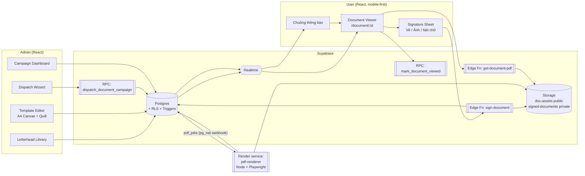
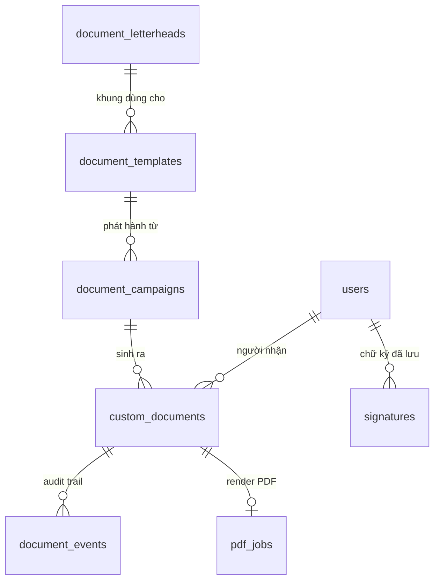
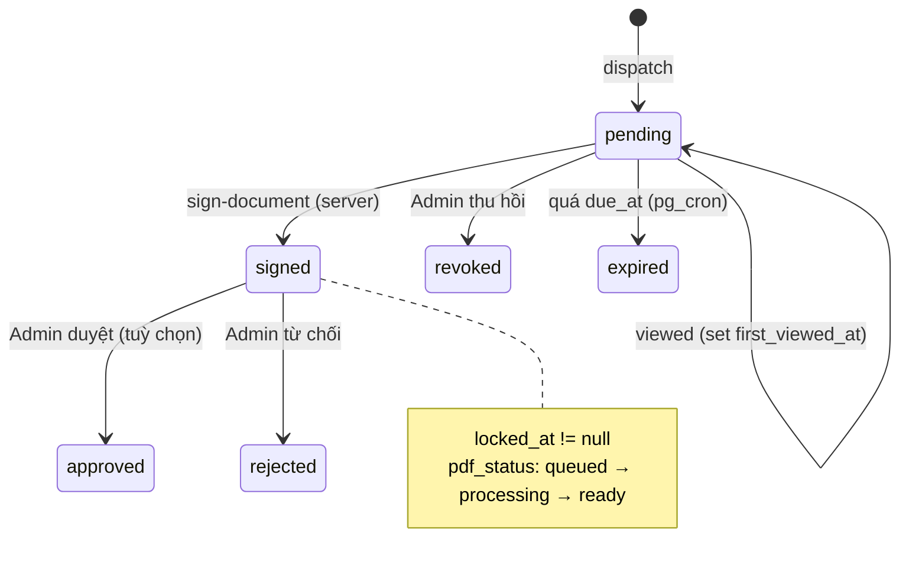

# Thiết kế Chi tiết: "Quản lý & Ký văn bản điện tử" trên Mẫu khung văn bản chuẩn (Generic Letterhead)

> Trạng thái: **Draft v1 — chờ review** · Phạm vi: Giai đoạn 2 của "E-Contract & Document e-Signing"
> Stack: Vite + React (JS), Supabase (Postgres + RLS + Realtime + Storage + Edge Functions), deploy Render.

---

## 0. Bối cảnh — cái gì ĐÃ CÓ, cái gì CÒN THIẾU

Spec này **mở rộng**, không thay thế, những thứ đã có trong repo:

| Thành phần hiện có | Vị trí | Đang làm gì | Sẽ thay đổi thế nào |
|---|---|---|---|
| Bảng `document_templates` | `supabase/migrations/20260928163353_document_templates.sql` | Mẫu dạng plain-text + placeholder `{{BIEN}}` | Thêm `letterhead_id`, `body_html`, `layout` (vị trí khung ký) |
| Bảng `custom_documents` | `supabase/migrations/20260928131024_custom_documents.sql` | 1 văn bản gửi 1 user; trạng thái `pending → signed → approved/rejected` | Thêm bản chụp đã render, hash, đường dẫn PDF, dữ liệu audit, liên kết đợt phát hành |
| Trigger `protect_custom_document_fields` | cùng file | User được tự ghi 3 cột chữ ký khi `pending` | **Siết lại**: user KHÔNG ghi trực tiếp nữa, chỉ ký qua Edge Function |
| `TemplateManager.jsx` | `src/components/admin/` | CRUD mẫu (textarea + danh sách biến) | Thay textarea bằng A4 Canvas editor + Inspector khung ký |
| `DocumentsTab.jsx` | `src/components/admin/` | Gửi 1 văn bản cho **1 user** | Thay bằng Dispatch Wizard: 1 user / nhóm / tất cả |
| `CustomDocumentView.jsx` | `src/components/documents/` | Render Quốc hiệu + nội dung + 2 cột ký (hard-code) | Tách thành `LetterheadRenderer` dùng chung cho Admin preview, User view, và PDF |
| `SignaturePicker.jsx` / `SignaturePad.jsx` | `src/components/signature/` | Tab Vẽ / Gõ tên / Đã lưu | Thêm tab **Tải ảnh**, chọn font, xuất PNG chuẩn hoá |
| `pages/Document.jsx` (`/document/:id`) | `src/pages/` | User xem + ký | Chuyển sang luồng chạm-vào-khung-ký + gọi Edge Function |
| `jspdf`, `html2canvas`, `react-quill` | `package.json` | Đã có sẵn | Tái sử dụng (Quill cho editor; jsPDF chỉ cho bản "xem nhanh" phía client) |

**Khoảng trống cần lấp:** (1) chưa có khái niệm *Letterhead* (Header/Quốc hiệu/Footer) tách khỏi nội dung; (2) chưa cấu hình được vị trí khung ký; (3) chưa gửi hàng loạt; (4) chưa có upload ảnh chữ ký; (5) chưa có PDF lưu trữ, hash, timestamp phía server; (6) chữ ký hiện do client tự ghi vào DB → không đủ tin cậy làm bằng chứng.

---

## 1. Mục tiêu & Ngoài phạm vi

### Mục tiêu
1. Admin soạn văn bản trên **khung chuẩn cố định** (Header thương hiệu + Quốc hiệu + Footer), chỉ tự do ở vùng thân.
2. Hỗ trợ **biến động** `{{user_name}}`, `{{date}}`, `{{notice_content}}`… được điền tự động theo từng người nhận.
3. Cấu hình **2 khung ký**: Người nhận (dưới-trái) và Bên phát hành (dưới-phải).
4. Phát hành tới **1 user / nhóm user / tất cả**.
5. User ký bằng **Vẽ tay / Tải ảnh / Tạo từ nét chữ**; hệ thống tự điền tên, chèn đúng bounding box.
6. Sau ký: **khoá read-only**, **timestamp phía server**, **xuất PDF** lưu Storage kèm **SHA-256**, có trang **nhật ký ký (audit trail)**.

### Ngoài phạm vi (v1)
- **Chữ ký số** có chứng thư CA / USB token / Remote Signing theo chuẩn PKI. Theo Luật Giao dịch điện tử 2023, luồng này là *chữ ký điện tử* (không phải *chữ ký số*) — giá trị pháp lý dựa trên việc chứng minh được danh tính người ký + tính toàn vẹn dữ liệu (hash + audit trail). Nếu cần giá trị pháp lý cao hơn, xem Giai đoạn 4 (PAdES + TSA).
- Nhiều người ký tuần tự (workflow nhiều bên) — thiết kế dữ liệu đã chừa chỗ (`layout.slots[]`) nhưng v1 chỉ có 1 người ký phía user.

---

## 2. Kiến trúc tổng quan



**Nguyên tắc thiết kế cốt lõi**

1. **Snapshot tại thời điểm phát hành.** Khi Admin bấm "Phát hành", nội dung đã thay biến được lưu cứng vào `custom_documents.rendered_html` + `content_sha256`. User luôn thấy đúng thứ đã gửi; sửa mẫu sau đó KHÔNG ảnh hưởng văn bản đã phát hành.
2. **Server là nguồn sự thật cho mọi thứ mang giá trị bằng chứng**: thời điểm ký (`now()` của Postgres), tên người ký (lấy từ bảng `users`, không lấy từ client), nội dung PDF (render từ snapshot trong DB, không nhận HTML từ client), hash.
3. **Một renderer duy nhất** (`LetterheadRenderer`) dùng cho Admin preview, User view và PDF renderer (cùng HTML/CSS) → WYSIWYG thật sự.
4. **Tái sử dụng tối đa** code/bảng đã có; mọi thay đổi schema tương thích ngược với dữ liệu Giai đoạn 1.

---

## 3. Mô hình bố cục văn bản (Layout Model)

### 3.1 Cấu trúc trang A4

```
┌──────────────────────── A4 · 210 × 297 mm · lề 20/15/20/25 ────────────────────────┐
│ [LOGO]  VINCLUB — tên đơn vị phát hành        │   CỘNG HÒA XÃ HỘI CHỦ NGHĨA VIỆT NAM   │  ← HEADER (letterhead, khoá)
│  Số: {{doc_no}}                               │      Độc lập - Tự do - Hạnh phúc       │
│                                               │  Hà Nội, ngày {{date}}                 │
├───────────────────────────────────────────────────────────────────────────────────────┤
│                         {{title}}  (TIÊU ĐỀ VĂN BẢN)                                 │
│                                                                                       │
│   Kính gửi: {{user_name}}                                                             │  ← BODY (Admin soạn tự do,
│   ...nội dung WYSIWYG... {{notice_content}} ...                                       │     Quill, có biến động)
│                                                                                       │
├───────────────────────────────────────────────────────────────────────────────────────┤
│  NGƯỜI NHẬN                               │              ĐẠI DIỆN BÊN PHÁT HÀNH        │  ← SIGNATURE ZONE
│  ┌─────────────────────────┐              │         ┌─────────────────────────┐        │     (luôn nằm sau body,
│  │  [slot: recipient]      │              │         │ [slot: issuer]          │        │      không bị tách trang)
│  │  chạm để ký             │              │         │ con dấu + chữ ký        │        │
│  └─────────────────────────┘              │         └─────────────────────────┘        │
│  {{user_name}}                            │          {{issuer_name}}                   │
│  Ký lúc: {{signed_at}}                    │          {{issuer_title}}                  │
├───────────────────────────────────────────────────────────────────────────────────────┤
│ VinClub · Hotline · địa chỉ · Mã VB {{doc_id}} · Trang x/y · SHA-256: {{hash8}}  [QR]  │  ← FOOTER (letterhead, khoá,
└───────────────────────────────────────────────────────────────────────────────────────┘     lặp mỗi trang)
```

### 3.2 Vì sao khung ký là "neo theo luồng" chứ không toạ độ tuyệt đối

Độ dài nội dung thay đổi theo từng người (biến `{{notice_content}}` có thể 2 dòng hoặc 2 trang). Toạ độ tuyệt đối trên trang sẽ đè lên chữ. Vì vậy:

- **Signature Zone** luôn được đặt **ngay sau body** trên **trang cuối**, có `break-inside: avoid` (nếu không đủ chỗ → cả khối nhảy sang trang mới).
- **Bên trong Zone**, mỗi slot được cấu hình bằng: cột (`left`/`right`), căn lề, kích thước box (mm), offset tinh chỉnh (mm), nhãn, có hiển thị tên/thời gian hay không.
- Khi render, frontend đo bounding box thật (`getBoundingClientRect` quy về mm của trang) và lưu vào `custom_documents.slot_boxes` lúc phát hành → PDF renderer và việc "chèn chữ ký đúng box" dùng số đo này.

### 3.3 Đơn vị & hệ toạ độ

- Đơn vị lưu trữ: **mm** (float, 1 chữ số thập phân), gốc toạ độ **góc trên-trái** của trang.
- Hiển thị trên màn hình: `scale = containerWidthPx / 210`; mọi phần tử vị trí tính `px = mm * scale`.
- In/PDF: CSS `@page { size: A4; margin: 0 }`, dùng trực tiếp đơn vị `mm`.

---

## 4. Data Schema

### 4.1 Sơ đồ quan hệ



### 4.2 Bảng mới: `document_letterheads` (Khung văn bản chung)

| Cột | Kiểu | Ghi chú |
|---|---|---|
| `id` | text PK | theo convention hiện tại (id text) |
| `name` | text | "Khung chuẩn VinClub 2026" |
| `is_default` | boolean | đúng 1 dòng `true` (partial unique index) |
| `header` | jsonb | `{ logo_url, org_name, org_sub, show_national_motto: true, doc_no_pattern: "VC/{{yyyy}}/{{seq}}", place: "Hà Nội" }` |
| `footer` | jsonb | `{ lines: ["VinClub · Hotline 1900…", "…"], show_page_number: true, show_hash: true, show_qr: true }` |
| `issuer` | jsonb | `{ name, title, seal_url, signature_url }` — ảnh con dấu/chữ ký đại diện, dùng cho slot `issuer` |
| `theme` | jsonb | `{ primary: "#948154", font_body: "Times New Roman", font_size_pt: 13, margins_mm: {top:20,right:15,bottom:25,left:20} }` |
| `status` | text | `draft \| published \| archived` |
| `version` | int | tăng mỗi lần publish |
| `created_by`, `created_date`, `updated_date` | | |

### 4.3 Mở rộng `document_templates`

| Cột mới | Kiểu | Ghi chú |
|---|---|---|
| `letterhead_id` | text FK → `document_letterheads.id` | NULL = dùng letterhead mặc định |
| `title_template` | text | ví dụ `"THÔNG BÁO V/v {{notice_subject}}"` |
| `body_html` | text | HTML từ Quill (đã sanitize). Cột `body` cũ giữ nguyên cho mẫu Giai đoạn 1 (plain-text) |
| `layout` | jsonb | cấu hình Signature Zone — xem 4.3.1 |
| `requires_signature` | boolean default true | false = chỉ là thông báo, không cần ký (vẫn có "Đã xem") |

`variables` (đã có) giữ nguyên định dạng mảng, mở rộng thêm field:

```json
[
  { "key": "notice_content", "label": "Nội dung thông báo", "type": "richtext", "scope": "campaign", "required": true },
  { "key": "deadline",       "label": "Hạn phản hồi",       "type": "date",     "scope": "campaign", "required": false },
  { "key": "amount",         "label": "Số tiền",            "type": "money",    "scope": "recipient", "required": false }
]
```

- `scope: "campaign"` → Admin nhập 1 lần cho cả đợt phát hành.
- `scope: "recipient"` → giá trị riêng từng người (nhập tay khi gửi 1 người, hoặc import CSV khi gửi nhóm).
- Biến **hệ thống** (không cần khai báo, luôn có): xem mục 5.

> **Tương thích:** `TemplateManager.jsx` hiện chuẩn hoá key thành CHỮ HOA (`normalizeVariableKey`). Quy ước mới: **so khớp không phân biệt hoa/thường**, key chuẩn lưu **snake_case chữ thường** (khớp ví dụ `{{user_name}}`). Mẫu cũ dùng `{{HO_TEN}}` vẫn render đúng.

#### 4.3.1 `document_templates.layout`

```json
{
  "page": { "size": "A4", "orientation": "portrait" },
  "signature_zone": {
    "placement": "after_body",
    "keep_together": true,
    "gap_top_mm": 8,
    "columns": 2
  },
  "slots": [
    {
      "id": "recipient",
      "role": "recipient",
      "column": "left",
      "align": "center",
      "heading": "NGƯỜI NHẬN",
      "hint": "(Ký, ghi rõ họ tên)",
      "box": { "w_mm": 60, "h_mm": 25, "offset_x_mm": 0, "offset_y_mm": 0 },
      "show_name": true,
      "show_signed_at": true,
      "required": true
    },
    {
      "id": "issuer",
      "role": "issuer",
      "column": "right",
      "align": "center",
      "heading": "ĐẠI DIỆN BÊN PHÁT HÀNH",
      "hint": "(Ký, đóng dấu)",
      "box": { "w_mm": 60, "h_mm": 30, "offset_x_mm": 0, "offset_y_mm": 0 },
      "fill": "auto_on_dispatch",
      "show_name": true
    }
  ]
}
```

- `issuer.fill`: `auto_on_dispatch` (chèn con dấu + chữ ký đại diện từ letterhead ngay khi phát hành — mặc định) | `after_recipient` (Admin ký sau khi user ký — dùng cho luồng duyệt `approved` hiện có).

### 4.4 Bảng mới: `document_campaigns` (Đợt phát hành)

| Cột | Kiểu | Ghi chú |
|---|---|---|
| `id` | text PK | |
| `template_id` | text FK | |
| `template_version` | int | chụp version lúc phát hành |
| `title` | text | tiêu đề đã điền biến campaign |
| `campaign_values` | jsonb | giá trị biến `scope=campaign` |
| `audience` | jsonb | xem bên dưới |
| `recipient_count` | int | số người nhận thực tế sau khi resolve |
| `due_at` | timestamptz null | hạn ký |
| `status` | text | `draft \| scheduled \| dispatching \| sent \| revoked` |
| `scheduled_at` | timestamptz null | phát hành hẹn giờ (pg_cron) |
| `created_by`, `created_date`, `dispatched_at` | | |

`audience` — một trong các dạng:

```json
{ "type": "user",  "user_ids": ["u_123"] }
{ "type": "users", "user_ids": ["u_1","u_2","u_3"], "per_recipient_values": { "u_1": { "amount": "5.000.000" } } }
{ "type": "segment", "filters": { "membership_tier": ["VIP 2 - Platinum"], "vip_level": ["VIP 3"], "is_locked": false, "created_before": "2026-09-01" } }
{ "type": "all", "exclude_locked": true }
```

> "Nhóm User" v1 dùng **segment động** theo các cột đã có trên `users` (`membership_tier`, `vip_level`, `is_locked`, `created_at`) + **danh sách chọn tay / import CSV**. Nếu sau này cần nhóm lưu sẵn, thêm bảng `user_groups` + `user_group_members` và audience `{ "type": "group", "group_ids": [...] }` — không ảnh hưởng phần còn lại.

### 4.5 Mở rộng `custom_documents`

| Cột mới | Kiểu | Ghi chú |
|---|---|---|
| `campaign_id` | text FK null | NULL với văn bản gửi lẻ kiểu cũ |
| `letterhead_snapshot` | jsonb | chụp nguyên header/footer/issuer/theme lúc phát hành |
| `layout_snapshot` | jsonb | chụp `layout` của mẫu |
| `rendered_html` | text | BODY đã thay biến + sanitize (snapshot bất biến) |
| `content_sha256` | text | SHA-256 của chuẩn hoá (`letterhead_snapshot` + `layout_snapshot` + `title` + `rendered_html`) |
| `doc_no` | text | số văn bản sinh theo `doc_no_pattern` (unique) |
| `requires_signature` | boolean | |
| `due_at` | timestamptz | |
| `delivered_at` / `first_viewed_at` | timestamptz | |
| `signer_name` | text | lấy từ `users.full_name` lúc ký (server) |
| `signature_method` | text | `draw \| upload \| typed \| saved` |
| `signature_path` | text | đường dẫn PNG chữ ký trong bucket private |
| `signature_meta` | jsonb | `{ typed_text, font, source_signature_id, width, height }` |
| `signed_ip`, `signed_user_agent` | text | |
| `consent_text` | text | câu đồng ý user đã tick (lưu nguyên văn) |
| `locked_at` | timestamptz | = `signed_at`; từ đây mọi UPDATE nội dung bị chặn |
| `pdf_status` | text | `none \| queued \| processing \| ready \| failed` |
| `pdf_path` | text | `signed-documents/{user_id}/{doc_id}.pdf` |
| `pdf_sha256` | text | hash file PDF cuối |
| `pdf_generated_at` | timestamptz | |

Máy trạng thái (giữ nguyên giá trị `status` cũ, thêm `revoked`/`expired`):



### 4.6 Bảng mới: `document_events` (Audit trail — append-only)

| Cột | Kiểu |
|---|---|
| `id` | bigint identity PK |
| `document_id` | text FK |
| `event` | text: `dispatched \| delivered \| viewed \| sign_started \| signed \| pdf_ready \| pdf_failed \| downloaded \| revoked \| approved \| rejected` |
| `actor_id` | text (user/admin id, `system`) |
| `ip`, `user_agent` | text |
| `data` | jsonb |
| `created_at` | timestamptz default `now()` |

RLS: SELECT own/admin; INSERT chỉ qua SECURITY DEFINER function / service role; **không có** policy UPDATE/DELETE.

### 4.7 Bảng mới: `pdf_jobs` (hàng đợi render)

`document_id` PK, `status`, `attempts`, `last_error`, `created_at`, `updated_at`. Trigger AFTER INSERT gọi `net.http_post` (pg_net) tới `pdf-renderer` với header bí mật; pg_cron quét job `queued` quá 2 phút để retry (tối đa 5 lần).

### 4.8 Storage

| Bucket | Public | Nội dung | Policy |
|---|---|---|---|
| `doc-assets` | ✔ | logo, con dấu, chữ ký đại diện (letterhead) | INSERT/UPDATE/DELETE: admin; đọc public |
| `signed-documents` | ✘ | `{user_id}/{doc_id}.pdf`, `{user_id}/{doc_id}.signature.png` | Không policy cho `authenticated` ghi; đọc qua **signed URL 5 phút** do Edge Function cấp |

`signatures` (bảng đã có, chữ ký đã lưu): giữ nguyên, thêm `extra.storage_path` khi user chọn "Lưu chữ ký này".

### 4.9 Migration SQL (bản nháp để review — CHƯA đặt vào `supabase/migrations/`)

```sql
-- 1) Letterhead
CREATE TABLE public.document_letterheads (
  id text PRIMARY KEY,
  name text NOT NULL DEFAULT '',
  is_default boolean NOT NULL DEFAULT false,
  header jsonb NOT NULL DEFAULT '{}'::jsonb,
  footer jsonb NOT NULL DEFAULT '{}'::jsonb,
  issuer jsonb NOT NULL DEFAULT '{}'::jsonb,
  theme  jsonb NOT NULL DEFAULT '{}'::jsonb,
  status text NOT NULL DEFAULT 'draft',
  version integer NOT NULL DEFAULT 1,
  created_by text,
  created_date timestamptz NOT NULL DEFAULT now(),
  updated_date timestamptz NOT NULL DEFAULT now()
);
CREATE UNIQUE INDEX uq_document_letterheads_default
  ON public.document_letterheads (is_default) WHERE is_default;
ALTER TABLE public.document_letterheads ENABLE ROW LEVEL SECURITY;
CREATE POLICY document_letterheads_admin_all ON public.document_letterheads
  FOR ALL TO authenticated
  USING (is_admin() AND NOT is_anon_session())
  WITH CHECK (is_admin() AND NOT is_anon_session());

-- 2) Template extensions
ALTER TABLE public.document_templates
  ADD COLUMN letterhead_id text REFERENCES public.document_letterheads(id),
  ADD COLUMN title_template text NOT NULL DEFAULT '',
  ADD COLUMN body_html text NOT NULL DEFAULT '',
  ADD COLUMN layout jsonb NOT NULL DEFAULT '{}'::jsonb,
  ADD COLUMN requires_signature boolean NOT NULL DEFAULT true;

-- 3) Campaigns
CREATE TABLE public.document_campaigns (
  id text PRIMARY KEY,
  template_id text NOT NULL REFERENCES public.document_templates(id),
  template_version integer NOT NULL,
  title text NOT NULL DEFAULT '',
  campaign_values jsonb NOT NULL DEFAULT '{}'::jsonb,
  audience jsonb NOT NULL,
  recipient_count integer NOT NULL DEFAULT 0,
  due_at timestamptz,
  status text NOT NULL DEFAULT 'draft',
  scheduled_at timestamptz,
  created_by text,
  created_date timestamptz NOT NULL DEFAULT now(),
  dispatched_at timestamptz
);
ALTER TABLE public.document_campaigns ENABLE ROW LEVEL SECURITY;
CREATE POLICY document_campaigns_admin_all ON public.document_campaigns
  FOR ALL TO authenticated
  USING (is_admin() AND NOT is_anon_session())
  WITH CHECK (is_admin() AND NOT is_anon_session());

-- 4) Document extensions
ALTER TABLE public.custom_documents
  ADD COLUMN campaign_id text REFERENCES public.document_campaigns(id),
  ADD COLUMN letterhead_snapshot jsonb,
  ADD COLUMN layout_snapshot jsonb,
  ADD COLUMN rendered_html text,
  ADD COLUMN content_sha256 text,
  ADD COLUMN doc_no text UNIQUE,
  ADD COLUMN requires_signature boolean NOT NULL DEFAULT true,
  ADD COLUMN due_at timestamptz,
  ADD COLUMN delivered_at timestamptz,
  ADD COLUMN first_viewed_at timestamptz,
  ADD COLUMN signer_name text,
  ADD COLUMN signature_method text,
  ADD COLUMN signature_path text,
  ADD COLUMN signature_meta jsonb NOT NULL DEFAULT '{}'::jsonb,
  ADD COLUMN signed_ip text,
  ADD COLUMN signed_user_agent text,
  ADD COLUMN consent_text text,
  ADD COLUMN locked_at timestamptz,
  ADD COLUMN pdf_status text NOT NULL DEFAULT 'none',
  ADD COLUMN pdf_path text,
  ADD COLUMN pdf_sha256 text,
  ADD COLUMN pdf_generated_at timestamptz;
CREATE INDEX idx_custom_documents_campaign ON public.custom_documents (campaign_id);

-- 5) Audit trail (append-only)
CREATE TABLE public.document_events (
  id bigint GENERATED ALWAYS AS IDENTITY PRIMARY KEY,
  document_id text NOT NULL REFERENCES public.custom_documents(id) ON DELETE CASCADE,
  event text NOT NULL,
  actor_id text,
  ip text,
  user_agent text,
  data jsonb NOT NULL DEFAULT '{}'::jsonb,
  created_at timestamptz NOT NULL DEFAULT now()
);
CREATE INDEX idx_document_events_doc ON public.document_events (document_id, created_at);
ALTER TABLE public.document_events ENABLE ROW LEVEL SECURITY;
CREATE POLICY document_events_select_own_or_admin ON public.document_events
  FOR SELECT TO authenticated
  USING ((is_admin() OR EXISTS (
            SELECT 1 FROM public.custom_documents d
            WHERE d.id = document_id AND d.user_id = (SELECT auth.uid())::text))
         AND NOT is_anon_session());
-- Không có policy INSERT/UPDATE/DELETE cho authenticated: chỉ ghi qua
-- SECURITY DEFINER function hoặc service role (Edge Function).

-- 6) Siết trigger bảo vệ: sau Giai đoạn 2, user KHÔNG tự ghi chữ ký trực tiếp.
--    Chữ ký chỉ được ghi bởi Edge Function (service role, bỏ qua RLS và
--    auth.uid() = NULL). Admin cũng không được sửa nội dung sau khi đã khoá.
CREATE OR REPLACE FUNCTION public.protect_custom_document_fields()
RETURNS trigger LANGUAGE plpgsql SECURITY DEFINER SET search_path TO 'public' AS $$
begin
  -- Service role (Edge Function / pdf-renderer): cho phép, nhưng vẫn không
  -- được thay đổi phần nội dung đã khoá.
  if old.locked_at is not null and (
       new.rendered_html   is distinct from old.rendered_html or
       new.content_sha256  is distinct from old.content_sha256 or
       new.title           is distinct from old.title or
       new.content         is distinct from old.content or
       new.signature_path  is distinct from old.signature_path or
       new.signed_at       is distinct from old.signed_at or
       new.signer_name     is distinct from old.signer_name) then
    raise exception 'document % is locked', old.id using errcode = '42501';
  end if;

  if auth.role() = 'service_role' then
    return new;
  end if;

  if public.is_admin() then
    -- Admin chỉ đổi được trạng thái duyệt / thu hồi sau khi phát hành
    if old.rendered_html is not null then
      new.rendered_html := old.rendered_html;
      new.content_sha256 := old.content_sha256;
      new.letterhead_snapshot := old.letterhead_snapshot;
      new.layout_snapshot := old.layout_snapshot;
    end if;
    return new;
  end if;

  -- User thường: không sửa được cột nào (ký đi qua Edge Function,
  -- đánh dấu đã xem đi qua RPC mark_document_viewed).
  return old;
end;
$$;
```

> ⚠️ **Chuyển tiếp:** trigger mới khiến `pages/Document.jsx` hiện tại (gọi `CustomDocument.update` để ký) ngừng hoạt động. Phải deploy Edge Function `sign-document` và sửa `Document.jsx` **trong cùng release** với migration (xem mục 10).

---

## 5. Biến động (Template Variables)

### 5.1 Danh mục biến hệ thống

| Biến | Nguồn | Thời điểm giải quyết |
|---|---|---|
| `{{user_name}}` | `users.full_name` → fallback `users.name` | Phát hành (snapshot) |
| `{{user_email}}`, `{{user_phone}}`, `{{user_identifier}}` | `users.*` | Phát hành |
| `{{id_card_number}}` | `users.id_card_number` (che bớt: `0012****789`) | Phát hành |
| `{{membership_tier}}`, `{{vip_level}}` | `users.*` | Phát hành |
| `{{date}}` | ngày phát hành, `dd/MM/yyyy` giờ `Asia/Ho_Chi_Minh` | Phát hành |
| `{{date_long}}` | "ngày 28 tháng 09 năm 2026" | Phát hành |
| `{{doc_no}}`, `{{doc_id}}` | sinh tự động | Phát hành |
| `{{title}}` | `title_template` đã điền | Phát hành |
| `{{issuer_name}}`, `{{issuer_title}}` | `letterhead.issuer` | Phát hành |
| `{{due_date}}` | `campaign.due_at` | Phát hành |
| `{{signed_at}}`, `{{signer_name}}` | server lúc ký | **Ký** (chỉ dùng trong Signature Zone / Footer) |
| `{{notice_content}}` và biến tuỳ chỉnh khác | khai báo trong `document_templates.variables` | Phát hành |

### 5.2 Thuật toán render (dùng chung FE + SQL/Edge)

```
resolve(template, campaign_values, recipient_values, user, system_ctx):
  values = merge(system_vars(user, system_ctx), campaign_values, recipient_values)   // phải-ghi-đè-trái
  for each {{ key }} in template (regex /\{\{\s*([a-zA-Z0-9_]+)\s*\}\}/g):
     k = lower(key)
     if k not in values:
         if variable(k).required → ERROR "Thiếu biến k" (chặn phát hành)
         else → ""   (không để lộ "{{...}}" cho user)
     v = values[k]
     if variable(k).type == "richtext" → sanitize_html(v)      // cho phép <b><i><u><p><ul><ol><li><br><a>
     else                              → escape_html(v)
  return sanitize_html(result)
```

- **Bảo mật (bắt buộc):** body là HTML và được hiển thị cho user → phải **sanitize 2 lớp**: lúc lưu mẫu và lúc render snapshot. Đề xuất thêm dependency `dompurify` (FE) và dùng cùng allow-list ở `pdf-renderer` (`isomorphic-dompurify`). Tuyệt đối không `dangerouslySetInnerHTML` chuỗi chưa sanitize.
- Đặt code render trong `src/lib/documentTemplate.js` (hàm thuần, có unit test Vitest) — thay `renderTemplateBody` hiện nằm trong `DocumentsTab.jsx`.

---

## 6. UI/UX — Phía Admin

Tất cả nằm trong tab **"Văn bản"** của trang Admin (thay `DocumentsTab`), chia 4 sub-tab: **Khung văn bản · Mẫu · Phát hành · Theo dõi**.

### 6.1 Khung văn bản (Letterhead Library)

- Danh sách card (thumbnail A4 thu nhỏ), badge `Mặc định` / `Nháp` / `Đã xuất bản`.
- Form sửa 2 cột: trái là form (Logo upload → `doc-assets`, Tên đơn vị, bật/tắt Quốc hiệu, mẫu số văn bản, nơi ban hành, dòng footer, ảnh con dấu + chữ ký đại diện, tên/chức vụ người đại diện, màu chủ đạo, font); phải là **preview A4 live** dùng `LetterheadRenderer` với nội dung giả.
- Upload con dấu: chấp nhận PNG nền trong suốt; nếu là JPG, tự động xoá nền trắng (xem 7.4) và cảnh báo.

### 6.2 Trình soạn Mẫu (Template Editor) — bố cục 3 cột

```
┌──────────────┬───────────────────────────────────────────┬──────────────────────┐
│ BIẾN         │           A4 CANVAS (zoom 50–150%)          │ INSPECTOR            │
│              │  ┌───────────────────────────────────────┐  │                      │
│ Hệ thống     │  │ HEADER (xám mờ, khoá 🔒)               │  │ ▸ Mẫu                │
│ • user_name  │  ├───────────────────────────────────────┤  │   Tên, Danh mục,     │
│ • date       │  │ Tiêu đề: [THÔNG BÁO V/v {{…}}]         │  │   Khung văn bản ▼    │
│ • doc_no     │  │                                       │  │   ☑ Yêu cầu ký       │
│ Tuỳ chỉnh    │  │  Quill editor (vùng soạn tự do)        │  │                      │
│ • notice_…   │  │  Kính gửi: [user_name] ← chip biến      │  │ ▸ Khung ký (chọn slot│
│ + Thêm biến  │  │                                       │  │   trên canvas)        │
│              │  ├───────────────────────────────────────┤  │   Cột: Trái | Phải   │
│ Khối nhanh   │  │ ┌ recipient ┐        ┌ issuer ┐        │  │   Rộng/Cao (mm)      │
│ • Kính gửi   │  │ │ ⬚ kéo/ co  │        │ ⬚       │        │  │   Lệch X/Y (mm)      │
│ • Căn cứ     │  │ └───────────┘        └─────────┘        │  │   Tiêu đề, gợi ý     │
│ • Nơi nhận   │  ├───────────────────────────────────────┤  │   ☑ Hiện tên          │
│              │  │ FOOTER (xám mờ, khoá 🔒)               │  │   ☑ Hiện giờ ký       │
│              │  └───────────────────────────────────────┘  │   Bên PH: Tự động ▼  │
└──────────────┴───────────────────────────────────────────┴──────────────────────┘
 [Xem trước với user mẫu ▼]   [Lưu nháp]   [Xuất bản v3]
```

Chi tiết tương tác:

- **Chèn biến**: kéo chip từ panel trái vào editor, hoặc gõ `{{` → dropdown autocomplete. Trong Quill, biến hiển thị dạng **chip màu** (custom Blot `VariableBlot`, lưu ra HTML là `<span data-var="user_name">{{user_name}}</span>`) → không bị gõ vỡ một nửa.
- **Header/Footer**: hiển thị nhưng không chọn/sửa được (overlay `pointer-events: none`, icon 🔒, tooltip "Sửa trong Khung văn bản").
- **Khung ký**: 2 khung nét đứt có nhãn; click để chọn → Inspector hiện thuộc tính. Kéo cạnh để đổi kích thước (snap 1 mm, giữ trong cột); kéo thân để đổi offset (giới hạn ±20 mm). Nút preset: "Dưới-trái / Dưới-phải (mặc định)", "Đổi bên".
- **Xem trước**: dropdown chọn 1 user thật (hoặc "User mẫu") → toàn trang render qua đúng `LetterheadRenderer` + `resolve()`; biến thiếu hiện nền đỏ nhạt.
- **Kiểm tra trước khi xuất bản** (chặn nếu lỗi): biến dùng trong body nhưng chưa khai báo; biến khai báo `required` mà không dùng (cảnh báo); HTML vượt 200 KB; có slot `recipient` khi `requires_signature = true`.
- **Versioning**: sửa mẫu đã xuất bản → tạo bản nháp mới; "Xuất bản" tăng `version`. Văn bản đã phát hành không bị ảnh hưởng (snapshot).
- Autosave nháp dùng hook đã có `useAutoSaveDraft`.

### 6.3 Phát hành — Dispatch Wizard (4 bước, stepper ngang)

1. **Chọn mẫu** — lưới card mẫu `published`, lọc theo danh mục.
2. **Nội dung** — form sinh tự động từ biến `scope=campaign` (richtext → mini Quill, date → date picker, money → input định dạng `1.000.000`). Tiêu đề đợt, hạn ký (`due_at`), bật/tắt nhắc nhở.
3. **Người nhận** — Segmented control: **Một người | Nhóm | Tất cả**
   - *Một người*: ô tìm kiếm (tên/email/SĐT/identifier), dùng lại pattern tìm user của `DocumentsTab`; nếu mẫu có biến `scope=recipient` → hiện form nhập ngay.
   - *Nhóm*: bộ lọc (Hạng thành viên, VIP level, Ngày tham gia, Bỏ tài khoản bị khoá) **và/hoặc** chọn tay nhiều người (checkbox list) **và/hoặc** Import CSV (`user_id|email, <biến recipient>...`) có bảng validate dòng lỗi.
   - *Tất cả*: hiển thị số lượng + cảnh báo màu cam.
   - Luôn hiển thị **"Sẽ gửi tới N người"** (RPC `count_campaign_audience`).
4. **Xem lại & gửi** — preview 3 người ngẫu nhiên (tab chuyển qua lại), tóm tắt; nút **"Phát hành ngay"** hoặc **"Hẹn giờ"**. Với N > 50: modal xác nhận gõ lại số N.

### 6.4 Theo dõi (Campaign Dashboard)

- Bảng đợt phát hành: Tiêu đề, Mẫu, Ngày, N người, thanh tiến độ **Đã gửi / Đã xem / Đã ký / Có PDF**, Hạn.
- Chi tiết đợt: bảng từng người (trạng thái, thời điểm xem/ký, IP, nút Xem PDF, nút Nhắc lại, Thu hồi), bộ lọc trạng thái, **Xuất CSV**.
- Hành động hàng loạt: Nhắc người chưa ký · Thu hồi phần chưa ký · Duyệt tất cả đã ký.
- Realtime: subscribe `custom_documents` filter `campaign_id=eq.X` để số liệu tự nhảy.

---

## 7. UI/UX — Phía User (mobile-first)

### 7.1 Nhận thông báo

- Khi phát hành: tạo 1 dòng `notifications` **per-user** (`user_id = <id>`, `type = 'document'`, `extra = { document_id, requires_signature, due_at }`) → hiện trên chuông (`NotificationBell`) + push (hạ tầng push đã có). Chạm → điều hướng `/document/:id`.
  - Lý do dùng chuông thay vì kênh CSKH (`notifyUser`): văn bản là tác vụ cần hành động, cần badge & deep link; tránh làm ngập khung chat.
- Trang Hồ sơ → "Văn bản của tôi" (`DocumentList.jsx` đã có): thêm tab **Cần ký (badge số) / Đã ký / Tất cả**.

### 7.2 Màn Xem văn bản `/document/:id`

```
┌─────────────────────────────┐
│ ←  Thông báo V/v …    ⋮     │  ← header dính; ⋮: Tải PDF (khi đã có), Chia sẻ
├─────────────────────────────┤
│ 🟠 Cần ký trước 05/10/2026   │  ← banner trạng thái
├─────────────────────────────┤
│ ┌─────────────────────────┐ │
│ │  A4 thu nhỏ theo chiều  │ │  ← pinch-zoom / double-tap (tái dùng PanZoomImage logic)
│ │  rộng màn hình          │ │
│ │  …nội dung…             │ │
│ │ ┌──────────┐            │ │
│ │ │ ✍ Chạm   │  [con dấu]  │ │  ← slot recipient: viền nét đứt màu primary,
│ │ │  để ký   │            │ │     hiệu ứng pulse nhẹ
│ │ └──────────┘            │ │
│ └─────────────────────────┘ │
├─────────────────────────────┤
│ [   ✍  Ký văn bản   ]        │  ← CTA dính đáy; bấm = cuộn tới slot + mở sheet
└─────────────────────────────┘
```

- Lần đầu mở → gọi RPC `mark_document_viewed` (ghi `first_viewed_at` + event `viewed`).
- Trạng thái trống/lỗi: skeleton khi tải; "Văn bản đã bị thu hồi"; "Đã quá hạn ký — liên hệ CSKH" (nút mở Support).
- Nếu `requires_signature = false`: CTA thành **"Tôi đã đọc"**.

### 7.3 Pop-up ký (Bottom Sheet — dùng `vaul` Drawer đã có)

```
┌─────────────────────────────────────┐
│  Ký văn bản                     ✕   │
│  [ Vẽ tay | Tải ảnh | Nét chữ | Đã lưu ]
│ ┌─────────────────────────────────┐ │
│ │                                 │ │  ← canvas tỉ lệ = tỉ lệ slot (w/h),
│ │         (vùng ký)               │ │     đường baseline mờ
│ │ ─────────────────────────────── │ │
│ └─────────────────────────────────┘ │
│  ↺ Hoàn tác   🗑 Xoá   ● ● ● (màu mực) │
│  ☐ Lưu chữ ký này cho lần sau        │
│  ☐ Tôi đã đọc, hiểu và đồng ý với    │
│     toàn bộ nội dung văn bản trên.   │
│  [        Xác nhận ký        ]       │  ← disabled tới khi có chữ ký + tick đồng ý
└─────────────────────────────────────┘
```

**Tab Vẽ tay** — mở rộng `SignaturePad.jsx`:
- Pointer Events (hỗ trợ bút/touch/chuột), nét mượt (quadratic Bézier), độ dày theo vận tốc; `devicePixelRatio` scaling; `touch-action: none` để không cuộn trang.
- Hoàn tác từng nét (stack stroke); 3 màu mực: đen, xanh đậm `#1a3c8f`, nâu primary.
- Gợi ý xoay ngang trên điện thoại (nút "Toàn màn hình").
- Kiểm tra tối thiểu: ≥ 1 nét và bounding box nét ≥ 15% chiều rộng vùng.

**Tab Tải ảnh** (mới):
- Nhận JPG/PNG/HEIC ≤ 5 MB; tái dùng `src/lib/imageCompression.js`.
- Bước xử lý phía client: crop (khung cố định theo tỉ lệ slot) → chuyển grayscale → **xoá nền** (pixel có độ sáng > ngưỡng 200 → alpha 0, có slider ngưỡng) → trim viền trong suốt → preview trên nền caro.
- Xuất PNG trong suốt tối đa 1200 × 400 px.

**Tab Nét chữ** (mới, thay tab "Gõ tên"):
- Mặc định điền sẵn `user.full_name` (sửa được), hiển thị 4 kiểu font chữ ký (Great Vibes — đã dùng, Dancing Script, Allura, Pacifico — nhớ subset `vietnamese` trên Google Fonts); chạm để chọn.
- Render ra **PNG** bằng `<canvas>` (đảm bảo PDF giống hệt, không phụ thuộc font máy chủ); lưu kèm `signature_meta.typed_text` + `font`.

**Tab Đã lưu**: lưới chữ ký trong bảng `signatures`; chạm để dùng.

**Sau khi bấm "Xác nhận ký":**
1. Sheet đóng; slot hiển thị ngay chữ ký (optimistic) + tên người dùng bên dưới + "Đang niêm phong…" spinner.
2. Gọi `POST /functions/v1/sign-document`.
3. Thành công → chữ ký + tên (lấy từ response server) + "Ký lúc 14:32:05 28/09/2026 (GMT+7)"; watermark nhẹ **"ĐÃ KÝ"** chéo trang; CTA đổi thành **"Tải PDF"** (disabled + "Đang tạo PDF…" tới khi `pdf_status = ready`, cập nhật qua Realtime).
4. Lỗi → rollback optimistic, toast lỗi cụ thể (hết hạn / đã thu hồi / mạng) + nút Thử lại (idempotent, xem 8.3).
5. Haptic nhẹ (`navigator.vibrate(20)`) + âm `soundFx` nếu bật.

### 7.4 Quy tắc "chèn chữ ký đúng Bounding Box"

```
box = slot.box (mm) ; img = PNG chữ ký đã trim (w_px, h_px)
padding = 2mm ; name_band = show_name ? 6mm : 0 ; time_band = show_signed_at ? 4mm : 0
avail_w = box.w - 2*padding ; avail_h = box.h - 2*padding - name_band - time_band
scale = min(avail_w / w_px, avail_h / h_px)            // contain, giữ tỉ lệ
draw_w = w_px*scale ; draw_h = h_px*scale
x = box.x + (box.w - draw_w)/2                          // căn giữa ngang
y = box.y + padding + (avail_h - draw_h)                // bám đáy vùng ảnh (chữ ký "ngồi" trên dòng tên)
name → căn giữa, dưới ảnh, font đậm 11pt, cắt "…" nếu dài
time → dưới tên, 8pt, màu xám
```

Cùng một hàm (`src/lib/signatureBox.js`) được dùng ở FE preview và `pdf-renderer` (copy file hoặc package dùng chung) → vị trí trùng khớp tuyệt đối.

### 7.5 Khả năng truy cập & i18n
- Slot ký là `<button aria-label="Ký tên tại đây">`; hỗ trợ bàn phím (Enter mở sheet).
- Tương phản ≥ 4.5:1 cho chữ; vùng chạm ≥ 44 × 44 px.
- Chuỗi UI đặt trong `src/locales/localesData.js` như các màn khác.

---

## 8. API & Workflow

### 8.1 Danh sách endpoint

| # | Tên | Loại | Ai gọi | Mô tả |
|---|---|---|---|---|
| A1 | `document_letterheads`, `document_templates` CRUD | PostgREST (qua `base44.entities.*`) | Admin | RLS admin-only |
| A2 | `count_campaign_audience(p_audience jsonb) → int` | RPC, SECURITY DEFINER, admin-only | Admin | Đếm người nhận cho wizard |
| A3 | `dispatch_document_campaign(p_campaign_id text) → jsonb` | RPC, SECURITY DEFINER, admin-only | Admin | Resolve audience, sinh `custom_documents` + `notifications` + events |
| A4 | `revoke_document_campaign(p_campaign_id text, p_only_unsigned bool)` | RPC | Admin | Thu hồi |
| A5 | `remind_document_campaign(p_campaign_id text)` | RPC | Admin | Tạo lại notification cho người chưa ký |
| U1 | `custom_documents` SELECT | PostgREST | User | RLS own |
| U2 | `mark_document_viewed(p_document_id text)` | RPC, SECURITY DEFINER | User | Ghi `first_viewed_at` 1 lần + event |
| U3 | `POST /functions/v1/sign-document` | Edge Function (Deno) | User | Ký + khoá + xếp job PDF |
| U4 | `GET /functions/v1/get-document-pdf?id=` | Edge Function | User/Admin | Trả signed URL 5 phút + event `downloaded` |
| S1 | `POST {PDF_RENDERER_URL}/render` | Render service (Node) | pg_net / cron | Render PDF, upload, cập nhật DB |
| P1 | `/verify/:doc_no` | Trang public (React) + RPC `verify_document(p_doc_no, p_sha256)` | Bất kỳ ai | Kiểm tra tính toàn vẹn (chỉ trả Đúng/Sai + ngày ký, không lộ nội dung) |

### 8.2 Luồng Phát hành (Admin)

```mermaid
sequenceDiagram
  autonumber
  actor A as Admin
  participant FE as Admin UI
  participant DB as Postgres
  A->>FE: Hoàn tất Wizard, bấm "Phát hành"
  FE->>DB: insert document_campaigns (status=draft)
  FE->>DB: rpc dispatch_document_campaign(id)
  activate DB
  DB->>DB: kiểm is_admin(); lock campaign FOR UPDATE; status=dispatching
  DB->>DB: resolve audience → danh sách users
  loop mỗi user (INSERT ... SELECT, theo lô 500)
    DB->>DB: render biến → rendered_html (hàm SQL render_template)
    DB->>DB: content_sha256 = sha256(canonical json)
    DB->>DB: insert custom_documents (status=pending, doc_no, snapshots)
    DB->>DB: insert notifications (type=document, extra.document_id)
    DB->>DB: insert document_events (dispatched)
  end
  DB->>DB: campaign.status=sent, recipient_count, dispatched_at
  deactivate DB
  DB-->>FE: { recipient_count, failed: [] }
  DB-->>FE: Realtime → dashboard cập nhật
```

Ghi chú hiện thực:
- Việc thay biến có thể làm **ở SQL** (hàm `render_template(text, jsonb)` dùng `regexp_replace` + escape) để phát hành "Tất cả" chỉ tốn 1 round-trip. Biến `richtext` scope campaign được FE sanitize trước khi gửi, SQL chỉ chèn nguyên; biến scope recipient/hệ thống luôn escape trong SQL.
- Với "Tất cả" số lượng lớn (> 5.000): RPC chỉ đặt `status=scheduled`, pg_cron job chạy theo lô để tránh timeout statement.
- Idempotent: unique `(campaign_id, user_id)` trên `custom_documents` + `ON CONFLICT DO NOTHING`.
- `doc_no`: sequence riêng `document_no_seq`, định dạng theo `header.doc_no_pattern`.

### 8.3 Luồng Ký (User) — trọng tâm

```mermaid
sequenceDiagram
  autonumber
  actor U as User
  participant FE as /document/:id
  participant EF as Edge Fn sign-document
  participant DB as Postgres
  participant ST as Storage
  participant PR as pdf-renderer
  U->>FE: Chạm khung ký → vẽ/tải/nét chữ → tick đồng ý → Xác nhận ký
  FE->>EF: POST {document_id, method, image_png_base64, typed_text?, font?, consent:true, content_sha256, idempotency_key}
  EF->>EF: verify JWT → user_id
  EF->>DB: SELECT ... FOR UPDATE custom_documents WHERE id AND user_id
  alt đã ký với cùng idempotency_key
    EF-->>FE: 200 (trả kết quả cũ)
  else status != pending / revoked / quá due_at
    EF-->>FE: 409 {code}
  else content_sha256 lệch
    EF-->>FE: 409 DOCUMENT_CHANGED (user đang xem bản cũ → tải lại)
  end
  EF->>EF: validate PNG (magic bytes, ≤ 500 KB, ≤ 2000×1000, không rỗng)
  EF->>ST: upload signed-documents/{uid}/{id}.signature.png
  EF->>DB: UPDATE: signature_*, signer_name=users.full_name, signed_at=now(), locked_at=now(), status=signed, ip, UA, consent_text, pdf_status=queued
  EF->>DB: insert document_events(signed), insert pdf_jobs(queued)
  EF-->>FE: 200 {signed_at, signer_name, pdf_status:"queued"}
  DB-)PR: pg_net POST /render {document_id}
  PR->>DB: đọc snapshot + chữ ký (service role)
  PR->>PR: HTML (LetterheadRenderer SSR) → Chromium → PDF A4 + trang Audit
  PR->>PR: pdf_sha256
  PR->>ST: upload {uid}/{id}.pdf
  PR->>DB: pdf_status=ready, pdf_path, pdf_sha256, pdf_generated_at; event pdf_ready
  DB-)FE: Realtime UPDATE → nút "Tải PDF" sáng
  U->>FE: Tải PDF
  FE->>EF: GET get-document-pdf?id
  EF-->>FE: signed URL (5 phút)
```

**Request/Response mẫu — `sign-document`**

```http
POST /functions/v1/sign-document
Authorization: Bearer <user JWT>
Content-Type: application/json

{
  "document_id": "doc_01J9Z…",
  "idempotency_key": "b2f1c9e4-…",          // uuid sinh 1 lần mỗi lần mở sheet
  "method": "draw",                          // draw | upload | typed | saved
  "image_png_base64": "iVBORw0KGgoAAA…",
  "typed_text": null,
  "font": null,
  "saved_signature_id": null,
  "save_for_later": true,
  "consent": true,
  "content_sha256": "9f2c…e1"               // hash văn bản user đang nhìn thấy
}
```

```json
200 OK
{
  "document_id": "doc_01J9Z…",
  "status": "signed",
  "signer_name": "Nguyễn Văn A",
  "signed_at": "2026-09-28T07:32:05.114Z",
  "signature_url": "https://…/signed-documents/…?token=… (signed, 5 phút)",
  "pdf_status": "queued"
}
```

Mã lỗi: `401 UNAUTHENTICATED`, `403 NOT_OWNER`, `404 NOT_FOUND`, `409 ALREADY_SIGNED | REVOKED | EXPIRED | DOCUMENT_CHANGED`, `422 INVALID_SIGNATURE_IMAGE | CONSENT_REQUIRED`, `429 RATE_LIMITED` (5 lần/phút/user), `500`.

### 8.4 pdf-renderer (dịch vụ Render)

- Node 20 + Playwright Chromium (Render Docker service; image `mcr.microsoft.com/playwright`). Endpoint `POST /render` xác thực bằng header `X-Renderer-Secret`.
- Render HTML bằng **chính component React** (`LetterheadRenderer`) qua `react-dom/server` + CSS in (Tailwind build riêng cho print) → `page.pdf({ format: 'A4', printBackground: true, preferCSSPageSize: true })`.
- Font nhúng: Times New Roman thay thế bằng **Tinos**/**Noto Serif** (hỗ trợ tiếng Việt, license mở) — cài trong image, không tải từ mạng lúc render.
- PDF gồm: các trang văn bản + **trang cuối "Chứng nhận ký điện tử"**: mã VB, `doc_no`, `content_sha256`, bảng sự kiện (phát hành / xem / ký: thời gian GMT+7, IP, thiết bị), QR tới `/verify/:doc_no`.
- Metadata PDF: Title, Author=VinClub, Subject=doc_no, Keywords=content_sha256; bật PDF permissions chỉ in (không bảo mật thực sự, chỉ tín hiệu).
- Retry: lỗi → `attempts++`, `pdf_status=failed` sau 5 lần + alert Admin (tái dùng hạ tầng admin push notification).

**Phương án dự phòng (nếu chưa dựng được service Render):** Edge Function dùng `pdf-lib` vẽ từ dữ liệu có cấu trúc — chỉ hỗ trợ tập con định dạng (đoạn, đậm/nghiêng, danh sách). Không khuyến nghị lâu dài vì lệch WYSIWYG. **Không** dùng `html2canvas + jsPDF` phía client làm bản lưu trữ (client có thể sửa DOM trước khi chụp); chỉ dùng cho nút "Tải bản xem nhanh" trước khi ký.

### 8.5 Tính toàn vẹn & timestamp

| Cơ chế | v1 | Giai đoạn 4 (tuỳ chọn) |
|---|---|---|
| Thời điểm ký | `now()` Postgres (UTC) hiển thị GMT+7 | RFC 3161 TSA timestamp token |
| Chống sửa nội dung | snapshot + `content_sha256` + trigger khoá | — |
| Chống sửa file PDF | `pdf_sha256` lưu DB + trang verify | Ký số PDF (PAdES-B-T) bằng chứng thư tổ chức |
| Bằng chứng người ký | JWT session, IP, UA, consent text, audit events | OTP SMS/email xác nhận trước khi ký |

---

## 9. Bảo mật — Checklist

- [ ] RLS mọi bảng mới; không policy ghi cho `authenticated` ở `document_events`, `pdf_jobs`, bucket `signed-documents`.
- [ ] Trigger khoá nội dung sau `locked_at` áp dụng **cả admin** (mục 4.9).
- [ ] Sanitize HTML 2 lớp (lưu mẫu + render snapshot), allow-list tag/attr; chặn `javascript:` URL, `style` chỉ cho `text-align`.
- [ ] Edge Function lấy `user_id` từ JWT, **không** từ body; `signer_name` từ DB.
- [ ] Validate ảnh chữ ký bằng magic bytes + giải mã thử; không nhận SVG.
- [ ] Signed URL ngắn hạn (5 phút); không bao giờ public bucket chứa PDF đã ký.
- [ ] Rate limit ký; idempotency key.
- [ ] `id_card_number` hiển thị che bớt trong văn bản.
- [ ] Secret `PDF_RENDERER_SECRET`, `SUPABASE_SERVICE_ROLE_KEY` chỉ trong Edge Function/Render env, không vào bundle Vite.
- [ ] RPC SECURITY DEFINER đặt `SET search_path = public` + `REVOKE EXECUTE ... FROM anon` (theo pattern `harden_rpc_execute_grants` đã có).

---

## 10. Kế hoạch triển khai (ticket cho đội Dev)

Mỗi mục ≈ 1 PR. Ước lượng theo ngày-người (d).

| # | Ticket | Phụ thuộc | Ước lượng |
|---|---|---|---|
| **Sprint 1 — Nền tảng** ||||
| T1 | Migration: letterheads, mở rộng templates/documents, campaigns, events, pdf_jobs, buckets, RLS (chưa đổi trigger) | — | 1.5d |
| T2 | `src/lib/documentTemplate.js` (resolve/escape/sanitize, case-insensitive key) + Vitest; thêm `dompurify` | — | 1d |
| T3 | `LetterheadRenderer` + `signatureBox.js` (A4, mm, scale, print CSS) thay phần khung trong `CustomDocumentView` | T2 | 2d |
| T4 | Admin: Letterhead Library (CRUD + upload `doc-assets` + preview) | T1, T3 | 1.5d |
| **Sprint 2 — Soạn & phát hành** ||||
| T5 | Template Editor 3 cột: Quill + VariableBlot + panel biến + preview user mẫu | T3 | 3d |
| T6 | Inspector & kéo/resize khung ký trên canvas, lưu `layout` | T5 | 2d |
| T7 | RPC `render_template`, `count_campaign_audience`, `dispatch_document_campaign`, `revoke`, `remind` + test SQL | T1 | 2.5d |
| T8 | Dispatch Wizard 4 bước (1 người / nhóm / tất cả / CSV) | T7 | 2.5d |
| T9 | Campaign Dashboard + realtime + xuất CSV | T7 | 1.5d |
| **Sprint 3 — Ký & PDF** ||||
| T10 | Signature Sheet: nâng cấp Pad (undo, màu, DPR), tab Tải ảnh (crop/xoá nền), tab Nét chữ (4 font → PNG) | — | 3d |
| T11 | Edge Function `sign-document` + `get-document-pdf` + RPC `mark_document_viewed` | T1 | 2d |
| T12 | Trang `/document/:id` mới (slot chạm-để-ký, optimistic, realtime pdf_status) **+ migration đổi trigger** (release cùng T11) | T3, T10, T11 | 2d |
| T13 | Service `pdf-renderer` trên Render (Dockerfile, SSR renderer, fonts, trang Audit, QR) + pg_net trigger + cron retry | T3, T11 | 3d |
| T14 | Trang public `/verify/:doc_no` + RPC `verify_document` | T13 | 1d |
| T15 | Notification type `document` trên chuông + tab "Cần ký" trong `DocumentList` | T7 | 1d |
| **Sprint 4 — Hoàn thiện** ||||
| T16 | pg_cron: hết hạn (`expired`), nhắc trước hạn 24h, dispatch theo lô | T7 | 1d |
| T17 | Migrate dữ liệu Giai đoạn 1: văn bản `pending` cũ → sinh `rendered_html` từ `content` (escape + `<br>`), gán letterhead mặc định | T1 | 0.5d |
| T18 | QA E2E (Playwright), kiểm thử bảo mật, tài liệu vận hành | tất cả | 2d |

**Tổng ≈ 34 ngày-người** (~4 sprint 1 tuần với 2 FE + 1 BE).

---

## 11. Tiêu chí nghiệm thu & Test cases

### Admin
1. Tạo letterhead, đặt mặc định → mọi mẫu không chọn khung dùng khung này.
2. Chèn `{{user_name}}`, `{{date}}`, `{{notice_content}}` qua chip; preview với user thật hiển thị đúng giá trị; biến thiếu bị tô đỏ & chặn phát hành nếu `required`.
3. Kéo khung ký recipient rộng 70 mm; preview & PDF thể hiện đúng 70 mm (sai số ≤ 0.5 mm).
4. Phát hành "Nhóm VIP 3" → đúng N văn bản, N notification, dashboard đếm N.
5. Sửa mẫu sau khi phát hành → văn bản đã gửi **không** đổi.
6. Admin cố UPDATE `rendered_html` của văn bản đã ký qua API → lỗi `42501`.

### User
7. Nhận thông báo → chạm → mở đúng văn bản; `first_viewed_at` ghi 1 lần.
8. Ký bằng mỗi phương thức (vẽ / ảnh JPG nền trắng / nét chữ / đã lưu) → chữ ký nằm gọn trong box, tên user hiện dưới chữ ký, giờ ký theo GMT+7.
9. Bấm "Xác nhận ký" 2 lần liên tiếp / mất mạng rồi thử lại → chỉ 1 lần ký (idempotent).
10. User gọi thẳng PostgREST UPDATE `signature_content` → bị bỏ qua (trigger trả `old`).
11. Sau ký: UI read-only, không mở lại sheet; PDF sẵn sàng trong ≤ 15 s (p95); SHA-256 file tải về khớp `pdf_sha256` và trang `/verify`.
12. Văn bản đã thu hồi / quá hạn → không ký được, thông báo rõ ràng.
13. User A không đọc được văn bản / PDF / event của user B (RLS + signed URL).

### Phi chức năng
- Phát hành 10.000 người < 60 s (theo lô), không timeout.
- Trang xem văn bản LCP < 2.5 s trên 4G; A4 hiển thị sắc nét trên màn 360 px.
- Vitest cho `documentTemplate.js`, `signatureBox.js` (≥ 90% branch).

---

## 12. Câu hỏi mở (cần Product chốt)

1. Bên phát hành ký **tự động lúc phát hành** (con dấu + chữ ký scan) hay **Admin ký sau** khi user ký? Spec mặc định: tự động; chế độ "ký sau" gắn với bước `approved` hiện có.
2. Có cần **OTP** xác nhận trước khi ký (tăng giá trị bằng chứng) không?
3. Thời hạn lưu trữ PDF (theo quy định lưu trữ chứng từ điện tử — đề xuất ≥ 10 năm) và chính sách xoá khi user xoá tài khoản.
4. Có cần nhóm user **lưu sẵn** (bảng `user_groups`) ngay v1, hay segment động + CSV là đủ?
5. Có dựng được service Docker trên Render cho `pdf-renderer` không (chi phí ~ gói Starter), hay chấp nhận phương án `pdf-lib` rút gọn?
