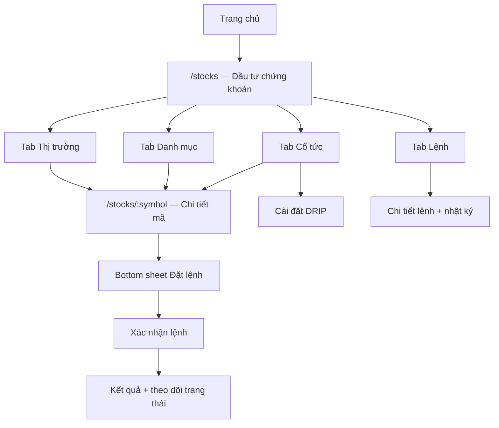
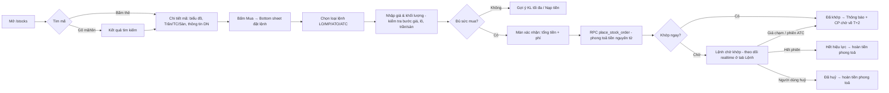
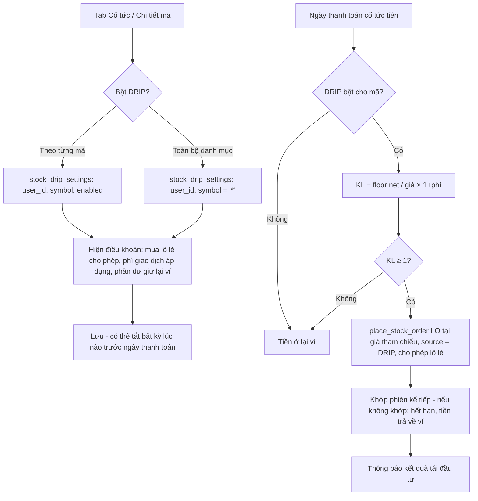
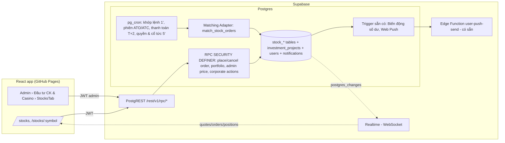
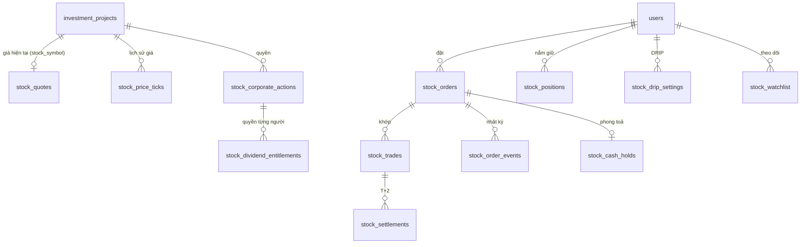
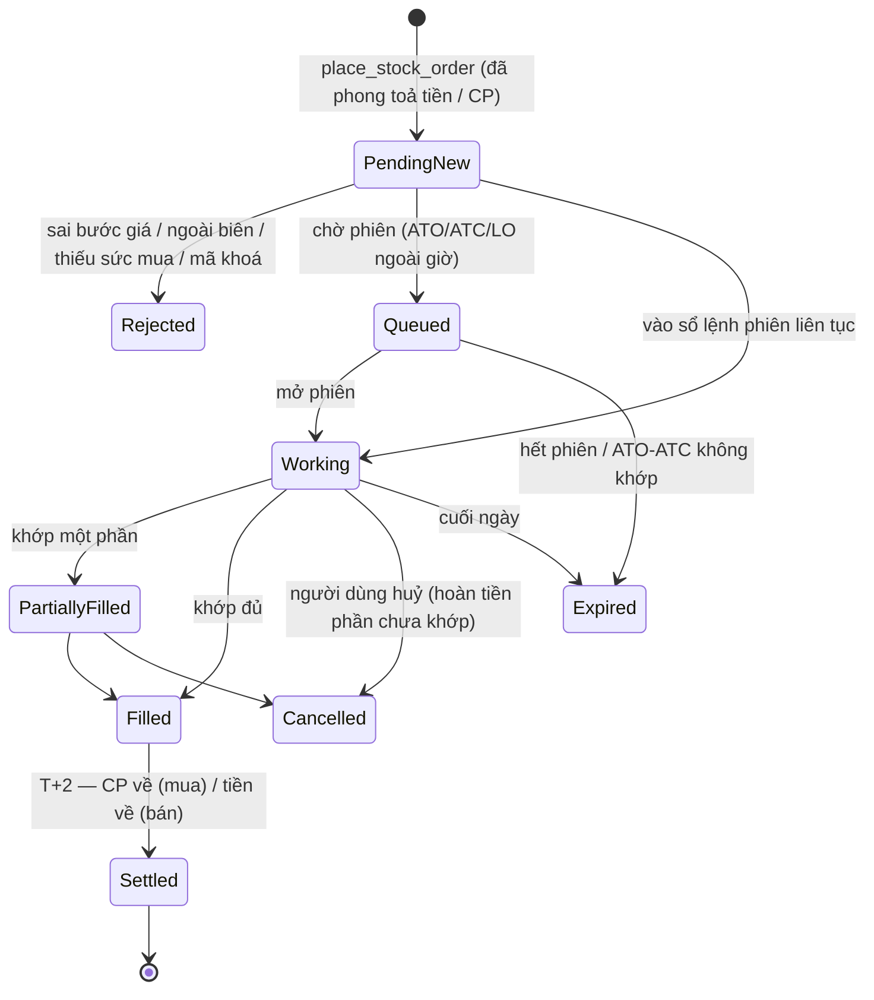
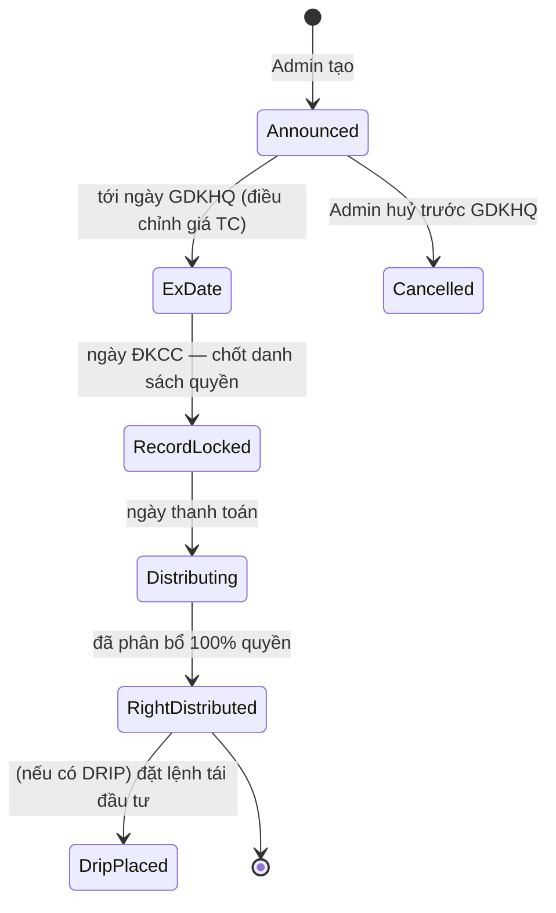

# Thiết kế: Mục Đầu Tư Chứng Khoán (Stock Investment Module) — Mua cổ phiếu & Quản lý cổ tức

> Phiên bản 1.0 · 02/10/2026 · Trạng thái: **Đề xuất (chưa triển khai)**
> Phạm vi: nâng cấp trang `/stocks` hiện có thành mô-đun đầu tư chứng khoán có danh mục nắm giữ, đặt lệnh nhiều loại, lịch & phân bổ cổ tức, tái đầu tư cổ tức (DRIP) — **dựa trên cấu trúc sẵn có của VinClub** (Vite/React + Supabase), không phá vỡ các luồng Dự án / Ví / Thông báo / Văn bản đang chạy.

---

## 0. Hiện trạng & nguyên tắc tương thích

### 0.1 Những gì đang có (khảo sát mã nguồn + dữ liệu production ngày 02/10/2026)

| Thành phần | Hiện trạng | Ghi chú |
|---|---|---|
| Danh mục mã | `investment_projects` với `category = 'Đầu tư chứng khoán'`, cột `stock_symbol`, `price_per_m2` (dùng làm **giá**), `daily_change_percent`, `is_active`, `min_amount` | 4 mã: VHM, VRE, VIC (đang khoá), VFS (đang khoá) |
| Trang người dùng | `src/pages/Stocks.jsx` + `StockCard`, `MarketSummary` (số liệu chỉ số **cố định trong code**), `TradeSheet` | Biểu đồ mini là đường **giả lập** từ giá + % thay đổi |
| Đặt lệnh | `TradeSheet`: client gọi `increment_user_balance_noted` trừ tiền → `Transaction.create(project_id = 'stock_<SYM>')` → `WalletTransaction.create(type 'investment')` | Không có loại lệnh, không có bán, không có danh mục nắm giữ |
| Quản trị | `src/components/admin/StocksTab.jsx` (trong tab "Đầu tư CK & Casino"): sửa giá/mã, tạo lệnh tay, duyệt lệnh | Lệnh đọc từ bảng `transactions` |
| Ví | `users.balance` (1 ví duy nhất), ghi qua RPC nguyên tử; trigger `trg_balance_change_notice` tự tạo thông báo **"Biến động số dư"** cho mọi thay đổi | Mọi luồng tiền mới **tự động** có thông báo + Web Push |
| Thông báo | Bảng `notifications` + trigger đẩy Web Push (`user-push-send`) cho mọi thông báo người dùng | Dùng lại nguyên trạng |
| Hằng số "Tổng nạp" | `users.total_deposited` = tiền Admin cộng trực tiếp + nạp được duyệt (trigger `derive_user_total_deposited`) | Cổ tức **không** được tính là nạp |

### 0.2 Lỗi nghiêm trọng phát hiện khi khảo sát (phải xử lý trước — Giai đoạn 0)

1. **Lệnh mua trừ tiền nhưng không lưu cổ phiếu.** `TradeSheet` ghi `project_id = 'stock_VRE'`, trong khi id thật là `p_stock_vre`; trigger `compute_transaction_interest` từ chối `project_id` không tồn tại ⇒ bảng `transactions` **không có dòng cổ phiếu nào**. Production hiện có **4 lần mua đã trừ ví (tổng 170.400.000 đ)** nhưng không có cổ phần tương ứng:

   | Thời điểm (UTC) | Người dùng | Lệnh | Số tiền |
   |---|---|---|---|
   | 05/09/2026 10:43 | `1e926c0a…` | 1.000 VRE | 18.350.000 |
   | 12/09/2026 18:13 | `2bb19736…` | 1.000 VIC | 45.200.000 |
   | 02/10/2026 16:54 | minh duc80 | 1.000 VRE | 18.350.000 |
   | 02/10/2026 16:54 | minh duc80 | 1.000 VFS | 88.500.000 |

2. **Trừ tiền và ghi lệnh không nguyên tử** (2–3 lời gọi riêng từ trình duyệt): lỗi giữa chừng ⇒ mất tiền hoặc lệnh ma.
3. **Mã đang khoá vẫn mua được** (`Stocks.jsx` ép `is_active = true`).
4. **Cổ phiếu dùng chung bảng `transactions` của Dự án** ⇒ bị trigger gán lãi suất kỳ hạn, `matures_at`, `payout_model = 'LUMP_SUM'` và có nguy cơ bị `settle_matured_investments` tất toán như một khoản đầu tư dự án — sai bản chất cổ phiếu.

### 0.3 Nguyên tắc thiết kế để không xung đột

| # | Nguyên tắc | Lý do |
|---|---|---|
| P1 | **Giữ `investment_projects` làm danh mục mã** (thêm cột mở rộng, không đổi cột cũ) | `StocksTab`, `ProjectsTab`, thông báo "dự án mới mở", deep-link `?highlight=` tiếp tục chạy |
| P2 | **Không dùng bảng `transactions` cho cổ phiếu nữa** — tạo nhóm bảng `stock_*` riêng | Tránh trigger lãi/đáo hạn của Dự án; `settle_matured_investments`, `disburse_daily_investment_payouts` không đụng tới cổ phiếu |
| P3 | **Mọi thay đổi tiền đi qua RPC `SECURITY DEFINER` nguyên tử** trên Postgres (không trừ tiền từ trình duyệt) | Sửa lỗi 0.2; thống nhất với `process_wallet_transaction`, `increment_user_balance` |
| P4 | **Một ví duy nhất `users.balance`**; sức mua = số dư − tiền đang phong toả cho lệnh chờ | Không tạo ví chứng khoán riêng, không đổi màn Ví/Hồ sơ |
| P5 | **Dùng lại thông báo & Web Push sẵn có**: biến động tiền ⇒ trigger "Biến động số dư" tự sinh (truyền ND qua `app.balance_memo`); sự kiện lệnh/cổ tức ⇒ chèn `notifications` loại mới `stock` | Không viết hệ thống thông báo mới |
| P6 | **Cổ tức không cộng vào `total_deposited`** (ghi `wallet_transactions.type = 'dividend'`) | Giữ đúng quy tắc "Tổng nạp = Admin cộng trực tiếp + nạp được duyệt" |
| P7 | **Realtime qua Supabase Realtime** (WebSocket có sẵn của Supabase) | Không dựng máy chủ WebSocket riêng; app đang chạy trên GitHub Pages |
| P8 | **Giữ giao diện tối hiện tại của `/stocks`** (`#0d1117`, thẻ `#151b24`, xanh `#10b981` / đỏ `#ef4444`, vàng `#d4af37`) | Đồng nhất với trang đang dùng |

### 0.4 Giới hạn pháp lý phải nêu rõ

VinClub **không kết nối sàn HOSE/HNX và không phải công ty chứng khoán được UBCKNN cấp phép**. Vì vậy:

- Giá do Admin công bố (hoặc nguồn tham chiếu Admin nhập), **khớp lệnh là khớp nội bộ** theo luật mô phỏng ở mục 2; mọi màn hình ghi rõ *"Giá và khớp lệnh do VinClub công bố, không phải giao dịch trên Sở GDCK"*.
- Thuật ngữ (LO, ATO, ATC, MP, T+2, GDKHQ…) dùng theo thông lệ thị trường Việt Nam để người dùng quen thuộc, nhưng không được quảng cáo như giao dịch niêm yết thật.
- Nếu sau này kết nối công ty chứng khoán đối tác, chỉ cần thay **Matching Adapter** (mục 4.1) — phần còn lại giữ nguyên.

---

## 1. Bố cục giao diện & trải nghiệm (UI/UX)

### 1.1 Kiến trúc thông tin



- Giữ route `/stocks` (đang có trong `App.jsx`), thêm `/stocks/:symbol`. Thanh **tab dính trên cùng** ngay dưới `PageHeader`.
- Mặc định mở **Danh mục** nếu người dùng đang nắm giữ ≥ 1 mã; ngược lại mở **Thị trường** (giống hành vi trang hiện tại).

### 1.2 Màn hình chính — tab "Danh mục"

```
┌──────────────────────────────────────────┐
│ ← ĐẦU TƯ CHỨNG KHOÁN                 🔔  │  PageHeader (có sẵn)
│ [Danh mục] Thị trường  Cổ tức  Lệnh      │  Tabs
├──────────────────────────────────────────┤
│ ① TỔNG QUAN DANH MỤC                     │
│   Tổng tài sản CK      258.300.000 đ  👁 │
│   Lãi/lỗ hôm nay   +3.120.000 (+1,22%) ▲ │
│   [biểu đồ giá trị 1T|1Th|3Th|1N]         │
├──────────────────────────────────────────┤
│ ② GIÁ TRỊ TÀI SẢN                        │
│   Giá trị CP   Sức mua    Tiền chờ về     │
│   206,4 tr     49,8 tr    2,1 tr (T+2)    │
│   [Nạp tiền]  [Mua cổ phiếu]              │
├──────────────────────────────────────────┤
│ ③ LÃI / LỖ                                │
│   Lãi/lỗ chưa thực hiện  +12,6 tr (+6,5%)│
│   Lãi/lỗ đã thực hiện    +1,8 tr          │
│   Cổ tức đã nhận (năm)   +3,4 tr          │
│   ── Nắm giữ ──────────────────────────  │
│   VHM  2.000 CP  GV 41.200  45.100 +9,5% │
│   VRE  1.000 CP  GV 18.350  18.900 +3,0% │
│        (500 CP chờ về T+2)                │
├──────────────────────────────────────────┤
│ ④ LỊCH CỔ TỨC SẮP TỚI                    │
│   VHM · Tiền 1.500đ/CP · GDKHQ 15/10 ▸   │
│   VRE · CP thưởng 10:1 · GDKHQ 22/10 ▸   │
├──────────────────────────────────────────┤
│ ⑤ DANH SÁCH THEO DÕI          [+ Thêm]   │
│   VIC 45.200 +3,1% ▁▂▃▅  [Mua]            │
│   VFS 88.500 −1,8% ▅▃▂▁  Tạm khoá         │
└──────────────────────────────────────────┘
│ BottomNav (có sẵn)                        │
```

### 1.3 Thành phần UI theo từng section

| Section | Component (đề xuất file) | Dữ liệu | Hành vi |
|---|---|---|---|
| ① Tổng quan | `PortfolioHeroCard` (`src/components/stocks/portfolio/`) | RPC `get_stock_portfolio` → `market_value`, `day_pnl`, `day_pnl_pct`, chuỗi `nav_history` | Nút 👁 ẩn/hiện số (lưu `localStorage`); chọn khung thời gian; số đổi màu xanh/đỏ; skeleton khi tải |
| ② Giá trị tài sản | `AssetBreakdown` (3 ô) + 2 nút | `holdings_value`, `buying_power` (= `balance − held_cash`), `pending_cash` (tiền bán chờ về) | Bấm "Sức mua" mở giải thích công thức; "Nạp tiền" → `/profile?deposit=true` (luồng có sẵn) |
| ③ Lãi/Lỗ + Nắm giữ | `PnlSummary`, `HoldingRow` | `stock_positions`: `qty_total`, `qty_available`, `qty_pending`, `avg_cost`, giá hiện tại | Hàng bấm → `/stocks/:symbol`; vuốt trái → [Mua thêm] [Bán]; nhãn "chờ về T+2" khi có `qty_pending` |
| ④ Lịch cổ tức | `UpcomingDividendList` (tối đa 3 + "Xem tất cả" → tab Cổ tức) | `stock_corporate_actions` của mã đang giữ/theo dõi, `ex_date ≥ hôm nay` | Huy hiệu loại (Tiền / CP thưởng / CP cổ tức); đếm ngược tới GDKHQ |
| ⑤ Theo dõi | `WatchlistRow` (dựa trên `StockCard` hiện có, bản gọn) | `stock_watchlist` + giá realtime | Thêm/bỏ ⭐; mã `is_active = false` hiện "Tạm khoá", **nút Mua bị khoá** |

**Quy ước hiển thị:** giá theo đơn vị đồng, phân cách `.` (vi-VN); % 2 chữ số thập phân; tăng `#10b981`, giảm `#ef4444`, tham chiếu `#d4af37`, trần tím `#a855f7`, sàn xanh lơ `#22d3ee` (thông lệ bảng điện VN). Mọi số tiền dùng `font-mono` như `TradeSheet` hiện tại.

### 1.4 Tab "Thị trường" & màn Chi tiết mã

- **Thị trường:** giữ `MarketSummary` nhưng lấy số liệu thật (chỉ số tự tính = bình quân gia quyền giá các mã đang mở; số mã tăng/giảm), `MarketSearchBar` lọc theo mã/tên, danh sách `StockCard`.
- **Chi tiết mã `/stocks/:symbol`:**
  1. Header giá: giá hiện tại, ±% so tham chiếu, Trần / TC / Sàn.
  2. Biểu đồ: 1N (theo phút) · 1T · 1Th · 3Th · 1N — dữ liệu `stock_price_ticks` (không còn đường giả lập).
  3. Sổ lệnh rút gọn 3 bước giá (từ lệnh LO đang chờ trong hệ thống — mô phỏng).
  4. Thông tin doanh nghiệp: `description`, ngành, vốn hoá (Admin nhập), lịch sử cổ tức.
  5. Vị thế của tôi (nếu có): SL, giá vốn, lãi/lỗ, trạng thái DRIP.
  6. Thanh nút dính đáy: **[Mua]** (xanh) **[Bán]** (đỏ, chỉ hiện khi `qty_available > 0`).

---

## 2. Luồng nghiệp vụ mua cổ phiếu

### 2.1 Hành trình người dùng



### 2.2 Bottom sheet "Đặt lệnh" (thay `TradeSheet` hiện tại, giữ phong cách)

| Vùng | Nội dung | Kiểm tra tức thời |
|---|---|---|
| Đầu | Mã, tên, giá hiện tại, Trần/TC/Sàn, phiên đang mở | — |
| Loại lệnh | Segmented `LO · MP · ATO · ATC` (ẩn loại không hợp lệ ở phiên hiện tại) | Mục 2.3 |
| Giá | Chỉ với LO: ô giá có nút −/+ theo **bước giá** | Trong [Sàn, Trần], đúng bước giá |
| Khối lượng | Ô số + nút nhanh `100 · 500 · 1.000 · Tối đa` | Bội số 100 (lô chẵn) hoặc 1–99 (lô lẻ, chỉ LO) |
| Sức mua | "Sức mua: 49.800.000 đ · Tối đa 1.100 CP" | Đủ tiền cho `KL × giá ước tính + phí` |
| Tổng | Giá trị lệnh, phí giao dịch (0,15% — Admin cấu hình), tổng tiền phong toả | — |
| Nút | `XÁC NHẬN MUA` (hoặc `NẠP TIỀN ĐỂ ĐẶT LỆNH` như hiện tại khi thiếu) | Chặn bấm 2 lần (`idempotency_key`) |

### 2.3 Loại lệnh & phiên giao dịch (mô phỏng theo HOSE)

| Phiên (giờ VN) | ATO | LO | MP | ATC | Ghi chú |
|---|---|---|---|---|---|
| 09:00–09:15 Mở cửa (khớp định kỳ) | ✅ | ✅ | ❌ | ❌ | Khớp 1 lần lúc 09:15 tại **giá mở cửa** |
| 09:15–11:30 Liên tục sáng | ❌ | ✅ | ✅ | ❌ | |
| 11:30–13:00 Nghỉ trưa | ❌ | ✅ (vào hàng chờ) | ❌ | ❌ | |
| 13:00–14:30 Liên tục chiều | ❌ | ✅ | ✅ | ❌ | |
| 14:30–14:45 Đóng cửa (khớp định kỳ) | ❌ | ✅ | ❌ | ✅ | Khớp 1 lần lúc 14:45 tại **giá đóng cửa** |
| Ngoài giờ / ngày nghỉ | Đặt trước cho phiên kế tiếp (LO, ATO) | | | | Theo bảng `stock_market_calendar` |

| Loại | Định nghĩa | Luật khớp nội bộ | Tiền phong toả |
|---|---|---|---|
| **LO** (giới hạn) | Mua với giá ≤ giá đặt | Liên tục: khớp ngay nếu `giá đặt ≥ giá hiện tại` (tại giá hiện tại); nếu không thì chờ tới khi giá công bố ≤ giá đặt. Định kỳ: khớp nếu `giá đặt ≥ giá mở/đóng cửa` | `KL × giá đặt × (1 + phí)` |
| **MP** (thị trường) | Mua ngay giá tốt nhất | Khớp ngay tại giá hiện tại; nếu giá hiện tại = trần và cấu hình "thanh khoản giới hạn" bật thì phần dư chuyển thành LO tại giá trần (như HOSE) | `KL × giá trần × (1 + phí)`, hoàn phần chênh khi khớp |
| **ATO** | Mua tại giá mở cửa | Khớp lúc 09:15 tại giá mở cửa Admin công bố; không khớp ⇒ huỷ | `KL × giá trần × (1 + phí)` |
| **ATC** | Mua tại giá đóng cửa | Khớp lúc 14:45 tại giá đóng cửa; không khớp ⇒ huỷ | `KL × giá trần × (1 + phí)` |

**Quy tắc giá:** biên độ ±7% quanh giá tham chiếu (cấu hình theo mã); bước giá `< 10.000: 10đ`, `10.000–49.950: 50đ`, `≥ 50.000: 100đ`; giá tham chiếu ngày = giá đóng cửa phiên trước (điều chỉnh khi GDKHQ — mục 3.2). Lệnh LO chưa khớp hết hiệu lực cuối ngày (GTD nhiều ngày: giai đoạn sau).

### 2.4 Sức mua (Buying Power)

```
buying_power = users.balance                      -- tiền mặt trong ví (đã trừ phong toả, xem dưới)
             (+ advance_available nếu bật ứng trước tiền bán — giai đoạn sau)
```

- **Phong toả bằng cách trừ thật khỏi `users.balance` lúc đặt lệnh** (giống luồng rút tiền hiện tại), ghi `stock_cash_holds`. Ưu điểm: không phải sửa mọi nơi đang đọc `balance`; trigger tự gửi "Biến động số dư … ND: PHONG TOA LENH MUA VHM 1000". Khi khớp: giải toả phần chênh; khi huỷ/hết hạn: hoàn đủ (đều có thông báo biến động).
- Sức mua hiển thị = `balance` hiện tại; "Tối đa CP" = `floor(balance / (giá × (1+phí)) / lô) × lô`.
- **Kiểm tra lại trên server** trong `place_stock_order` (khoá dòng `users … FOR UPDATE`); client chỉ để hiển thị.
- Tài khoản bị khoá (`is_locked`), mã `is_active = false`, ngoài biên độ, sai bước giá/lô ⇒ từ chối với mã lỗi rõ ràng (mục 4.3).

### 2.5 Bán cổ phiếu (rút gọn)

Chỉ bán được `qty_available` (đã về tài khoản). Tiền bán **chờ về T+2** (`stock_settlements`), hiển thị "Tiền chờ về"; khi tới hạn cron cộng vào ví (trigger tạo "Biến động số dư … ND: TIEN BAN VHM 1000 CP"). Thuế TNCN 0,1% giá trị bán + phí — khấu trừ khi thanh toán.

---

## 3. Quản lý & nhận cổ tức

### 3.1 Lịch cổ tức (Dividend Calendar) — tab "Cổ tức"

```
┌ Cổ tức ─────────────────────────────────────────┐
│ [Sắp tới] [Đã nhận] [Tất cả mã]   Năm 2026 ▾     │
│ ── Tháng 10/2026 ────────────────────────────── │
│ VHM  💵 Tiền mặt 15% (1.500 đ/CP)               │
│      GDKHQ 15/10 · ĐKCC 16/10 · Thanh toán 30/10│
│      Bạn nắm giữ 2.000 CP → dự kiến 2.850.000 đ │
│      (sau thuế 5%)        DRIP: ● Bật           │
│ VRE  🎁 CP thưởng 10:1                            │
│      GDKHQ 22/10 · ĐKCC 23/10 · Dự kiến 15/11   │
│      Dự kiến nhận 100 CP                         │
└─────────────────────────────────────────────────┘
```

| Mốc | Ý nghĩa | Luật trong hệ thống |
|---|---|---|
| **Ngày GDKHQ** (ex-date) | Ngày giao dịch không hưởng quyền | Ai **mua từ ngày này** không có quyền; giá tham chiếu được điều chỉnh |
| **Ngày ĐKCC** (record date) | Ngày đăng ký cuối cùng = GDKHQ + 1 ngày làm việc | Hệ thống **chốt danh sách** người hưởng quyền: nắm giữ (kể cả CP đang chờ về) với lệnh mua khớp **trước GDKHQ** |
| **Ngày thực hiện** (payment date) | Ngày tiền/cổ phiếu về tài khoản | Cron phân bổ |

Bộ lọc: Sắp tới / Đã nhận / Tất cả mã; nhóm theo tháng; bấm 1 sự kiện → bottom sheet chi tiết (tỉ lệ, cách tính, số dự kiến, trạng thái quyền của người dùng).

### 3.2 Cơ chế phân bổ cổ tức

```mermaid
sequenceDiagram
  autonumber
  participant AD as Admin (StocksTab › Quyền & Cổ tức)
  participant DB as Postgres (Supabase)
  participant CR as pg_cron stock-corporate-actions (5 phút)
  participant NT as notifications + Web Push
  AD->>DB: create_corporate_action(VHM, CASH, 1.500đ/CP, ex 15/10, record 16/10, pay 30/10)
  DB->>NT: Thông báo "VHM công bố cổ tức" tới người đang giữ / theo dõi
  CR->>DB: Ngày GDKHQ 09:00 — điều chỉnh giá tham chiếu VHM
  CR->>DB: Ngày ĐKCC — snapshot_entitlements(): stock_dividend_entitlements (qty, gross, tax 5%, net)
  DB->>NT: "Bạn được hưởng 2.850.000 đ cổ tức VHM, thanh toán 30/10"
  CR->>DB: Ngày thanh toán — distribute_corporate_action()
  alt Cổ tức tiền mặt
    DB->>DB: users.balance += net (app.balance_memo='CO TUC TIEN MAT VHM 2026'), wallet_transactions(type='dividend')
    DB-->>NT: Trigger tự sinh "Biến động số dư +2.850.000 … ND: CO TUC TIEN MAT VHM 2026"
    opt DRIP bật
      DB->>DB: place_stock_order(ATC/LO giá tham chiếu, KL = floor(net / giá))
      DB-->>NT: "Tái đầu tư cổ tức: đặt mua 60 CP VHM"
    end
  else Cổ tức cổ phiếu / CP thưởng
    DB->>DB: stock_positions.qty += floor(qty × tỉ lệ); giá vốn bình quân điều chỉnh
    DB->>DB: Phần lẻ < 1 CP: trả tiền theo giá Admin công bố (nếu cấu hình)
    DB-->>NT: "Bạn nhận 200 CP VRE thưởng — giá vốn mới 16.680 đ"
  end
```

**Công thức:**

| Loại | Quyền nhận | Cập nhật danh mục |
|---|---|---|
| Tiền mặt | `gross = qty × mệnh_giá(10.000) × tỉ_lệ%` hoặc `qty × đ/CP`; `tax = 5% × gross`; `net = gross − tax` | Giá vốn **không đổi** (theo thông lệ VN, cổ tức tiền ghi nhận là thu nhập); hiển thị ở "Cổ tức đã nhận" |
| CP cổ tức / CP thưởng | `new_qty = floor(qty × a / b)` (tỉ lệ `b:a`, ví dụ 10:1 ⇒ a=1, b=10) | `avg_cost_mới = (qty × avg_cost) / (qty + new_qty)` (tổng giá vốn giữ nguyên); CP mới **về tài khoản** ở ngày thực hiện, được bán ngay |
| Điều chỉnh giá tham chiếu ngày GDKHQ | Tiền: `P_tc = P_đóng_cửa − cổ tức/CP`; CP: `P_tc = P_đóng_cửa / (1 + a/b)` | Áp vào `stock_quotes.reference_price` |

**Tính lũy đẳng:** khoá duy nhất `(corporate_action_id, user_id)` cho quyền và cho bút toán ví ⇒ cron chạy lại không trả trùng (giống `wallet_transactions` id cố định của lãi ngày hiện tại).

### 3.3 Tái đầu tư cổ tức tự động (DRIP)



- Cài đặt: công tắc chung "Tái đầu tư toàn bộ cổ tức tiền mặt" + công tắc theo từng mã (từng mã ưu tiên hơn cài đặt chung).
- DRIP chỉ áp dụng **cổ tức tiền mặt**, chỉ mua **lại chính mã đó**; mã đang `is_active = false` ⇒ bỏ qua, tiền ở lại ví (có thông báo lý do).
- Lệnh DRIP gắn `source = 'drip'` để thống kê và để không bị giới hạn lô chẵn.

---

## 4. Logic IT & kiến trúc backend

### 4.1 Kiến trúc tổng thể (khớp hạ tầng hiện có)



- **Matching Adapter** = một hàm Postgres `match_stock_orders(p_symbol)` khớp nội bộ theo bảng 2.3. Khi có đối tác môi giới thật, thay bằng Edge Function gọi API đối tác; hợp đồng dữ liệu (`stock_orders`, `stock_trades`) giữ nguyên.
- Khớp chạy: ngay trong `place_stock_order` (MP/LO khớp được ngay), khi Admin cập nhật giá (trigger trên `stock_quotes`), và pg_cron mỗi phút cho lệnh chờ + mốc 09:15 / 14:45 cho ATO/ATC.

### 4.2 Mô hình dữ liệu (bảng mới, tiền tố `stock_`)



| Bảng | Cột chính | Ghi chú |
|---|---|---|
| `investment_projects` (**mở rộng**) | + `exchange` (HOSE/HNX/UPCOM), `lot_size` (100), `price_band_pct` (7), `par_value` (10.000), `allow_odd_lot` (bool), `sector`, `market_cap` | Không đổi cột cũ; `price_per_m2` vẫn được đồng bộ = giá hiện tại để màn cũ không vỡ |
| `stock_quotes` | `symbol` PK, `last_price`, `reference_price`, `ceiling`, `floor`, `open_price`, `close_price`, `change_pct`, `volume`, `updated_at` | Realtime publish |
| `stock_price_ticks` | `symbol`, `ts`, `price`, `volume` | Biểu đồ; giữ phút 30 ngày, ngày vô hạn |
| `stock_market_calendar` | `date`, `is_trading_day`, `note` | Ngày nghỉ lễ |
| `stock_orders` | `id`, `user_id`, `symbol`, `side` (BUY/SELL), `order_type` (LO/MP/ATO/ATC), `limit_price`, `qty`, `filled_qty`, `avg_fill_price`, `status`, `source` (user/drip/admin), `idempotency_key` UNIQUE(user_id,…), `fee`, `tax`, `expires_at`, `created_at` | |
| `stock_trades` | `id`, `order_id`, `price`, `qty`, `matched_at`, `settle_date` | Mỗi lần khớp |
| `stock_cash_holds` | `order_id` PK, `user_id`, `amount_held`, `amount_used`, `released_at` | Đối soát phong toả |
| `stock_positions` | `user_id`+`symbol` PK, `qty_available`, `qty_pending` (chờ về), `qty_blocked` (đang bán), `avg_cost`, `realized_pnl`, `dividends_received` | Chỉ RPC ghi |
| `stock_settlements` | `id`, `trade_id`, `user_id`, `kind` (SHARES_IN / CASH_IN), `amount`/`qty`, `due_at`, `settled_at` | Cron T+2 |
| `stock_corporate_actions` | `id`, `symbol`, `type` (CASH / STOCK_DIVIDEND / BONUS_SHARE), `cash_per_share`, `ratio_from`, `ratio_to`, `ex_date`, `record_date`, `payment_date`, `status`, `tax_rate` (0,05), `created_by` | Admin tạo |
| `stock_dividend_entitlements` | `action_id`+`user_id` PK, `qty_eligible`, `gross_cash`, `tax`, `net_cash`, `new_shares`, `cash_in_lieu`, `status`, `distributed_at`, `drip_order_id` | Snapshot ở ĐKCC |
| `stock_drip_settings` | `user_id`+`symbol` PK (`'*'` = tất cả), `enabled`, `updated_at` | |
| `stock_watchlist` | `user_id`+`symbol` PK, `created_at` | |
| `stock_order_events` | `id`, `order_id`, `event`, `actor_id`, `ip`, `data`, `created_at` | **Append-only** (Audit Trail) |

`wallet_transactions` dùng thêm `type`: `stock_buy`, `stock_sell`, `stock_hold`, `stock_release`, `dividend` — **không** thuộc nhóm được tính vào `total_deposited`.

### 4.3 Vòng đời trạng thái

**Lệnh mua/bán**



| Trạng thái | Tiền | Cổ phiếu (mua) | Hiển thị người dùng |
|---|---|---|---|
| `pending_new` → `queued`/`working` | Đã phong toả | — | "Chờ khớp" (vàng) |
| `partially_filled` | Phong toả phần còn lại | `qty_pending += khớp` | "Khớp 300/1.000" |
| `filled` | Giải toả phần chênh giá | `qty_pending` | "Đã khớp — CP về ngày 06/10" |
| `settled` (T+2, 13:00) | — | `qty_pending → qty_available` | "Đã về tài khoản" |
| `cancelled` / `expired` / `rejected` | Hoàn toàn bộ phần chưa dùng | — | Xám + lý do |

> Thời gian thanh toán: **mua** — cổ phiếu về chiều T+2 (13:00) như thị trường VN; **bán** — tiền về T+2 (cấu hình `settlement_days` để chuyển sang T+1.5/T+1 sau này mà không đổi code).

**Quyền / cổ tức**



### 4.4 Danh sách API

Ứng dụng không có máy chủ API riêng; "REST endpoint" = **PostgREST của Supabase** (`POST /rest/v1/rpc/<tên>` với JWT người dùng) và đọc bảng có RLS (`GET /rest/v1/<bảng>`). Bảng dưới ghi đường dẫn logic để dễ đọc, kèm hàm thực thi.

| Logic | Thực thi | Request chính | Response chính |
|---|---|---|---|
| `GET /stocks` | `select` `investment_projects` ⨝ `stock_quotes` | `?category=eq.Đầu tư chứng khoán` | `[{symbol,name,last_price,change_pct,ceiling,floor,reference_price,is_active}]` |
| `GET /stocks/{symbol}/chart` | RPC `get_stock_chart` | `{symbol, range:'1D'\|'1W'\|'1M'\|'3M'\|'1Y'}` | `{points:[{t,p,v}]}` |
| `GET /portfolio` | RPC `get_stock_portfolio` | — | `{market_value, buying_power, pending_cash, day_pnl, unrealized_pnl, realized_pnl, dividends_ytd, positions:[{symbol,qty_available,qty_pending,avg_cost,last_price,pnl,pnl_pct,drip}]}` |
| `POST /orders` | RPC `place_stock_order` | `{symbol, side:'BUY', order_type:'LO', limit_price:45100, qty:1000, idempotency_key}` | `{order_id, status:'working'\|'filled'\|…, held_amount, filled_qty, avg_fill_price, buying_power_after}` |
| `POST /orders/{id}/cancel` | RPC `cancel_stock_order` | `{order_id}` | `{status:'cancelled', released_amount}` |
| `GET /orders` | `select stock_orders` (RLS) | `?status=in.(working,queued)&order=created_at.desc` | `[{…order, trades:[…]}]` |
| `GET /orders/{id}/events` | `select stock_order_events` | — | Nhật ký trạng thái |
| `GET /dividends/calendar` | RPC `get_dividend_calendar` | `{from, to, scope:'holding'\|'watchlist'\|'all'}` | `[{action_id,symbol,type,cash_per_share,ratio,ex_date,record_date,payment_date,my_qty,my_expected_net,my_new_shares,status}]` |
| `GET /dividends/received` | `select stock_dividend_entitlements` | `?status=eq.distributed` | Lịch sử nhận |
| `PUT /drip` | RPC `set_drip` | `{symbol:'VHM'\|'*', enabled:true}` | `{symbol, enabled}` |
| `PUT /watchlist/{symbol}` / `DELETE` | `upsert`/`delete stock_watchlist` | — | — |
| **Admin** `POST /admin/stocks/{symbol}/price` | RPC `admin_set_stock_price` | `{symbol, last_price, open_price?, close_price?}` | `{quote, matched_orders}` |
| **Admin** `POST /admin/corporate-actions` | RPC `admin_create_corporate_action` | `{symbol, type:'CASH', cash_per_share:1500, ex_date, record_date, payment_date}` | `{action_id, preview:{holders, total_net}}` |
| **Admin** `POST /admin/corporate-actions/{id}/cancel` | RPC `admin_cancel_corporate_action` | `{reason}` | `{status}` |
| **Admin** `GET /admin/stocks/orders` | `select stock_orders` (RLS admin) | lọc mã/trạng thái/ngày | Bảng lệnh + CSV |

**Mã lỗi chuẩn** (giống `sign-document`): `MARKET_CLOSED`, `SYMBOL_HALTED`, `PRICE_OUT_OF_BAND`, `INVALID_TICK`, `INVALID_LOT`, `INSUFFICIENT_BUYING_POWER`, `INSUFFICIENT_SHARES`, `ACCOUNT_LOCKED`, `ORDER_NOT_CANCELLABLE`, `DUPLICATE_REQUEST`, `RATE_LIMITED`.

### 4.5 Bảo mật & tuân thủ

| Hạng mục | Thiết kế |
|---|---|
| Quyền truy cập | RLS mọi bảng `stock_*`: người dùng chỉ `select` dòng của mình; **không** có quyền `insert/update` trực tiếp — mọi ghi qua RPC `SECURITY DEFINER SET search_path = public`, `REVOKE … FROM anon`. Admin qua `is_admin()` |
| Toàn vẹn tiền | Trừ/hoàn tiền + ghi lệnh + ghi `wallet_transactions` trong **một giao dịch Postgres**; khoá `users … FOR UPDATE`; `idempotency_key` duy nhất; kiểm tra lại sức mua trên server |
| Chống lạm dụng | Giới hạn 10 lệnh/phút/người qua `esign_rate_hit` sẵn có (đổi khoá `stock:<user>`); chặn tài khoản `is_locked` |
| Audit Trail | `stock_order_events` append-only (trigger chặn UPDATE/DELETE) ghi mọi chuyển trạng thái, IP, user agent, giá trị trước/sau; `audit_logs` sẵn có ghi thao tác Admin (đổi giá, tạo/huỷ quyền); thông báo "Biến động số dư" là sổ phụ phía người dùng |
| Mã hoá | TLS cho mọi kết nối (Supabase/GitHub Pages); Postgres mã hoá khi lưu (Supabase); không lưu thêm dữ liệu cá nhân mới; secret nội bộ ở Vault như hiện tại |
| Đồng bộ thời gian thực | Supabase Realtime (WebSocket) publish `stock_quotes` (công khai cho người đăng nhập), `stock_orders` / `stock_positions` (lọc `user_id=eq.<uid>` + RLS); client giới hạn cập nhật UI 1 lần/giây; mất kết nối ⇒ tự kéo lại bằng REST |
| Thời gian | Mọi mốc phiên/T+2/quyền tính theo giờ Postgres `Asia/Ho_Chi_Minh`, không tin đồng hồ thiết bị |
| Minh bạch | Hiển thị cố định câu miễn trừ (mục 0.4); lưu snapshot giá khớp và phí vào lệnh |

---

## 5. Tác động tới phần đang có

| Phần | Thay đổi | Rủi ro xung đột |
|---|---|---|
| `Stocks.jsx`, `StockCard`, `MarketSummary`, `TradeSheet` | Thay bằng bộ component mới; `TradeSheet` gọi `place_stock_order` thay vì trừ tiền phía client | Không — cùng route |
| `StocksTab.jsx` (Admin) | Thêm khu "Giá & phiên", "Quyền & Cổ tức", "Sổ lệnh"; bỏ tạo lệnh vào `transactions` | Lệnh tay của Admin chuyển sang `place_stock_order(source='admin')` |
| `investment_projects` | Thêm cột (mục 4.2) | Cột mới có mặc định, không ảnh hưởng Dự án khác |
| `transactions` / cron đầu tư dự án | Không đổi; cổ phiếu không còn ghi vào đây | Loại trừ nguy cơ tất toán nhầm |
| Ví / thông báo / Web Push | Dùng nguyên trạng; truyền ND qua `app.balance_memo` | Không |
| `total_deposited` | Không đổi (cổ tức không tính là nạp) | Không |
| `TransactionList` (Hồ sơ) | Thêm nhóm "Chứng khoán" đọc `stock_orders` | Thấp |

---

## 6. Kế hoạch triển khai

| Giai đoạn | Nội dung | Ước lượng |
|---|---|---|
| **0 — Sửa lỗi gấp** | Chặn mua mã `is_active = false`; RPC `place_stock_order` tối thiểu (MP, khớp ngay, nguyên tử) thay luồng trừ tiền phía client; tạo `stock_positions` và **chuyển 4 giao dịch đã trừ tiền (170,4 tr) thành cổ phần** (hoặc hoàn tiền — chủ ứng dụng quyết định) | 1–2 ngày |
| 1 — Danh mục & lệnh | Bảng `stock_*`, `stock_quotes` + Admin chỉnh giá, LO/MP, phiên, huỷ lệnh, T+2, tab Danh mục/Lệnh, Realtime | 1–1,5 tuần |
| 2 — ATO/ATC & bán | Phiên định kỳ, lệnh bán, tiền chờ về, phí/thuế, biểu đồ thật | 1 tuần |
| 3 — Cổ tức | Admin tạo quyền, lịch cổ tức, snapshot ĐKCC, phân bổ tiền/CP, điều chỉnh giá TC, thông báo | 1 tuần |
| 4 — DRIP & hoàn thiện | Cài đặt DRIP, lệnh tái đầu tư, watchlist, báo cáo Admin, CSV | 3–4 ngày |

### Trạng thái triển khai

- **Giai đoạn 0** — xong (`20261007090000_stock_phase0.sql`).
- **Giai đoạn 1** — xong (`20261008090000_stock_phase1.sql`). Khác bản thiết kế:
  - Tiền phong toả lưu ngay trên `stock_orders.hold_amount` thay vì bảng `stock_cash_holds` riêng (mỗi lệnh 1 lần phong toả, chưa cần bảng riêng).
  - T+2 theo dõi bằng `stock_trades.settle_date / settled_at` và `stock_positions.qty_pending` thay cho `stock_settlements` (chưa có lệnh bán nên chưa có tiền chờ về).
  - Giá vẫn sửa được ở tab Dự án; trigger kẹp trong Trần/Sàn và đồng bộ vào `stock_quotes`.

## 7. Tiêu chí nghiệm thu chính

- Đặt lệnh khi thiếu sức mua ⇒ server trả `INSUFFICIENT_BUYING_POWER`, số dư không đổi; gọi lặp cùng `idempotency_key` ⇒ chỉ 1 lệnh.
- Mua MP 1.000 VHM ⇒ ví giảm đúng `giá × 1.000 × (1+phí)` trong **một** thông báo "Biến động số dư", lệnh `filled`, CP ở trạng thái "chờ về", sau T+2 13:00 chuyển "khả dụng".
- LO giá thấp hơn giá hiện tại ⇒ chờ; Admin hạ giá chạm mức đặt ⇒ khớp trong ≤ 1 phút, người dùng thấy realtime + nhận Web Push.
- Huỷ lệnh chờ ⇒ hoàn đủ tiền phong toả, có thông báo biến động.
- Mã `is_active = false` ⇒ không đặt được lệnh (UI và server).
- Cổ tức tiền 1.500 đ/CP, người giữ 2.000 CP mua trước GDKHQ ⇒ nhận 2.850.000 đ (sau thuế 5%) đúng ngày thanh toán; người mua từ ngày GDKHQ ⇒ không nhận; cron chạy 2 lần ⇒ không trả trùng; `total_deposited` không đổi.
- CP thưởng 10:1 với 1.000 CP giá vốn 18.350 ⇒ thành 1.100 CP, giá vốn 16.682.
- DRIP bật ⇒ sau khi nhận tiền cổ tức có lệnh mua lại đúng mã với KL = floor(net / giá); không đủ 1 CP ⇒ không đặt lệnh, tiền ở lại ví.
- Không đọc/ghi được dòng `stock_*` của người khác (RLS); không cập nhật trực tiếp `stock_positions` từ client.
